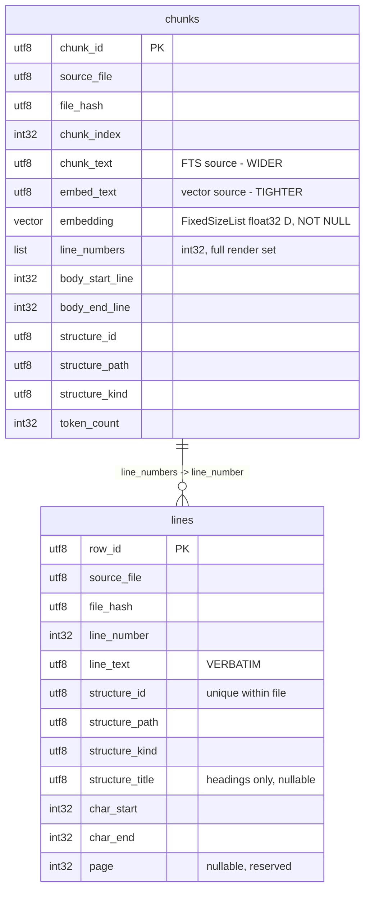

# Markdown Indexer on LanceDB - Design Plan

A TypeScript library that indexes Markdown documents into LanceDB and serves
hybrid (vector + full-text) search, returning verbatim line ranges with explicit
markers wherever content was skipped.

This document is self-contained. It assumes no prior implementation.

## 1. Purpose and scope

**In scope for v1**

- `.md` input files only
- All storage in LanceDB: rows, vectors, and the full-text index
- Structure-aware chunking (headings, tables, lists, code fences, blockquotes)
- Hybrid retrieval with reciprocal rank fusion
- Verbatim reconstruction of matched regions, with omission markers
- Scoped search - restrict a query to one section, table, or file

**Out of scope for v1**

- Non-`.md` inputs. Other formats arrive later as crawlers that convert to `.md`,
  which is why the page-number column exists in the schema but is unused.
- Visual/image chunking and vision-model descriptions
- Cross-encoder or LLM reranking
- Corpus summary generation
- Distributed orchestration

**Corpus assumption that shapes several decisions:** documents are mostly
hand-written Markdown, wrapped, with short paragraphs. Blocks larger than
roughly 250 words are rare. If this stops being true - for example if a crawler
begins importing Word or Confluence exports, where unwrapped multi-thousand
character paragraphs are the norm - revisit open decision C.

## 2. Glossary

Four granularities. Keeping these words distinct matters, because several
design arguments turn on which one is meant.

| Term | Definition | Role |
| --- | --- | --- |
| **line** | one physical line of the source file = one row in `lines` | verbatim storage, display, citation |
| **chunk** | a SET of lines carrying one embedding and one full-text document | retrieval |
| **segment** | a contiguous line range in the output, after merging | presentation |
| **structure** | a Markdown block or section node | scoping, what `structure_id` addresses |

A chunk's line set is deliberately **not contiguous**. It holds a contiguous
*body* span plus that body's ancestor heading lines and prelude lines (a table
header, a code fence opener).

## 3. Libraries

### Runtime dependencies

| Package | Purpose |
| --- | --- |
| `@lancedb/lancedb` | storage, vector index, full-text index. **Also re-exports `apache-arrow`**, so Arrow types come from here rather than from a direct dependency - see below |
| `unified` | processor pipeline |
| `remark-parse` | Markdown to mdast |
| `remark-gfm` | tables, strikethrough, task lists, autolinks, footnotes |
| `remark-frontmatter` | YAML/TOML frontmatter as nodes |
| `unist-util-visit` | tree walking |

### Development dependencies

`typescript`, `vitest`, `@types/node`, `@types/mdast`, `@types/unist`

### Node built-ins - no dependency required

| API | Use |
| --- | --- |
| `node:crypto` | `createHash('sha256')` for `file_hash` and the embedding cache key |
| `node:fs/promises` | reading files |
| `fetch` | global since Node 18; enough for the embeddings endpoint |
| globbing | `fs.promises.glob` if stable in the target Node version, otherwise `tinyglobby` |

### Constraints and traps

- **remark is ESM-only.** The package must be `"type": "module"`.
- **`@lancedb/lancedb` ships native prebuilt bindings.** Node only - never
  browser or edge runtimes.
- **Do not add `apache-arrow` as a direct dependency.** `@lancedb/lancedb`
  re-exports the whole of `apache-arrow` from its `arrow` module, so `Schema`,
  `Field`, `Int32`, `Utf8`, `List` and `FixedSizeList` can all be imported from
  the LanceDB package. Adding a second direct dependency risks resolving two
  copies of `apache-arrow`, and Arrow's `instanceof`-based type checks then fail
  across the boundary with confusing errors. Importing from the re-export makes
  that impossible by construction. Add a direct dependency only if a version
  conflict forces it, and then pin it to exactly what `@lancedb/lancedb`
  declares.

### Why an explicit Arrow schema is mandatory

LanceDB infers a schema from plain JavaScript objects when none is given.
The inference rules make that unusable here, for four independent reasons.

1. **Every integer column would become `Float64`.** Inference maps
   `typeof value === "number"` to `Float64`. That silently turns
   `chunk_index`, `body_start_line`, `body_end_line`, `line_number`,
   `char_start`, `char_end` and `page` into doubles.
2. **`line_numbers` would become `List<Float64>`, not `list<int32>`** - the
   element type is inferred from the same number rule.
3. **`page` cannot be inferred at all.** It is null on every row in v1, and
   inference cannot derive a type from an all-null column.
4. **Creating an empty table requires a schema outright.** LanceDB raises
   "A schema must be provided if data is empty", which matters when a glob
   matches nothing or when tables are created ahead of the first write.

One inference rule that does happen to work, and should not be relied on: a
column whose **name contains "vector" or "embedding"** is special-cased into
`FixedSizeList<Float32>`. The `embedding` column would therefore be inferred
correctly by accident. Declaring it explicitly keeps the dimension `D` asserted
rather than derived from whatever the first row happened to contain.

There is also a narrower `vectorColumns` option that converts named columns to
fixed-size lists without a full schema. It does not help, because it addresses
only the one case that already works and none of the four above.

### Optional and deferred

- `js-tiktoken` - only if the `chars/4` token heuristic proves inadequate.
  Prefer it over `tiktoken`, which is WASM, for portability. `tokenCount` is an
  injectable function specifically so this is a one-line swap.

### Deliberately not used

| Rejected | Reason |
| --- | --- |
| `gray-matter` | It strips frontmatter *before* parsing, which shifts every subsequent line number. This design is line-indexed throughout, so that is disqualifying. `remark-frontmatter` keeps frontmatter in the tree with correct positions. |
| `markdown-it` | Produces no mdast. Stage C would need a separate inline pass, which is the specific thing remark was chosen to provide. |
| An OpenAI SDK | One endpoint, one request shape. `fetch` is enough. |
| LangChain / LlamaIndex text splitters | Controlling chunking *is* this project. A generic splitter would replace exactly the part being designed. |
| A schema-registered embedding function | Embedding is explicit in Stage G so the content-addressed cache can skip unchanged chunks. Schema-level embedding re-embeds on every write. |

### To verify before writing code

These shape Stage H and the search implementation, so confirm them against the
installed version first. It is much cheaper to discover a missing option before
the schema is built than after.

- Vector index creation config, and full-text index creation config -
  specifically whether tokenizer, stemming and ASCII-folding options are exposed
  in the Node binding
- Whether `.where()` predicates compose with `fullTextSearch()` in a single query
- `list<int32>` round-tripping for `line_numbers`

## 4. Data model

Two tables. `chunks` serves retrieval; `lines` serves verbatim reconstruction.



### Table `chunks`

Roughly 16 rows for a 61-line document.

| Column | Type | Notes |
| --- | --- | --- |
| `chunk_id` | utf8 | `${file_id}#c${n}`. The fusion key. |
| `source_file` | utf8 | |
| `file_hash` | utf8 | sha256 of file bytes |
| `chunk_index` | int32 | document order within the file |
| `chunk_text` | utf8 | **Full-text source.** Heading path + prelude + carry-in + body + table caption. |
| `embed_text` | utf8 | **Vector source.** The same, minus the table caption. |
| `embedding` | FixedSizeList\<float32, D\> | NOT NULL on every row |
| `line_numbers` | list\<int32\> | full render set, sorted and deduplicated |
| `body_start_line` | int32 | start of the contiguous body span |
| `body_end_line` | int32 | end of the contiguous body span |
| `structure_id` | utf8 | innermost structure node containing the *whole* body |
| `structure_path` | utf8 | materialized ancestry, prefix-scoped with LIKE |
| `structure_kind` | utf8 | |
| `token_count` | int32 | |

`line_numbers` holds the full render set: every ancestor heading line, the
prelude lines, and the body span. This makes prelude injection a property of the
chunk decided at index time rather than a step at assembly time, which is why a
matched table row can never be rendered without its header.

`body_start_line` and `body_end_line` are kept alongside the list because the
renderer must distinguish "this is the match" from "this is context that was
pulled in", and because result ordering needs a document position that is not
skewed by an injected top-level heading at line 1.

`structure_id` for a body inside a single block is that block. For a body
spanning two paragraphs of one prose run it is their common parent, the section.
Prefix filtering and the diversity cap both still work; the path is just shorter.

### Table `lines`

61 rows for a 61-line document. Blank lines included.

| Column | Type | Notes |
| --- | --- | --- |
| `row_id` | utf8 | `${file_id}:${line_number}` |
| `source_file` | utf8 | |
| `file_hash` | utf8 | |
| `line_number` | int32 | 1-based |
| `line_text` | utf8 | **verbatim** original line, never normalized |
| `structure_id` | utf8 | `kind:ordinal`, unique within a file |
| `structure_path` | utf8 | for example `doc/sec:1/sec:5/table:1/row:4` |
| `structure_kind` | utf8 | see kinds below |
| `structure_title` | utf8 nullable | populated on **heading rows only** |
| `char_start` | int32 | |
| `char_end` | int32 | |
| `page` | int32 nullable | reserved for future non-Markdown crawlers |

Structure kinds: `heading`, `paragraph`, `table`, `table_header`, `table_row`,
`list`, `list_item`, `code`, `blockquote`, `frontmatter`, `html`, `blank`, `hr`.

Path segments carry their kind (`sec:1`, not `1`) precisely so that heading
ancestors are recoverable by filtering for `sec:` segments.

`structure_title` is the one denormalization in the schema. Omission markers and
API breadcrumbs both need heading titles, and headings are a tiny fraction of
rows, so the duplication is cheap and bounded.

### Deliberately absent columns

| Column | Why it does not exist |
| --- | --- |
| a lexical projection of each line | Full-text search operates on chunks, not lines, so a per-line lexical column has no consumer. |
| `heading_path` | Resolved from heading rows at assembly time. At index time the structure tree is in memory and the path is baked into the chunk text strings. |
| `heading_line_nums`, `prelude_line_nums` | Subsumed by `chunks.line_numbers`. |
| `structure_level` | Equals `structure_path.split('/').length`. |
| `slice_index` | A wide-table row slice is simply its own chunk row. |
| `is_anchor`, `chunk_start_line`, `chunk_end_line`, `chunk_id` on `lines` | The chunk-to-line relation lives on the `chunks` table. |

### Indices

- `chunks`: vector index (IVF_PQ or HNSW, cosine) on `embedding`; full-text
  index on `chunk_text` with stemming, lowercasing and ASCII folding; BTREE on
  `source_file`, `structure_path`, `structure_kind`.
- `lines`: BTREE on `source_file`, `line_number`, `structure_kind`,
  `structure_path`. No vector index and no full-text index - this table is a
  reconstruction store.

## 5. Core design decisions

### 5.1 Two tables rather than one

Chunks are a genuine entity with their own attributes: `chunk_text`,
`embed_text`, `embedding`, `token_count`.

Folding chunks into the `lines` table would force roughly 74% of rows to carry a
null embedding, a null embed text and a null chunk range, and would force every
vector query to remember a `where is_anchor = true` filter. Two tables avoid
both.

### 5.2 Both retrieval legs operate on chunks

Vector search runs over `embed_text`; full-text search runs over `chunk_text`.
Fusion is reciprocal rank fusion keyed on `chunk_id`.

"The two legs" is simply the name for the internals of hybrid search. There is
no third mechanism. They are named separately only because the design needs to
state which column each reads and how they fuse.

**Why both:** they fail in opposite directions.

- The **vector leg is blind to rare exact tokens** - part numbers, error codes,
  API names, version strings. A token like `V-200-30` is outside the embedding
  model's training distribution and lands nowhere meaningful in vector space.
- The **full-text leg is blind to paraphrase**. "How do I stop the valve
  leaking" shares no terms with "seat leakage remediation".

A representative query needs both at once: *"Cv of the 3 inch valve at half
travel"*. `Cv` and `3 inch` are lexical anchors that only full-text search
catches, while "half travel" must map to a column header reading `Cv @50%`,
which only the vector leg can do. Neither leg retrieves that row alone.

**Line-level full-text search is deliberately not offered.** A per-line index
cannot see across lines, so a query whose terms are split between a heading and
a body line scores both lines weakly and may match neither. The same blindness
hits table rows, which do not contain their own column names. Chunk text
contains all of it.

The cost accepted is the loss of a pinpoint "which line matched". That is
acceptable here because the chunk already carries the context that a pinpoint
would have had to be expanded into.

### 5.3 Structural context is a column, not injected text

`structure_id` and `structure_path` are real columns, which is what makes it
possible to scope a search to one table or one section with a single prefix
predicate that also covers descendants.

### 5.4 Overlap: text yes, structure no

Three different things get called overlap. The answers differ.

| Kind | Overlap? | Detail |
| --- | --- | --- |
| **body lines** between chunks | **No** | Bodies never overlap; their union is a subset of the file |
| **`line_numbers`** between chunks | **Yes, heavily** | By design - ancestor headings and prelude lines are shared |
| **text** inside `chunk_text` / `embed_text` | **Yes, small** | The carry-in line and the table caption |

The governing rule is: **overlap in text, never in structure.**

Fixed-size token windows over raw text need roughly 50% overlap as damage
control, because a blind cut can land mid-sentence, mid-table-row, or between a
heading and the paragraph it introduces. Overlap is insurance against cutting
blindly. This design does not cut blindly: cuts land on block boundaries by
construction, and every chunk carries its own heading path and prelude
explicitly. Body overlap would only multiply the embedding bill.

Because structure never overlaps:

- no line is embedded twice as a body, so no doubled embedding cost
- no extra chunk rows, so no near-duplicate pollution of the result list
- assembly unions `line_numbers` and deduplicates, so **nothing is ever
  rendered twice**
- full-text document frequency is not inflated, so IDF is undistorted

Because text overlaps slightly, a query whose answer straddles a chunk boundary
can still match the later chunk on its own, rather than requiring both chunks to
survive the top-k cut.

Body overlap was also evaluated purely as a *simplification*, since it would
delete the packer and the carry-in outright. It was rejected because it deletes
only the prose-cutting logic, while the structure tree, the `lines` table,
`line_numbers`, context attachment and all table handling are required
regardless. It buys little and costs roughly 2x embedding plus IDF compression.

### 5.5 Token budgets

| Constant | Value | Meaning |
| --- | --- | --- |
| `chunkTokens` | 384 | soft target |
| `maxChunkTokens` | 512 | hard ceiling |
| `tableSliceTokens` | 128 | wide-row slicing threshold |

All three are measured with the `chars/4` heuristic, so 384 means roughly 1536
characters. `tokenCount` must be a single injectable function.

**Why 384/512 and not smaller:** BM25 scores a multi-term query well only when
the terms land in the same document, so larger bodies raise co-occurrence
directly. 384 is still inside the range where a single mean-pooled vector stays
sharp.

**Why not larger:** an embedding model that accepts 8191 tokens does not mean
1000-token chunks are good. Capacity is not the binding constraint - mean-pooling
dilution is. Every additional topic in a chunk pulls its vector toward the chunk
centroid rather than toward anything specific in it.

Treat these as starting defaults, not tuned values.

`tableSliceTokens` stays at 128 and deliberately does **not** scale with
`chunkTokens`, because it is a dilution control on a single row rather than a
packing budget.

Table row packing uses the same 384 as prose, with no separate constant. Packing
roughly 13 rows instead of 7 dilutes the row-chunk vector further, but a vector
averaged over 7 independent records was never going to discriminate one row
anyway. Exact row lookup is carried by the full-text leg, which benefits from
more rows per document. The diversity cap handles the resulting near-identical
neighbours.

### 5.6 Token counting

`chars/4` for v1, not a real tokenizer.

- Accurate to roughly +/-15% for English prose.
- Wrong in three specific places: CJK text, dense numeric or punctuation content
  such as table rows, and long URLs or identifiers. Table row chunks will run
  somewhat larger in real tokens than the budget implies.
- **Cannot cause a request failure.** 512 estimated tokens sits far below the
  8191-token limit of current embedding models, so even a 3x underestimate has
  headroom. The heuristic risks chunk-size quality, never an API error.

Measure the real characters-per-token ratio on the actual corpus once, then
decide whether to keep it.

## 6. Indexing algorithm

### Stage A - discovery and change detection

Glob `.md` files, read bytes, compute sha256. If `file_hash` is unchanged, skip
the file entirely.

Otherwise delete from **both** tables with `where source_file = ?`, then
reinsert. Whole-file atomicity is what guarantees no denormalized value can
drift out of sync.

### Stage B - block parse

Parser: `unified` + `remark-parse` + `remark-gfm` + `remark-frontmatter`.

**Pipeline order must be deliberate: normalize CRLF first, then parse the
normalized string.** mdast positions refer to the exact string handed to the
parser, so the normalized text becomes the single source of truth for both the
parser and the `lines` table. Split it once and keep per-line character offsets.

Edge cases the parser handles, which would otherwise all have to be implemented
by hand:

- `---` means frontmatter at line 1, a setext H2 after a paragraph line, or a
  thematic break standing alone. Same characters, three meanings.
- Escaped pipes in table cells: `| a \| b | c |` is **two** cells, not three.
- Lazy continuation in blockquotes, where an unprefixed line still belongs to the
  quote.
- Indented code versus list-item continuation at four spaces of indent.
- The seven CommonMark HTML block types, each with its own termination rule.
- Reference links and images, where `[text][ref]` pairs with a definition
  elsewhere in the document.

**What the parser does not provide, and must be implemented:**

- **The section tree.** mdast is flat at the top level: a `heading` node is a
  *sibling* of the paragraphs that follow it, never their parent. Building the
  nesting that `structure_path` expresses means walking heading depths directly.
- **Blank lines are not nodes.** Every line needs a row, so walk lines 1..N and
  assign each to the innermost node whose position range contains it, defaulting
  to blank.
- A page-break marker convention, should non-Markdown crawlers later need one,
  would require a pre-pass or a micromark extension.

**Division of labour:** the parser owns parsing - block boundaries and types,
inline structure, table cells. This library owns structure and retrieval - the
section tree, the line fill, `structure_id` and `structure_path` assignment, and
all of chunking.

Output of this stage: a structure tree plus a per-line assignment of
`structure_id`.

### Stage C - text normalization

This feeds `chunk_text` and `embed_text`. It is not a stored column, and
`line_text` remains verbatim and untouched.

**Walk the inline mdast nodes. Do not apply regular expressions to raw
Markdown.** A regex-based link and emphasis stripper corrupts inline code spans.
Given the sentence:

    Use `[label](url)` syntax to create a link.

a regex stripper emits "Use label syntax to create a link.", silently mangling
both the lexical and the vector text of any document that discusses Markdown,
code, or anything containing brackets. With an inline AST, an `inlineCode` node
is simply not a `link` node, and the failure cannot occur.

Rules:

| Node | Serializes to |
| --- | --- |
| `image` | `image: {alt}` |
| `link` | its text |
| `inlineCode` | its value |
| `emphasis`, `strong` | their text |
| `html` | dropped |
| entities | decoded by the parser |

Then collapse whitespace and trim.

**Table rows serialize as `{header}: {cell}. ` prose, not by stripping pipes.**
A data row does not contain its own column names. Pipe-stripping leaves
`V-200-30 3" WCC 98.2` with no occurrence of `Cv` anywhere, so a query for a
column name could lexically match only the header line and never a data row.
Hybrid search would then silently degenerate to vector-only for every table in
the corpus.

Table separator rows contribute nothing - an alignment row must never be
lexically matchable. mdast emits no node for it at all, since alignment lives on
`table.align`, so this falls out for free.

### Stage D - cut points

**Cuts land on block boundaries. There is no sentence segmentation stage.**

Once the structure tree exists, block boundaries are free: the tree already
records exactly where every paragraph ends, so block ends are safe cut points at
zero additional cost.

A sentence segmenter would earn its keep in exactly one situation: a single block
larger than the budget. Below the budget the packer lands on a block boundary
anyway. A 384-token block is roughly 1500 characters, or 250 words - a very large
paragraph, and rare in this corpus.

**Consequence:** when a single block does exceed the hard ceiling, it is split at
line boundaries, at an arbitrary line rather than a sentence end. This is
deliberately the same weakness already tracked in open decision C, so the design
has one known soft spot rather than machinery spread across the pipeline to
handle a rare case.

Reintroducing sentence-boundary cutting later is additive and touches only case 3
of `choose()`.

### Stage E - chunking

#### Prose runs

A **prose run** is the maximal sequence of sibling prose-kind blocks (paragraph,
blockquote) inside one section, separated only by blank lines. The packer
operates over a whole run, not a single block.

A run is terminated by a heading (a section boundary) or by a block of a
different kind (list, table, code, thematic break, HTML, frontmatter).

Run-scoped packing is what makes a section of ten 100-token paragraphs yield
roughly 3 well-sized chunks instead of ten weak ones, with no post-processing
pass and no additional tuning constants.

#### The packer

Operates on whole blocks. Context lines are attached afterwards.

```
acc = []                       # blocks accumulated for the current body
for each block B in run (document order):
    if acc is empty and tokens(B) > soft:
        emit splitOversized(B)
        continue
    if tokens(acc) + tokens(B) > soft:
        emit body(acc)
        acc = [B]
    else:
        acc.append(B)
if acc is non-empty:
    emit body(acc)

splitOversized(B):
    if tokens(B) <= hard:
        emit body([B])
    else:
        walk B's lines, cutting at the last line fitting under hard
```

A body start is never a free choice - it is the first line of a block. It can
never be a blank line, a thematic break, or a heading line, and this now holds by
construction rather than by an explicit guard, because bodies are unions of
prose-kind blocks.

`choose()` has three cases:

1. Run exhausted - emit whatever is accumulated.
2. The next block would exceed the soft budget - cut at the previous block end.
3. A single block exceeds the hard ceiling - split it at line boundaries.

#### Rules per structure kind

| Kind | Rule and rationale |
| --- | --- |
| `heading` | Never a chunk body on its own. A heading alone embeds to near-nothing and would compete with real content. It reaches results two ways: inside `chunk_text` via the heading path, and inside `line_numbers` of every descendant chunk. An empty section - a heading immediately followed by a deeper heading - simply never becomes a body, and nothing is lost because it remains in its descendants' line numbers. |
| `table` | See below. |
| `code` | Whole fence if under budget, otherwise split at blank lines inside it. The fence opener is repeated in `chunk_text`, since it carries the language, and is present in `line_numbers`. |
| `list` | One chunk per top-level item **including** its nested children, packing siblings up to budget. An item and its sub-items are one thought, and an item's continuation lines are never split from it. |
| `blockquote` | Prose-kind. Joins the surrounding prose run rather than being packed alone. Stage C already strips the `> ` marker, so a blockquote body and a paragraph body serialize identically. |
| `frontmatter` | One chunk, whole. Metadata, small, self-contained. |
| `blank`, `hr` | Never start a body. |

#### Tables

**Descriptor chunk**, one per table regardless of width: column names, row count,
and the preceding paragraph used as a pseudo-caption. Markdown tables almost
never carry a real caption, and the lead-in sentence is the only natural-language
description of the table that exists. Its body is the header lines. This is what
makes "is there a table of valve pressure ratings?" match the table itself rather
than an arbitrary row.

**Row chunks**: rows serialize to `{header}: {cell}. ` prose, because embedding
models are trained on natural language and `Cv: 45` embeds far better than
`| 45 |`. Consecutive rows pack into a chunk up to `chunkTokens`.

**Slicing**: if a single row exceeds `tableSliceTokens`, split that row into
column-group slices. Each slice becomes its own chunk row with the same
`line_numbers` and the same body span. **Repeat the row-key column in every
slice** - column 1 by default, otherwise the first non-numeric column. A slice
covering columns 12 through 18 is unattributable without it, which is the same
principle as repeating the table header.

Two reasons to slice at all: **dilution**, where a query about one field is
compared against a vector dominated by 39 irrelevant fields; and **budget**,
where one wide row runs 300-400 tokens, so row packing degenerates to one row per
chunk and no chunk is sharp.

There is deliberately **no column-count threshold** for slicing. The token budget
alone decides. A 12-column table of short cells serializes to roughly 82 tokens
and produces one slice regardless of any column rule, while a 3-column table of
paragraph-length cells needs slicing despite being narrow. A column-count
threshold never changes an outcome.

#### Context attachment

After bodies are fixed:

```
line_numbers = sort(unique(
      ancestor heading lines
    + prelude lines (table header + separator, code fence opener)
    + [body_start_line .. body_end_line] ))
```

**Bodies do not tile the file.** Blank lines, inter-block separators and empty
sections may belong to no body at all. Those lines still exist in `lines`, still
carry structure metadata, and are still returned during assembly. They simply can
never be the target of a retrieval hit.

### Stage F - building `chunk_text` and `embed_text`

The two columns diverge in **content**, not in granularity. Same rows, same
`chunk_id`, one vector and one full-text document per row - so there is no
alignment problem and no cross-granularity fusion.

| Component | `embed_text` | `chunk_text` |
| --- | --- | --- |
| heading path, joined with " > " | yes | yes |
| kind prelude (header row, fence opener) | yes | yes |
| carry-in line | yes | yes |
| body | yes | yes |
| **table caption** | **no** | **yes** |

**Why diverge:** the optimal document size for BM25 is genuinely larger than for
dense retrieval, because BM25 scores a multi-term query well only when the terms
land in the same document. A dense vector wants the opposite - every additional
topic dilutes the mean-pooled vector. So widen the lexical text and keep the
vector text tight.

**The table caption in row chunks** closes a specific gap. Row chunks already
carry the heading path and the table header, so column names are present. What
was missing is the caption - the lead-in paragraph, which otherwise lives only in
the descriptor chunk. So this query fails:

> "pressure rating table for the 6 inch valve"

"pressure rating" is in the caption, in the descriptor chunk; "6 inch" is in a
data row, a different chunk. Neither chunk contains both. The fix is to put the
caption into the `chunk_text` of every row chunk of that table, and into the
`embed_text` of none of them, where it would pull all row vectors toward one
another. Cost is roughly 15 tokens per chunk.

**Tail carry-in**, for prose bodies only, and only when the previous body is in
the same prose run: prepend the last **line** of the previous body to
`chunk_text` and `embed_text`. Never to `body_start_line`/`body_end_line`, and
never to `line_numbers`.

Because the previous body ends at a block boundary, its last line is the tail of
a complete paragraph.

This is text-level overlap with zero structure-level overlap: no duplicated body
line, no extra chunk row, no extra embedding call, no invariant change, and
nothing rendered twice at assembly time. It exists because zero body overlap has
exactly one real weakness - a query whose answer straddles a chunk boundary
matches neither chunk strongly, so recovery depends on both chunks surviving
top-k. The carry-in lets the second chunk match such a query on its own.

**Known asymmetry:** carry-in is backward-looking only. Chunk N+1 receives the
tail of chunk N; chunk N receives nothing from N+1. True 50% overlap is
symmetric. This is accepted for v1 because prose builds forward - setup in N and
payoff in N+1 is the common direction. Making it symmetric is cheap if evaluation
demands it: also prepend the first line of the following body, still text-only,
still with no extra embedding calls.

In the oversized-block split case the predecessor does not end at a block
boundary, so carry in nothing.

**Four serialization rules**, because lexical and semantic matching want
different things:

1. Folded heading lines are **excluded** from the body. They are already in the
   heading path prefix, and repeating them skews the vector toward the title.
2. Paragraph lines are **rejoined with a space**, not a newline. Line breaks
   inside a Markdown paragraph are soft wraps, not semantic breaks.
3. List chunks **keep** the bullet or ordinal marker. Enumeration and step order
   are meaningful - `1.` differs from `-`. Item continuation lines join their
   item.
4. Images serialize as `image: {alt}` so a caption stays distinguishable from a
   sentence.

### Stage G - embedding

Batch N inputs per request against the embeddings endpoint with an explicit
`dimensions` parameter. Cache is content-addressed, keyed on
`sha256(model|dims|embed_text)`, so re-indexing an edited file re-embeds only the
chunks that actually changed.

Validate that the returned vector length equals D and fail loudly otherwise.

### Stage H - write and index

Insert chunk rows and line rows, then create the indices listed in section 4.

## 7. Invariants

Asserted by tests.

1. `body_start_line..body_end_line` is contiguous and is a subset of
   `line_numbers`.
2. `line_numbers` is sorted, deduplicated, and within file bounds.
3. No body crosses a **section** boundary. A body may cross a *block* boundary,
   but only between sibling prose blocks of one prose run.
4. Bodies within a file never overlap, and their union is a **subset** of the
   file's lines.
5. Every chunk row has a non-null embedding.
6. Every table chunk's `chunk_text` contains the header row, or for a slice, the
   row-key column.
7. Every ancestor heading line of a body appears in that chunk's `line_numbers`.
8. No body starts on a blank line, a thematic break, or a heading line. Holds by
   construction, but still asserted.
9. No body spans a change of structure kind - prose to list, list to table.
10. Carry-in text appears in `chunk_text` and `embed_text` only. It never widens
    `line_numbers` or the body span, so no line is ever rendered twice.
11. A body ends mid-block **only** when that block alone exceeded the hard
    ceiling.

## 8. Search algorithm

Input:

```
{
  query,
  k,
  mode: 'hybrid' | 'vector' | 'text',
  filters: { files?, structureId?, structurePrefix?, kinds? },
  context: { before, after },
  budget
}
```

**Step 1 - predicate build.** SQL for the `chunks` table:

```
source_file IN (...)
structure_path LIKE 'PATH%'
structure_kind IN (...)
```

A `structureId` is resolved to its `structure_path` prefix by a single-row lookup
against `lines`, so "search only in this table or section" becomes one prefix
predicate that covers all descendants.

**Step 2 - vector leg.** Embed the query with the same model and dimensions, then
query `chunks` with `nearestTo(v)`, the predicate, and `limit(kVec)`. No anchor
filter is needed, because every chunk row has a vector.

**Step 3 - full-text leg.** Query `chunks` with `fullTextSearch(q)` restricted to
the `chunk_text` column, the same predicate, and `limit(kText)`.

**Step 4 - fusion.** Reciprocal rank fusion keyed on `chunk_id`:

```
score(c) = SUM over legs of  w_leg / (rrfK + rank_leg(c)),   rrfK = 60
```

Both legs already return chunks, so there is no expansion, no rank inheritance,
and no cross-granularity reconciliation.

`rrfK = 60` deliberately flattens the curve - rank 1 gives 1/61, rank 10 gives
1/70 - so that a chunk found by **both** legs at mediocre ranks outranks a chunk
found by **one** leg at rank 1. Agreement across independent evidence beats
strength in a single signal. This is also why raw score normalization is
unnecessary.

**Implement fusion directly rather than relying on a built-in hybrid query.**
The TypeScript binding exposes exactly one built-in reranker, RRF, whose only
parameter is `k`; it has no per-leg weights. Weighted variants exist only in the
Python binding. A custom reranker is possible through the reranker interface, at
the cost of an Arrow IPC round trip per query.

Reasons to run the two legs explicitly:

- `mode: hybrid | vector | text` is already public API, so the single-leg paths
  exist regardless. Explicit legs make hybrid the same shape as the other two
  rather than a separate mechanism.
- The built-in hybrid path fuses on a physical row id, which moves on
  compaction. Fusing on `chunk_id` is stable and loggable.
- The built-in path normalizes both score sets before reranking, and RRF then
  discards them, since it reads only rank order.
- Graceful degradation when the full-text index is missing or the corpus is
  empty stays under direct control.

One detail worth knowing: the Rust RRF implementation enumerates ranks 0-based
while the Python one enumerates 1-based, so the two built-ins disagree by one.

**Step 5 - diversity cap.** At most `maxChunksPerParent` (default 3) surviving
chunks may share the same parent `structure_path`, and at most
`maxChunksPerFile` (default 5) per file. Without this, a wide table's
near-identical row chunks fill top-k with a single structure. Chunk-level fusion
has no natural damping for this, so the cap is explicit.

**Step 6 - optional heading boost.** Multiply the score if query terms appear in
the chunk's heading path. This is partly redundant, since `chunk_text` already
contains the heading path and is full-text indexed. Recommend dropping for v1 and
measuring first.

**Step 7.** The surviving top-k chunks are the seeds for assembly.

## 9. Result assembly

1. **Union the `line_numbers`** of the winning chunks, per file. This already
   includes ancestor headings and prelude lines, so there is **no prelude
   injection step**, and a matched table row can never be shown headerless.
2. **Optional context expansion** by `[-context.before, +context.after]`, applied
   to **body spans only**, not to injected context lines, clamped to file bounds.
3. **Fetch in one query per file** - the needed lines and every heading:

   ```
   lines where source_file = ?
     AND (line_number IN (...) OR structure_kind = 'heading')
   ```

   The heading rows supply `structure_title` and `line_number`, serving both API
   breadcrumbs and step 5, at no extra round trip.
4. **Merge ranges**: sort by start line and merge when the gap is at most
   `mergeGap` (default 2). A one or two line gap is cheaper to include than to
   annotate.
5. **Emit an ordered `Segment[]` per file.** Between non-contiguous segments
   insert:

   ```
   OmissionMarker { fromLine, toLine, lineCount, skippedStructures: string[] }
   ```

   `skippedStructures` needs no extra query - filter the heading rows already
   returned by step 3 to those within the gap and take `structure_title`.
   Rendered as `... 42 lines omitted (Configuration, Advanced Usage) ...`. Also
   emitted when a token or line budget truncates output.
6. **Ordering**: files by best chunk score descending; segments within a file in
   document order, because readability beats intra-file score ordering.
7. **Render**: `## {source_file}`, then per segment `L{start}-{end}` followed by
   verbatim `line_text` joined with newlines, with markers interleaved. The
   structured result object is the API; Markdown rendering is a separate
   formatter.
8. **No column projection for wide tables.** A matched row is emitted verbatim,
   all 40 columns. Projecting down to the key column plus the matched slice's
   columns, with a "34 columns omitted" note, was rejected for two reasons:
   - **Lossy retrieval with no way to expand.** The query matched slice 2, but
     the qualifier the caller needs - units, temperature basis, revision - often
     sits in slice 5. Line omission is safe because the marker says what to go
     read; cell omission inside a row that was just displayed is not.
   - The pipe-table re-renderer, handling escaped pipes, ragged rows, the
     alignment row and re-padding, is the fiddliest code in the design and is
     pure cosmetics. The primary consumer is an LLM, which reads a wide pipe row
     without difficulty.

   Slicing still pays for itself where it was justified - at embedding time.

## 10. Public API

| Function | Behaviour |
| --- | --- |
| `createIndex(config)` | Full or incremental index of a glob set |
| `search(query)` | Returns `{ results: FileResult[], stats }` |
| `getStructure(structureId)` | Resolve id to path, then all lines matching `LIKE 'path%'` |
| `listStructures(file)` | Fetch heading rows and rebuild the tree from path segments, where a parent is the path minus its last segment |
| `getLines(file, from, to)` | Raw verbatim line fetch for follow-up expansion |

## 11. Verification

1. **Golden fixtures.** Markdown exercising nested headings, tables with
   alignment rows, fenced code containing `#` and `|`, nested lists,
   blockquotes, frontmatter, CRLF, and unicode. Assert every line maps to exactly
   one `structure_id`, and that the structure tree rebuilt from `structure_path`
   strings alone matches the tree the parser produced.
   **Blank-line fill:** the parser emits no node for a blank line, so assert
   every line 1..N has a `structure_id` including blanks, with no gaps and no
   line assigned twice. This is the seam where the position walk is most likely
   to fail.
2. **Property test.** Concatenating all `line_text` in line-number order
   reproduces the source file byte-for-byte, modulo CRLF normalization.
3. **Serialization tests.** Link, image, emphasis and entity cases; paragraph
   soft wraps rejoin with a space; list bullets and ordinals survive into
   `chunk_text`; table rows serialize to `{header}: {cell}` and therefore contain
   their own column names; separator rows contribute nothing.
   **Inline-code protection**, the case that decided the parser choice: the line
   ``Use `[label](url)` syntax to create a link.`` must normalize with the
   bracket text intact, not stripped to "Use label syntax". Same for an image, an
   emphasis marker, and an HTML tag appearing inside a code span.
   **Escaped pipes:** `| a \| b | c |` parses as two cells.
   **`---` disambiguation:** at line 1 it is frontmatter, after a paragraph line
   it is a setext H2, standing alone it is a thematic break. One fixture per
   case.
4. **Chunker tests.** Soft and hard budgets respected; no body crossing a
   section; no body starting on a blank, thematic break, or heading line; cuts
   land on block boundaries except when a single block exceeds the hard ceiling;
   an oversized single line becomes its own chunk; bodies do not overlap and
   their union is a subset of the file's lines.
   One fixture per `choose()` case: C1 run exhausted; C2 next block would exceed
   soft, so cut at the previous block end; C3 a single block exceeds hard and is
   split at line boundaries. Plus: a single block between soft and hard is
   emitted **whole**, not split.
   **Prose-run tests:** ten consecutive 100-token paragraphs in one section pack
   into roughly 3 bodies, not ten; a run is terminated by a heading and by a
   list; a body may span two paragraphs but its `structure_id` is then the
   section.
   No body ever ends mid-block unless that block alone exceeded the hard ceiling.
5. **Carry-in tests.** `chunk_text` of a non-first body in a run begins with the
   previous body's last line; `line_numbers` and the body span are unaffected;
   the first body of a run carries in nothing; an oversized-split predecessor
   carries in nothing; assembly output never shows the carried line twice.
6. **Context attachment tests.** Every ancestor heading line of a body is present
   in `line_numbers`; table row chunks include the header and separator lines;
   code chunks include the fence opener; `line_numbers` is sorted and
   deduplicated.
7. **Table tests.** A descriptor chunk exists per table and absorbs the preceding
   paragraph; rows pack to budget; a row exceeding `tableSliceTokens` splits into
   slices; every slice's `chunk_text` contains the row-key column; all slices of
   a row share identical `line_numbers` and body span.
   **Caption divergence:** every row chunk's `chunk_text` contains the table
   caption and its `embed_text` does not; assert `chunk_text != embed_text` for
   table row chunks and `chunk_text == embed_text` for plain prose chunks with no
   carry-in; assert the caption never appears in `line_numbers` or the body span.
   **Regression query:** "pressure rating table for the 6 inch valve" retrieves
   the data row, not just the descriptor.
8. **Fusion tests.** Fixed rank lists produce exactly the expected RRF ordering;
   a chunk found by both legs outranks a chunk found by one leg at rank 1; the
   diversity cap limits chunks sharing a parent `structure_path`.
9. **Assembly tests.** Overlapping ranges merge; a gap larger than `mergeGap`
   produces exactly one `OmissionMarker` with correct `lineCount` and
   `skippedStructures`; budget truncation produces a trailing marker; a retrieved
   table row is always accompanied by its header lines without any injection
   step.
10. **End-to-end.** Index a fixture corpus; assert a known query retrieves a
    known table row with its header; assert `structureId` scoping excludes hits
    outside the target table; assert a query whose terms span a heading and a
    body line matches.
11. **Incremental.** Reindexing an unchanged file makes zero embedding calls;
    editing one paragraph re-embeds only the affected chunks; reindexing deletes
    from both tables.

## 12. Open decisions

**C. Oversized single block or single line.**
This is the design's single concentrated soft spot. Block-boundary cutting sends
every over-budget block through the oversized split, which cuts at an arbitrary
line. Compounding it, because there is no line-level full-text index, the
truncated tail of a 3000-character unwrapped paragraph is invisible to **both**
legs.

Mitigated in practice by the corpus assumption - mostly hand-written wrapped
Markdown with short paragraphs - so this fires rarely.

Options: reintroduce sentence-boundary cutting for this case only, which is
additive and touches only case 3 of `choose()`; use sub-line chunk bodies with
character ranges, which breaks the line-boundary invariant that everything else
rests on; or accept it.

Recommendation: accept for v1, and revisit if a crawler later imports unwrapped
exports.

**D. Weak isolated paragraphs.**
Run-scoped packing means consecutive small paragraphs pack together
automatically. What remains is that a run is terminated by any kind change, so a
lone small paragraph whose only neighbour is a list is still a weak standalone
chunk.

Options: allow a prose run to absorb an adjacent short list, or accept it - a
30-token chunk under a specific heading path still retrieves quite precisely.

Recommendation: accept for v1.

**F. Full-text document width.**
The optimal BM25 document is larger than the optimal dense-retrieval document,
and the table caption closes only one gap. Two further steps exist if evaluation
shows lexical recall is still short:

- **F1. Neighbour-window `chunk_text`** - each `chunk_text` also absorbs adjacent
  chunk bodies up to a window budget. Cheap, and requires no fusion change. Costs
  roughly 13% IDF compression on the rarest terms, because each body would appear
  in around 3 full-text documents, so document frequency roughly triples while N
  is unchanged. Length normalization is **not** a problem: all documents grow by
  a similar factor, average document length grows too, and the ratio is roughly
  preserved. Near-duplicate hits are already handled by the diversity cap and by
  assembly merging adjacent ranges.
- **F2. A separate full-text table** with genuinely larger documents. This is the
  only option that avoids IDF distortion, since each piece of text would live in
  exactly one full-text document. But it reintroduces cross-granularity fusion,
  which this design deliberately eliminated. Two ways to fuse:
  - *Rank inheritance*: a full-text document at rank r confers rank r on every
    chunk it contains, then RRF on `chunk_id`. Principled coarse-to-fine, where
    full-text picks the region and the vector picks the chunk within it. Failure
    mode: on a purely lexical query such as a part-number lookup, every chunk in
    the winning region receives an identical lexical rank, so the tiebreak falls
    to the vector leg - precisely the leg that is blind to part numbers. Partly
    mitigated because assembly merges adjacent ranges.
  - *Roll-up*: take the maximum chunk vector score up to the full-text document,
    fuse at document level, then drill back down. Loses chunk-level output
    precision.

Recommendation: defer both until there is evaluation data.
