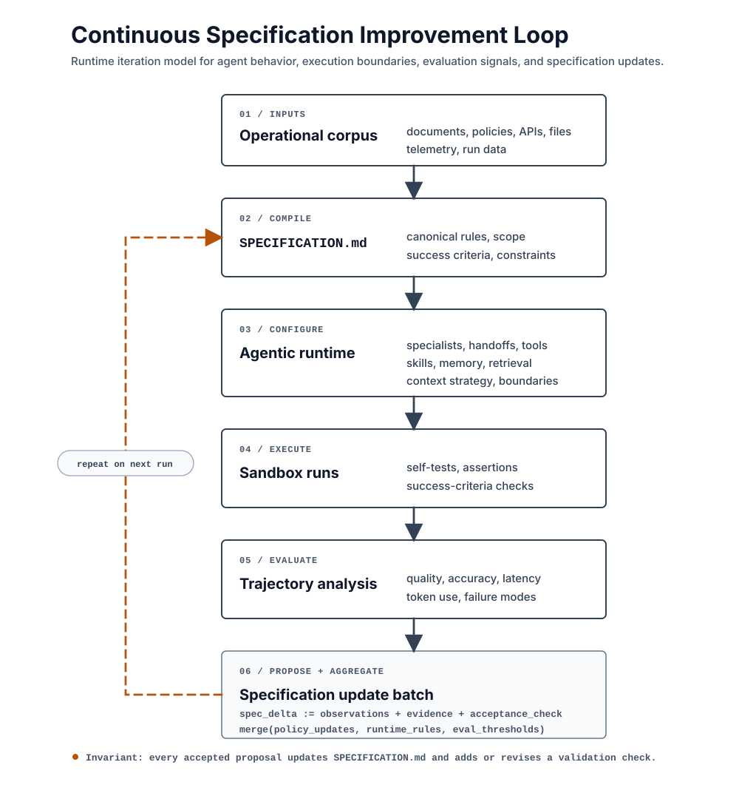

<div align="center">
<picture>
  <source media="(prefers-color-scheme: dark)" srcset="docs/imgs/banner-neo-dark.svg">
  
</picture>

[](https://github.com/andreyryabov/ZeneraNeo/actions/workflows/ci.yml)
[](LICENSE)
[](https://nodejs.org)
[](#packages)

</div>

# ZeneraNeo

**A toolkit for creating specialized, self-improving agent systems from a
specification and the knowledge your work already has.**

ZeneraNeo turns a clear description of a job into an agentic system built for
that job. Give it the documents, policies, API schemas, files and integrations
the work depends on; describe the outcome and its constraints; then let the
meta-agent design the specialists, tools, skills, memory, handoffs, retrieval
and execution strategy that fit.

This is for recurring work that needs more than one general-purpose chat:
technical investigation, policy review, operations triage, software delivery,
analysis and workflows that must show their evidence. The result is a project
you can run, inspect, improve, review and share.

> **This is an open-source side project for experimentation and chore work.**
> It is **not** the official Zenera AI Platform, and it carries no support or
> stability promises.

## From knowledge to a better system

`SPECIFICATION.md` is the source of intent: the work to perform, the knowledge
to use, the boundaries to keep, and the criteria that define success. A
meta-agent turns that intent into a working system and keeps the implementation
aligned as the specification changes.



The loop is deliberate. A run is not only an answer; it is evidence about the
system that produced it. ZeneraNeo records the trajectory, evaluates the result
against the specification, identifies changes that improve quality, accuracy,
latency or token use, and turns those findings into reviewable updates. The next
system is generated from the improved specification rather than patched by hand.

Projects are ordinary Markdown and YAML, so the intent, generated system and
proposed changes can be versioned in Git and reviewed like any other software.
Each run leaves an inspectable trajectory of the prompts, agent handoffs, tool
calls, results and usage that produced it. Teams can examine that record
themselves or give it to a meta-agent to evaluate outcomes, diagnose weak steps
and propose the next improvement with evidence.

## What the toolkit creates

- **Specialized agents** with distinct responsibilities, models and execution
  boundaries instead of one prompt asked to do everything.
- **Teams that coordinate** through explicit handoffs, parallel work and
  strategies matched to the task.
- **Knowledge systems** over documentation and API schemas, with retrieval that
  can discover, inspect and verify evidence.
- **Tools and integrations** selected for the job, with file access, sandboxed
  commands and generated integrations where they are needed.
- **Durable memory** that carries useful context between runs without relying on
  an ever-growing chat transcript.
- **Evaluation and observability** through self-tests, success criteria and
  trajectories that explain what happened, how long it took and what it used.
- **Shareable projects** expressed as Markdown and YAML, ready for source
  control, code review and reuse by another team.

## Start with a specification

```sh
npm i -g @zenera/cli
zen key add openai
zen init my-project
zen open my-project
```

Describe the system in `SPECIFICATION.md`, then run `/sync-with-spec` from your
editor's agent chat. It generates and updates the system. Use `zen check` to
verify it, `zen run` to exercise it, and `zen inspect` to examine the resulting
trajectory and improvement opportunities.

The complete project workflow, command reference and examples are in
[`@zenera/cli`](packages/cli/README.md).

## Packages

| Package                                     | Role                                                                                                                                           |
| ------------------------------------------- | ---------------------------------------------------------------------------------------------------------------------------------------------- |
| [`@zenera/cli`](packages/cli/README.md)     | The `zen` command-line workflow for creating projects, generating agent systems, running them, testing them and inspecting their trajectories. |
| [`@zenera/neo`](packages/neo/README.md)     | The TypeScript runtime for applications that need agents, models, tools, skills, memory, trajectories and project loading directly in code.    |
| [`@zenera/rag`](packages/rag/README.md)     | Advanced retrieval for agent knowledge: semantic, full-text and hybrid search over documents, plus graph-aware API schema indexing and search. |
| [`@zenera/faker`](packages/faker/README.md) | Mock API generation from OpenAPI and Swagger descriptions, with generated behavior validated against the API contract.                         |

`@zenera/cli` installs `zen`; `@zenera/rag` and `@zenera/faker` extend it with
their own subcommands. Install only the capabilities a project needs.

## Learn more

- [Specification-driven projects](docs/specification.md)
- [Agent configuration](docs/agents-yaml.md)
- [Projects and sharing](docs/projects.md)
- [Agent knowledge and document retrieval](docs/knowledge.md)
- [API integrations](docs/integrations.md)
- [Memory](docs/memory.md)

Early days and moving fast - issues, questions and pull requests are welcome.
[MIT](LICENSE).
