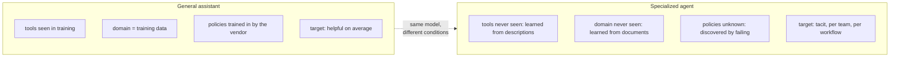
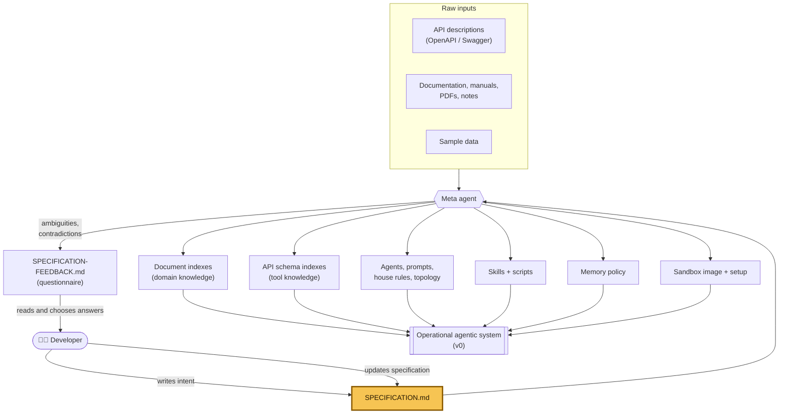
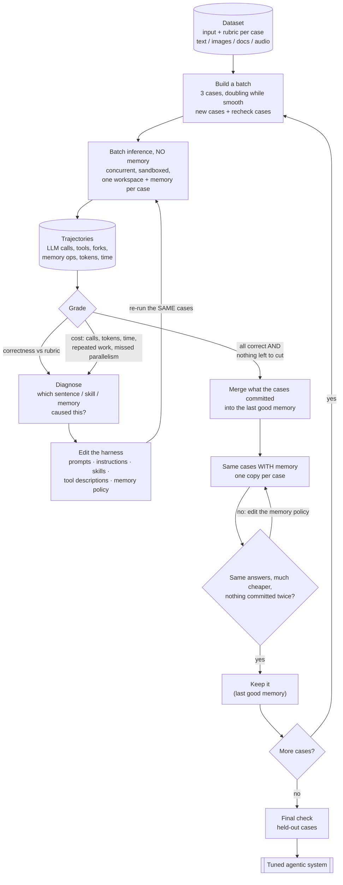
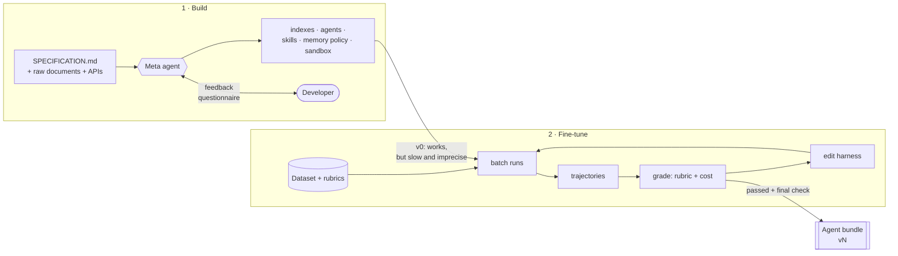
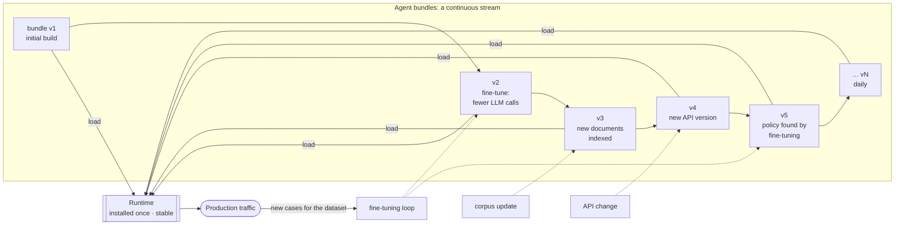
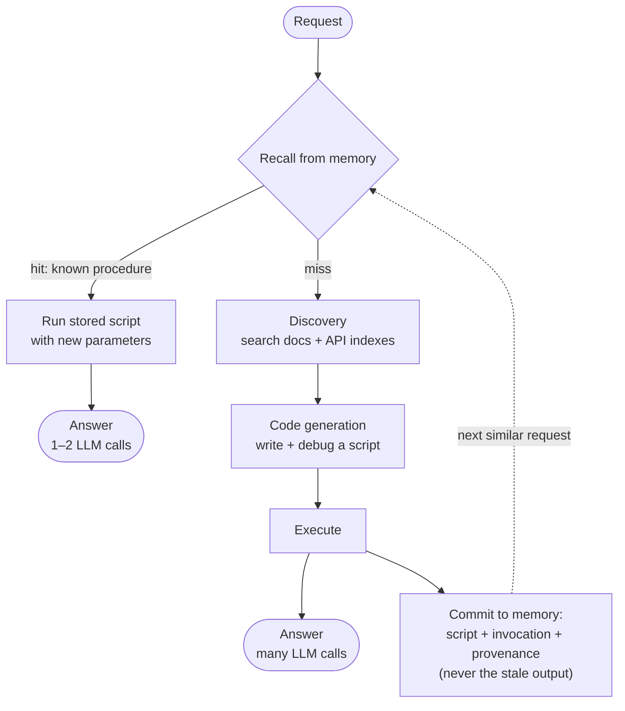

# How specialized agentic systems are built

A general-purpose assistant and a specialized agent look alike from the outside: a chat box, a
model, some tools. Underneath they are different kinds of software, made under different
conditions. This article covers why a specialized agent is hard to build by hand, how we split
that work into a **build** phase and a **fine-tuning** phase run by a meta agent, and why the
result ships as a data bundle on a runtime that stays the same.

---

## 1. Why this is hard

### A program with no compiler

An agentic system is a program, but most of its source code is prose:

- a system prompt for each agent, plus house rules that every agent shares;
- skills: procedures the agent loads when it needs them, sometimes with scripts attached;
- tool descriptions, including the wording that tells the model when to call a tool;
- a memory policy: what is worth remembering, who may read it, when it goes stale, and what
  must never be cached;
- sandbox configuration, document indexes, API indexes, hand-off and fork topology.

None of this gets checked the way code does. There is no type checker to tell you that two
paragraphs contradict each other, no compiler to point out that a skill tells the agent to run
a tool it does not have, and no linker to report that a rule in the house instructions is
cancelled by an exception three files away. The only way to find a bug is to run the system,
read the trajectory and work out which sentence the model misread.

Prose also fails in ways code does not:

| Code                                        | Prose for an agent                                                        |
| ------------------------------------------- | ------------------------------------------------------------------------- |
| An undefined name fails to compile.         | A path the agent cannot reach reads fine and fails at run time.           |
| Two definitions of one symbol are an error. | Two copies of one rule drift apart, and the model follows the softer one. |
| A condition is true or false.               | "Only when absolutely necessary" is whatever the model decides it is.     |
| Behaviour is deterministic.                 | The same prompt passes four times and fails the fifth.                    |
| Cost is visible in a profiler.              | A wasted LLM call looks like diligence in the transcript.                 |

One example shows the problem. A rule said _"do not run inline code, except in rare cases when it
is truly one-time use."_ Agents broke it every run. Every ad-hoc probe is one-time use by
construction, so the exception allowed exactly what the rule banned. The rule also appeared in
two skills the agent loaded every turn, so the model saw the exception three times per turn and
the plain ban once. No tool would have caught this. It took a person reading the whole
assembled prompt.

Making an agent specialized means writing hundreds of sentences like that one. Each can be wrong
in a way that stays hidden until the right request arrives.

### General agents work on familiar ground

A general assistant does something very hard, but it does it on familiar ground:

- **The tools are fixed and were seen in training.** Search, a browser, a Python interpreter,
  file edits. The model has used them many times before you ask it anything.
- **The domain is the training set.** General knowledge, common code, public documentation.
- **The policies are the vendor's.** Alignment, refusals and tone were decided and trained in.
- **"Good" means "helpful to the average user."** That target is broad, but it is defined.

### Specialized agents work on unfamiliar ground

A specialized agent gets none of that:

- **The domain was not in the training set.** Internal manuals, a proprietary API, a
  company's own vocabulary, a product version released last month.
- **The tools were not in the training set.** The agent has never seen `acme_4.1.0` routing
  endpoints, the in-house CLI or the schema of the customer database. It learns them from the
  descriptions you write, and it learns them every run.
- **The policies have to be discovered.** Which calls are safe to run in parallel? What
  belongs in memory? When should the agent ask instead of assuming? Which documents are
  authoritative when two disagree? Nobody writes these down in advance. They come out of
  failed runs.
- **Alignment is not defined.** "Correct" means what this team, for this workflow, would
  accept. That is usually tacit knowledge in a few experts' heads, not a written spec.

In short: a general assistant is a trained capability, while a specialized agent is software you
have to engineer, with no compiler to help. Writing all of it by hand, and keeping it consistent,
is the main reason specialized agents are slow to build and easy to break.

---

## 2. Our approach: an agent builds the agent

We don't ask a person to write the harness. A person writes the **intent**. A **meta agent**
writes and maintains the implementation, then tunes it against evidence. The work has two
phases.

### Phase 1: Build

**Inputs**

- **`SPECIFICATION.md`**: plain text written by the developer. It says what the system is
  for, which agents exist, what each may use, which data it may read, and what _done_ means.
  It is the source of truth. Where it and the implementation disagree, the specification wins.
- **Raw material**: API descriptions (OpenAPI/Swagger), product documentation, manuals,
  PDFs, internal notes, sample data.

**What the meta agent does**

It reads the specification and the whole corpus, then produces a working system:

- **Domain knowledge**: document indexes (hybrid vector + full-text) built from the manuals.
- **API knowledge**: schema indexes that turn thousands of endpoints and types into a
  searchable graph, so an agent can ask "which operation returns this field?" without having
  seen the API before.
- **Agents**: prompts, roles, hand-offs, fork topology and tool bindings, written into
  `agents.yaml` and `agents/`.
- **Skills**: procedures and scripts for recurring tasks in the domain.
- **Memory policy**: what is remembered, for whom, and how it is invalidated.
- **Sandbox**: an image with the tools the agents need to run code.
- **Setup**: a script that builds everything that has to be built, and can report what is missing.

**Feedback, not guesses**

A specification is never complete on the first pass. When the meta agent reaches something it
can't decide without guessing (an ambiguity, a contradiction, a requirement the documents
don't support), it doesn't guess silently. It writes **`SPECIFICATION-FEEDBACK.md`**, a
questionnaire. Each question includes where it came from, why it is a problem, what was built
in the meantime, and two to four fully written answers. The developer ticks one, and the answer
is folded back into the specification.

After a few rounds of this loop the specification and the architecture settle, and the system
**works**: it loads, it answers, you can test it. But it is almost always **inefficient and not
yet accurate enough**. It takes too many LLM calls, re-discovers the same things every run,
runs work in sequence that could run in parallel, and misreads parts of the domain. The build
phase produces a correct structure. It can't produce a correct policy, because the policy hasn't
been observed yet.

### Phase 2: Fine-tune

Here fine-tuning does **not** mean changing model weights. It means tuning the **harness**:
the prompts, instructions, skills and memory that the meta agent built. The model stays the same.
Everything the model is told changes.

**Inputs**

A **dataset** of cases. Each case has:

- an **input**: text, images, documents, audio, or a mix;
- a **rubric**: expected behaviour and output, in free form.

For example:

> **Input:** "Plan my day."
>
> **Rubric:** calls the calendar for today's events (`/api/calendar?date=today`) and the
> mailbox for unread threads (`/gmail/list`), in parallel. Does not ask for information
> it can fetch. Output is a step-by-step, time-ordered plan: what to do, when, and why,
> with conflicts pointed out.

A rubric grades the **path** as well as the **answer**: which calls were made, in what order,
what ran in parallel, and what was assumed instead of checked.

**The loop**

The meta agent runs a controlled experiment:

1. **Batch inference.** A batch of cases runs concurrently, each in its own sandbox, with its
   own workspace and memory. The first batch is a 3-case smoke test; each batch that goes
   smoothly doubles the next, up to a maximum. Graded and complex cases come first.
2. **Collect trajectories.** Every run records a full graph: each LLM call, tool call, fork,
   memory read and write, token count and duration.
3. **Grade on two axes.**
    - _Correctness_: does the output and the path match the rubric?
    - _Cost_: LLM calls per case, repeated work, forks that should have happened and didn't,
      discovery the agent should already have known, tokens, wall-clock time.
4. **Diagnose and edit.** Ask the model why at each critical point, collect what every case
   suggests, merge it into patterns, then change the prompt, instruction, skill, tool
   description or memory policy. Generalize the fix instead of patching one case.
5. **Re-run the same cases.** This is the controlled half of the experiment: same inputs,
   changed harness. A run **passes** only when every case is correct _and_ the cost review
   finds nothing left to cut.
6. **Recheck.** Each new batch also runs cases from earlier batches that already passed —
   difficult ones first, then complex ones — so a fix for one class of request can't quietly
   break another. Cases that keep failing are tracked and retried until fixed or stuck.

Every batch goes through this **twice**:

- **Without memory.** Each case starts from an empty memory. This grades what the agent
  _writes_: does it remember the right things, with provenance, at the right granularity?
- **With memory.** Once it passes, what its cases committed is merged into the memory of
  earlier batches, and every case runs again from its own copy of it. This grades what the
  agent _reads_: does it recall and reuse, or rediscover — and does it skip committing what
  memory already holds? When it passes, that memory becomes the last good one.

A **final check** over held-out cases (cross-validation) confirms the gains carry over to cases
the loop never saw.

**What comes out**

After several rounds of self-optimization and cross-validation, the difference is large:
**often around 90% fewer tokens and a matching drop in latency**, and higher rubric accuracy
at the same time. The gains don't come from a smarter model. They come from removing work:

- discovery replaced by knowledge (the agent stops exploring the API every run);
- sequential calls replaced by forks (independent lookups run in parallel);
- regenerated code replaced by recalled, parameterized scripts;
- guesses replaced by rules the loop discovered and wrote down.

### The whole lifecycle

---

## 3. Running: a fixed runtime and a stream of bundles

### What the runtime takes in

At run time the system splits into two parts that change at very different rates.

**The runtime** is code: the agent loop, model adapters, tool execution, sandbox management,
memory engine, retrieval, tracing. It is general. It has no knowledge of any domain.

**The agent bundle** is data:

- instructions, prompts, house rules;
- skills and their scripts;
- agent topology: hand-offs, forks, tool bindings;
- document and API indexes;
- memory: the graph plus its policy;
- sandbox configuration.

The runtime loads a bundle and runs it. **All behaviour lives in the bundle.**

### The release cycle

Because behaviour is data, the release cycle turns around:

- **The runtime is installed once and rarely changes.** It is stable, tested infrastructure,
  the same across every project and customer.
- **Agents change often, frequently every day.** Each bundle update comes from something
  specific: fine-tuning found a better policy, a new document arrived in the corpus, an API
  version shipped, or a new class of request entered the dataset.
- **Bundle updates are cheap.** Nothing is compiled or redeployed, and no infrastructure
  changes. A new bundle is a new set of files, validated, rolled out and rolled back like any
  other artifact.

This is the same split databases made between an engine and a schema, or browsers made between
an engine and web pages: a stable engine and a fast-moving layer of content. The engine earns
trust by staying the same. The content earns value by changing.

---

## 4. Performance: the fastest step is the one that never runs

### Where the time goes

When a specialized agent answers a request, most of the latency comes from three sources:

1. **Discovery**: searching documents and API schemas to find out how to do the task.
2. **Code generation**: writing the script that calls the APIs and shapes the result.
3. **Reasoning turns**: LLM calls that decide what to do next.

A faster model trims each of these a little. The biggest saving is not doing them at all.

### Memory as a precomputed answer path

A well-tuned agent doesn't use memory as a notebook of facts. It uses it as a **cache of
procedures**. The fine-tuning loop teaches it one rule for deciding what to keep: _can the
next run get this again cheaply, and still current?_

- If it is cheap to re-read, keep a **pointer** (file, section, endpoint).
- If it was assembled from several sources, keep the **conclusion** with a pointer to each
  source.
- If it was a computation, keep the **script and how to call it**, not the output, so the
  next run re-executes and gets fresh data.
- If it is a reading of the moment (today's calendar, current prices), keep the **call**, never
  the value.

So when a request resembles one that has been solved before, the agent doesn't rediscover the
API, rewrite the script or reason its way to the same plan. It **recalls the stored script,
fills in the parameters and runs it**. Discovery and code generation are skipped entirely, not
just made faster.

### Predicting instead of reacting

The best latency is zero. A system that knows its workload can do some of the work before the
request arrives:

- The fine-tuning dataset shows which classes of request come up. The scripts that answer
  them can be **written, tested and stored in memory ahead of time**, in the bundle and before
  the first user asks.
- Stage 2 of fine-tuning measures exactly this: how much of each answer came from recall
  rather than rediscovery. A window doesn't pass while the agent is still re-deriving
  something it should already know.
- Memory has provenance on every node, so a recalled procedure can be **re-checked at its
  source** rather than re-derived. When the source has changed, the check fails and the
  agent falls back to discovery.

Put together, the path for most requests gets shorter: _recall → execute → answer_, with the
expensive generate-and-search path kept for requests that are actually new.

---

## Summary

| Problem                                                | Our answer                                                                                 |
| ------------------------------------------------------ | ------------------------------------------------------------------------------------------ |
| No compiler for prose; humans can't keep it consistent | A meta agent writes and maintains the harness from a plain-text specification              |
| Domain, tools and policies are all new to the model    | Indexes for documents and APIs; policies discovered by a grading loop                      |
| "Correct" is tacit                                     | Rubrics per case, turned into written rules by fine-tuning                                 |
| First working version is slow and imprecise            | Trajectory-driven fine-tuning of prompts, skills and memory, with cost as a pass criterion |
| Shipping behaviour changes is expensive                | Stable runtime; behaviour ships as a cheap, frequent data bundle                           |
| Latency                                                | Memory as a procedure cache: most requests skip discovery and code generation              |

A specialized agent is software whose source is mostly prose, running where the model has no
prior experience. Nobody can write that reliably by hand. You can specify it, have an agent
build it, measure it against real cases, and let the loop turn what it measures into the text
that runs it.
