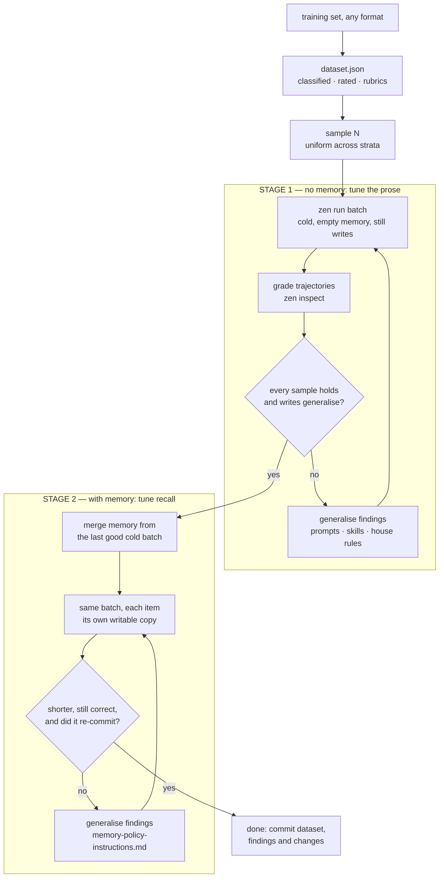

# Fine-tuning an agent project

Nothing here touches model weights. What gets tuned is the prose the project is
made of — the agent prompts, the skills, the house rules in `agents/` — and what
it is tuned against is a dataset of real queries and the trajectories they
produce. The model is fixed; the instructions around it are the parameters.

The reason it is a loop rather than a review is that an instruction's effect is
not legible from reading it. A rule that reads as obvious gets ignored; a rule
nobody expected to matter turns out to be load-bearing. The only way to know
which is which is to run the queries, read the graphs, change one thing, and run
them again — which is what everything below is about.

It is two loops, not one: a first stage run entirely **without memory**, which
tunes the prose until the agent is correct from nothing, and a second stage run
**with memory**, which tunes recall until the same work costs a fraction of what
it did. They run in that order and never at the same time.



The dataset is built once and cached. Everything after it runs many times.

## The two stages

Fine-tuning is two stages, run in order and never interleaved. They optimise
different things, they are graded on different evidence, and running them
together makes both unreadable.

|                    | **Stage 1 — without memory**                                                      | **Stage 2 — with memory**                                                                       |
| ------------------ | --------------------------------------------------------------------------------- | ----------------------------------------------------------------------------------------------- |
| Phases             | 1 to 7                                                                            | 8                                                                                               |
| What is tuned      | agent prompts, skills, `agents/instructions.md`, new policy files                 | the memory policy: what is committed, and when it is recalled                                   |
| Memory at run time | `--memory .finetune/empty` — every item starts empty and **writes its own graph** | `--memory <merged>` — every item starts from **its own copy** of one graph and writes into that |
| Graded on          | the eight criteria; the trajectory must be right _from nothing_                   | whether recall shortened the trajectory, and what was committed on top of a graph that knew     |
| The win            | correctness — the agent does the right work for the right reason                  | speed and cost — the same verdicts for dramatically fewer tokens and less wall clock            |
| Done when          | every sample holds cold, and what each run _wrote_ to memory is generalisable     | every sample still holds warm, materially cheaper, and no recall replaced a live reading        |

**Both stages run the same tool surface, and that is the point.** A batch given
a memory directory copies it per item and lets the item write — cold from an
empty directory, warm from the merged graph — so the agent sees the same tools
and the same house rules in both. `--memory-read-only` would share one graph
across the batch instead, but it also clamps every agent's `access` to `read`,
which removes `memory_commit` from the schema and changes the memory prose the
model reads. That is two variables moving at once, and a warm round has only one
number to explain them with. Keep the flag for production-shaped runs where many
processes genuinely share one graph; do not tune with it.

**Stage 1 writes memory but never reads it.** That is not a side effect to be
tolerated — it is half of what stage 1 grades. Each cold item commits into its
own empty graph, so the commits are a clean record of what that run _thought was
worth keeping_, uncontaminated by anything a previous run left behind. Criterion
3 grades exactly that: a run that cached today's inbox as a fact has poisoned
every future run, and a run that learned a new API's shape and committed nothing
has thrown the round away. Fixing those is stage 1 work, because the merged graph
stage 2 measures against is built out of these commits. Tuning recall on top of
commits you have not graded is tuning on sand.

**Stage 2 never reads a cold run's prose problem as a memory problem.** If a
sample is still failing cold, memory can hide it — the warm run passes, the graph
is rebuilt one day, and the failure returns with no trace of why. So stage 2 does
not begin until stage 1 is green. When it does begin, the prompts, skills and
house rules are frozen: the only artefact stage 2 edits is
`agents/memory-policy-instructions.md`. Changing both layers at once gives two
causes for one number.

The expected shape of a successful stage 2 is a large drop, not a small one.
Cold, every run rediscovers the same endpoints, the same schema, the same layout
of the same system, every time. Warm, it should recall them and go straight to
work — fewer llm calls, fewer tool calls, less wall clock, same verdicts. A warm
round that is only a few percent cheaper has not used memory; it has merely
carried it.

## What fine-tuning may change

| Artefact                                            | Stage  | Changed by this loop                                                  |
| --------------------------------------------------- | ------ | --------------------------------------------------------------------- |
| `agents/prompts/<name>.md`                          | 1      | Yes — the usual place a per-agent finding lands                       |
| `agents/skills/<name>/SKILL.md`                     | 1      | Yes — when the fix is knowledge, not standing policy                  |
| `agents/instructions.md`                            | 1      | Yes — when the fix binds every agent in the project                   |
| `agents/<topic>-policy-instructions.md`             | 1      | Yes — new files are created here, one topic per file                  |
| `agents/memory-policy-instructions.md`              | 1 or 2 | Yes — commit policy in stage 1, recall policy in stage 2              |
| `agents.yaml`                                       | 1      | Rarely — only when the finding is structural (wrong tools, wrong fan) |
| `agents/memory-instructions.md` and the other three | —      | **Never.** They are `zen`'s copies; `zen check --fix` overwrites them |
| The dataset                                         | —      | Only to add samples or fix a wrong rubric — never to make a run pass  |

Moving a failing sample's rubric to match what the agent did is not tuning. It
is deleting the test. If a rubric was wrong, say so in the round's notes and fix
it before the round, not after seeing the result.

## Phase 1 — Build the dataset (shared)

### The input is whatever the user has

A training set arrives as a section of `SPECIFICATION.md`, a markdown file of
headed examples, a transcript, a spreadsheet exported to CSV, a folder of
screenshots with captions. There is no format to parse, so do not try to write a
parser. Read the file, understand which parts are queries, and write out the
structure yourself. This is the one step in the loop that is a model's job and
not a script's.

What to look for:

| In the source                                                    | In the dataset                                                       |
| ---------------------------------------------------------------- | -------------------------------------------------------------------- |
| A heading like `## Query:` and a quoted string                   | One sample, `input` is the string                                    |
| A bullet list under `### Rubric:`                                | `rubric` — **verbatim**, one entry per bullet                        |
| An embedded image, a `` link, an audio or PDF attachment | A media part in `input`, path relative to the dataset file           |
| A paragraph of context before the query                          | `notes`, not `input` — unless the agent is meant to see it           |
| The expected answer                                              | `expected`, one string; it is context for grading, not a diff target |
| Nothing but a query                                              | A sample with no `rubric`. Still useful, ranked lower                |

Preserve the rubric word for word. A paraphrased rubric grades the paraphrase.

### The shape

Write `.finetune/dataset.json`:

```json
{
    "version": 1,
    "source": ["SPECIFICATION.md", "docs/examples/day-planning.md"],
    "extractedAt": "2026-03-04T10:12:00Z",
    "samples": [
        {
            "id": "planning-organize-day",
            "class": "planning",
            "complexity": "medium",
            "input": "organize my day",
            "rubric": [
                "calls api /mail/list",
                "calls api /calendar/list for today",
                "correlates emails with calendar events",
                "proposes a schedule, does not just list both"
            ],
            "expected": "A time-ordered plan naming the two conflicting meetings.",
            "notes": "From SPECIFICATION.md, worked example."
        },
        {
            "id": "receipts-photo-expense",
            "class": "extraction",
            "complexity": "simple",
            "input": ["file this expense", { "image": "./assets/receipt-014.jpg" }],
            "rubric": ["reads the total off the image", "does not invent a vendor"]
        }
    ]
}
```

`input` is exactly what `zen run batch` accepts: a string, or an array of parts.
A part is a string, `{ "text": "…" }`, or `{ "image" | "audio" | "video" | "file": "<path or url>" }`
with an optional `"mimeType"`. Relative paths resolve against the file they are
written in — so keep the generated `cases.json` in the same directory tree as the
media, or write absolute paths. Local media is inlined as base64 and capped at
20 MB per part, so reference a URL for anything large.

`id` names a directory under the batch dir. Letters, digits, dot, dash and
underscore only, unique across the dataset, and worth making readable:
`class-short-slug` means the batch directory listing is already an index.

### Classify only what the source already tells you

The instruction is "if obvious from the input" and it should be taken literally.
A class is a distinction the source makes — by section heading, by which agent or
API the example is about, by task type. Do not invent a taxonomy; six classes
over forty samples is useful, twenty classes over forty samples is one sample per
class and stratified sampling degenerates into taking everything. When a sample
fits nowhere, leave `class` out: the sampler groups those as `unclassified` and
they still get their share.

### Annotate complexity

Three levels, and rate the _trajectory_ the query demands, not the sentence:

| Level     | What it means                                                               |
| --------- | --------------------------------------------------------------------------- |
| `simple`  | One tool call or none; one agent; the answer is a lookup or a restatement   |
| `medium`  | Several calls that depend on each other, or one delegation, or one artefact |
| `complex` | Fan-out, multi-agent, ambiguity to resolve, or a plan that can go wrong     |

"organize my day" is three words and complex. Complexity is where the interesting
failures are, which is why the sampler spreads across it rather than letting the
easy majority set the score.

### It is a cache

Extraction is expensive and non-deterministic; re-doing it per round would make
two rounds incomparable. So `.finetune/dataset.json` is written once and read
thereafter. Re-extract only when the source files change, and when you do, keep
the existing ids stable — an id that moves breaks every previous round's
findings. Commit the dataset. It is the project's eval set from then on.

## Phase 2 — Sample (shared)

Input is limited: a batch of 100 complex runs is a lot of tokens and a long wait,
and nothing is learned from the eightieth one that the twentieth did not already
say. Pick a budget — 10 to 25 is a working round — and spend it evenly.

```sh
.github/skills/zen-finetune/scripts/sample.sh -n 16 -o .finetune/rounds/r1/cases.json
```

| Flag                   | Effect                                                    |
| ---------------------- | --------------------------------------------------------- |
| `-n <N>`               | Budget. Without it, everything, still in stratified order |
| `--class <name>`       | One class only — for a targeted round after a class fails |
| `--complexity <level>` | One level only                                            |
| `--rubric-only`        | Drop samples with no rubric                               |
| `--seed <n>`           | Deterministic. The same seed picks the same batch         |
| `-o <file>`            | Where to write; default stdout                            |

The sampler groups the dataset into strata of one class × one complexity, sorts
rubric-bearing samples to the front of each, and then takes one from each stratum
in turn until the budget runs out. Three consequences worth knowing:

- A budget smaller than the dataset still buys a cross-section of it, not the
  front of the file.
- Rare classes are over-represented relative to their share. That is deliberate.
  A class with two samples is the one most likely to be under-instructed.
- Graded samples come first, so a small budget is spent almost entirely on
  samples that can say _why_ they failed rather than only _what_ happened.

Keep the seed fixed across the rounds of one tuning session. Changing the sample
and the instructions at the same time means a difference in the score has two
possible causes and you cannot tell which.

## Phase 3 — Stage 1: run cold

**Check the machine before the first cold batch, and again after any change to
`--concurrency`, to the indexes, or to the podman VM:**

```sh
.github/skills/zen-sandbox-capacity/scripts/preflight_sandbox.sh --concurrency 8 \
    && zen run batch …
```

It takes seconds, starts nothing you have to clean up, and exits non-zero when
the batch cannot fit. Skipping it is how five rounds get spent grading prose
that was never the cause. Load `zen-sandbox-capacity` if it refuses.

```sh
cd <project>
mkdir -p .finetune/rounds/r1
zen run batch \
    --input .finetune/rounds/r1/cases.json \
    --batch-dir .finetune/rounds/r1/batch \
    --memory .finetune/empty \
    --concurrency 8
```

`--memory` naming a directory that does not exist is how a batch is made cold:
each item gets its own empty graph, the project's real `memory/` is not read and
not touched, and every item still writes, so what it _chose_ to remember is
evidence. Both halves matter, and both are graded in this stage: the trajectory
has to be right starting from nothing, and the commits have to be worth the
next run's attention. Never point a tuning batch at the project's live memory —
a warm graph means a run can succeed by recall instead of by instruction, which
is precisely the thing stage 1 exists to rule out.

Concurrency has two ceilings and the provider is only one of them. The default
is 16 and the cap is 32, but rate-limit errors turn a graded run into a retried
one — and the machine's ceiling is usually the lower of the two, because every
item is a container and the podman VM is not the host. Whichever binds first,
`--concurrency` is the dial; see `zen-sandbox-capacity` for the other ceiling.
`stdout` is the batch directory alone, so `BATCH="$(zen run batch …)"` is safe
to script. `<batch-dir>/README.md` is a live dashboard — open it while the
batch runs.

What lands:

```
.finetune/rounds/r1/batch/
    batch.json                   roster, counts, timings, memory mode, tokens per model
    README.md                    the dashboard
    <id>/output.json             the envelope: run.dir, run.graph, usage, output
    <id>/workspace/              anything the item wrote
    <id>/memory/                 what the item committed, if it committed anything
```

What a round cost is in both: `README.md` draws a `Tokens by model` table, and
`batch.json` carries the same split under `batch.models`. Read it per model — a
round that moved work onto a cheaper agent shows up there and nowhere else.

An item that fails is data, not an outage: its `output.json` holds
`{ "ok": false, "id", "error" }` and the rest of the batch still runs. Grade the
failures too — a crash is a finding.

## Phase 4 — Stage 1: grade the trajectories

```sh
.github/skills/zen-finetune/scripts/collect.sh -d .finetune/rounds/r1/batch
.github/skills/zen-finetune/scripts/collect.sh -d .finetune/rounds/r1/batch graphs > /tmp/r1.mmd
```

`collect.sh index` prints one line per item — verdict, agent, stop reason,
tokens, duration, whether it has a rubric, and its run directory.
`collect.sh graphs` concatenates every item's `graph.mmd` with its id and rubric
as a header, which is one read instead of N invocations of `zen inspect graph`.
`collect.sh compare` is the per-sample cost table the round is written up with,
and it is the last thing this phase does rather than the first — read the
trajectories before the numbers, or the numbers decide what you look at.

Then work item by item. Load **zen-inspect** for the mechanics; this is what to
look for.

### The three depths

| Depth                                                           | Answers                                           | Cost           |
| --------------------------------------------------------------- | ------------------------------------------------- | -------------- |
| The graph (`graph.mmd`, or `zen inspect graph --dir <run.dir>`) | What happened, in what order, and where it looped | Free           |
| `zen inspect node n13 --dir <run.dir>`                          | What a step actually said, sent or got back       | Free           |
| `zen inspect ask <llm_call-id> "…"`                             | Why the model chose this over that                | One model call |

Stay at the top for as long as it works. The `%%` header rows on the graph carry
`nodes`, `tokens`, `thinking`, `tools`, `branches`, `compacted` and `why` — and
the `tools` row is a loop detector: the same tool with the same arguments three
times is a finding without opening a single node.

Descend to `node` for evidence. A finding that does not cite node ids is an
impression, and impressions are how a tuning round produces a rule nobody needed.

`ask` is last, and it is worth the call in exactly one situation: the graph shows
a choice you cannot explain and the node contents do not explain it either. It
replays one `llm_call` with the same context, no tools, and writes nothing back —
so the answer is that call's own reasoning, not a reconstruction.

```sh
RUN="$(jq -r .run.dir .finetune/rounds/r1/batch/planning-organize-day/output.json)"
zen inspect graph --dir "$RUN"
zen inspect node n12 n13 --dir "$RUN" --part request --full
zen inspect ask n13 "why did you call /mail/list twice instead of paging the first result?" --dir "$RUN"
```

Treat the answer as testimony, not ground truth. It is the model's account of the
model's choice; it is useful because it names which instruction it was reading,
and that is the instruction you are about to change.

### The criteria

Grade each sample against all of these. The first is the user's; the rest apply
whether or not a rubric was written.

**1. Rubric compliance.** Every line of the rubric, checked against the graph.
Mark each `met` / `partial` / `missed` and cite the node. A rubric line naming an
API call is met by the call appearing with sensible arguments — not by the answer
claiming it was made.

**2. Optimality.** Did it take the short path? Symptoms, all visible in the
graph: the same read twice; a search that could have been one call made as four;
a tool loop; thinking tokens spent re-deriving something already in context; a
compaction that a shorter trajectory would not have needed. Record `nodes` and
`tokens` from the header — they are the round-over-round number.

**3. Memory hygiene.** Read `<id>/memory/` and the commit nodes. The rule is
commit what _produces_ the answer, not the material it was made from: a file
becomes a pointer, a call becomes the operation. So a run that stored the
_contents_ of `/mail/list` — today's inbox, a price, a status, a queue depth —
has cached a live reading as if it were a fact, and every later run is wrong.
What it should have stored is that the mail list is at that endpoint, what shape
it returns and what the useful filter was. The carve-outs are narrow: an answer
the agent assembled itself, and a source that genuinely cannot change. Also
check the other direction — a run that committed nothing at all when it learned
the shape of a new API has thrown the round away.

**4. Fork.** Independent work should fan out; dependent work must not. Look for:
serial calls with no data dependency between them (missed fork); branches that
read each other's output (a fork that should have been a sequence); a fork with
one branch (that is delegation, and should be written as delegation); branches
that all do the same thing with the same inputs. `branches` in the header and the
shape of the graph say all of it.

**5. Delegation.** Did it hand off to the right agent, and did it hand off at
all? Both failures are common: doing a specialist's job inline because the prompt
never said to delegate, and delegating a one-line question because the prompt
said to delegate too eagerly. Check the handoff carries enough context to be
answerable, and that the result comes back somewhere rather than ending the run.

**6. Tools and skills.** Did it use the tool it was given, or hand-roll the same
thing in a shell? Did it load the skill that covers the task — and if it loaded
it, did it then follow it? A skill loaded and ignored is a prose problem in the
skill, not a routing problem.

**7. Grounding.** Is every claim in the final answer traceable to something the
graph shows it read? An answer that is right by luck grades as a failure; it will
be wrong by luck next time.

**8. Failure handling.** When a tool returned an error, did it adapt, or did it
retry the identical call? The `tools` header row finds this in one line.

### Write it down

One file per round, `.finetune/rounds/r1/findings.md`. It opens with a **verdict
block** — a plain-language answer to "are we making progress", what was changed
to get there, and the per-sample table that either supports that or does not —
and only then the spec and the per-sample grading.

Write the verdict block last and put it first. Somebody who has not read the
earlier rounds should learn from the top of the page whether the work is moving;
somebody who has should be able to stop after it.

The table is not typed by hand. `compare` builds it against the previous round
and prints markdown ready to paste:

```sh
.github/skills/zen-finetune/scripts/collect.sh \
    -d .finetune/rounds/r2/batch -p .finetune/rounds/r1/batch compare
```

Every column comes from the run itself — tokens from `output.json`, llm calls,
tool calls and forks from the graph's own `%% nodes` header row, time from
`durationMs`. The one column it leaves as `?` is **verdict**, because whether a
sample is right is the judgement the previous phase made and no script can read
it off a trajectory. Fill that column in from the rubric grading below.

Above the table it prints a `memory:` line for this round and, when comparing, a
`prev memory:` line for the other. Both belong in `findings.md` as printed. They
are not a footnote: the same numbers mean opposite things cold and warm, and a
round whose report does not say which cannot be compared to any other round
later. `zen run batch --memory .finetune/empty` records in `batch.json` as mode
`copied` exactly like a warm run does, so do not read the mode out of the JSON
by eye — `collect.sh` decides it by whether the source is a real graph.

```md
# r2 — COLD, --concurrency 7

## PROGRESS — one sample fixed, none broken

memory: COLD — every item started from an empty graph and wrote its own (.finetune/empty)
prev memory: COLD — every item started from an empty graph and wrote its own (.finetune/empty)

**Changed since r1:** one paragraph in `agents/skills/rag_search/SKILL.md`
(+11 lines) — a question naming two products is two lookups, and the worst
verdict decides.

| sample                           | verdict | tokens                   | llm calls | tool calls | forks   | time               |
| -------------------------------- | ------- | ------------------------ | --------- | ---------- | ------- | ------------------ |
| info-upgrade-pair-4100-4110      | ✘ → ✔   | 923k → 2.04M (+121%)     | 23 → 49   | 24 → 47    | 1 (=)   | 74s → 128s (+73%)  |
| info-intel-4120-compat-420       | ✔ → ✔   | 676k → 1.09M (+61%)      | 24 → 33   | 21 → 30    | 1 (=)   | 70s → 79s (+13%)   |
| info-malware-profiles-medium-412 | ✘ → ✘   | 3.40M → 1.00M (−70%)     | 65 → 41   | 61 → 36    | 2 (=)   | 222s → 107s (−52%) |
| code-can-vms-talk                | ✔ → ✔   | 1.20M → 4.80M (+302%)    | 35 → 124  | 32 → 113   | 1 → 5   | 93s → 463s (+398%) |
| **total**                        | 14 → 15 | **19.7M → 24.3M (+23%)** | 585 → 717 | 517 → 637  | 27 → 31 | 1602s → 1922s      |

**Effect:** `info-upgrade-pair-4100-4110` is fixed and nothing regressed. The
+121% on it is the second lookup the rule asks for, which is the cost of the
fix and not a surprise.

**Not the rule's doing:** `code-can-vms-talk` alone is +3.6 M of the +4.5 M, and
124 llm calls against 35 is a loop, not variance — the rule cannot reach that
sample. Excluding it the round moves +5%, inside the noise floor.

**Verdict:** keep. One sample fixed for eleven lines. Open the loop next round.

machine: vm 12.0 GiB / 6 cpus · container 4096 MiB · index docs 3.2 GiB · host 36 GiB

## planning-organize-day — partial

| #   | Rubric                                  | Verdict | Evidence                      |
| --- | --------------------------------------- | ------- | ----------------------------- |
| 1   | calls api /mail/list                    | met     | n7                            |
| 2   | calls api /calendar/list for today      | met     | n9                            |
| 3   | correlates emails with calendar events  | partial | n14 — matched on subject only |
| 4   | proposes a schedule, does not just list | missed  | n21                           |

- optimality: 34 nodes, 61k tokens. n7 and n11 are the same /mail/list call (2)
- memory: committed the body of the 09:00 stand-up invite as a fact (3) — n18
- fork: n9 and n7 are independent and ran in sequence (4)
- delegation: none needed
```

Cite the criterion number. The next phase reads down the column.

The heading carries the verdict in one word, so a folder of rounds shows the
shape of the work without anything being opened. The round's own title carries
`COLD` or `WARM` for the same reason — `# r3 — WARM, --concurrency 8`. Use
exactly one of:

| Heading      | Means                                                              |
| ------------ | ------------------------------------------------------------------ |
| `PROGRESS`   | at least one sample fixed, none broken                             |
| `NO CHANGE`  | the round ran clean and moved nothing — the change did not work    |
| `REGRESSION` | a sample that passed now fails, whatever else improved             |
| `MIXED`      | something fixed and something broken in the same round             |
| `VOID`       | any exit 137, or the machine spec changed — nothing here is graded |
| `VERIFIED`   | a confirmation round after both stages ended — nothing was changed |

Five rules keep the block honest, and each is a round that was wasted once:

- **Say whether memory was used, in the heading and in the `memory:` line.** A
  warm round graded as a cold one reads as an agent that knew things it was
  never told, and a cold round compared against a warm one attributes to a
  prompt edit what was really recall. Both lines are printed by `compare`; paste
  them. If `compare` warns that the two rounds ran on different memory, either
  that _is_ the measurement (phase 8) and the heading must say so, or the wrong
  `-p` was given.
- **The verdict column decides, not the token column.** Tokens swing ±2× between
  identical runs of this kind of project. Say what noise floor you measured and
  treat anything under it as unchanged — an aggregate move of 20% is usually
  nothing.
- **Localise an aggregate change before attributing it to the edit.** That is
  what the per-sample rows are for. Growth concentrated in the samples the rule
  touches is the price of the rule; growth spread evenly across all of them is
  prose leaking into every agent, which is a regression even when every sample
  still passes.
- **Read the call columns, not only the tokens.** They are the ones that say
  _why_: tool calls up with tokens is more work, tokens up with tool calls flat
  is a longer prefix, and llm calls at three times the round before is a loop
  that no amount of token arithmetic will name.
- **Name the fixed and broken samples.** "14 → 15" is not actionable and
  `info-upgrade-pair-4100-4110` is. A round that fixes one and breaks one is
  `MIXED`, not a draw — the broken one is the more valuable finding, because it
  is almost always the new instruction.

`Verdict:` ends in keep or revert, and the ratio to judge it by is prose bought
per sample fixed. A round that added forty lines and fixed nothing is reverted,
not built on.

For a **warm** round (phase 8) the same command compares against the cold round
the memory was merged from, and the heading answers the only question that phase
asks — whether memory shortened the work:

```sh
.github/skills/zen-finetune/scripts/collect.sh \
    -d .finetune/rounds/r3/batch -p .finetune/rounds/r2/batch compare
```

A warm round that costs _more_ than its cold round is `NO CHANGE` at best:
memory is being loaded and not used, and the fix is an instruction about when to
recall. A warm round that costs dramatically less has one thing left to check
before it counts — that the saving is recall replacing _discovery_ and not
recall replacing a live read. Open a sample's trajectory and confirm the calls
that must hit the live system still did.

The `machine:` line is not decoration. Token counts and wall clocks are only
comparable between rounds **measured on the same spec** — a resized VM
invalidates a baseline exactly as a prompt edit does, and a round with no spec
recorded cannot be compared to anything later. `preflight_sandbox.sh --json`
prints every figure on that line.

### A round with any exit 137 is void, not graded

Before grading anything, check how the round died:

```sh
.github/skills/zen-finetune/scripts/collect.sh <batch-dir> oom
```

An item killed at 137 ran out of memory; an item at 124 hit a timeout, which
under memory pressure is the same fault wearing a different number. Neither
produced evidence about the prompt. **Do not grade the round, do not change one
word of instruction on its basis, and do not compare its tokens to anything** —
fix the machine, then run it again. A round scored on OOM debris will send the
next round after a defect that does not exist.

`failures` will not catch this and neither will the dashboard. An item whose
command was killed usually recovers, answers anyway and is recorded `ok`; a
round can read `16 items, 16 ok, 0 failed` with six of them OOM-killed inside.
The kill is in the graph, not in the verdict, which is why this is a separate
mode and why it runs before grading rather than after.

## Phase 5 — Stage 1: generalise

This is where a tuning round is won or lost. Collect every finding from every
item into one table before writing a single word of instruction, because the
unit of change is not a finding — it is a _pattern across findings_.

**One item is an anecdote.** A rule written from a single sample's failure fixes
that sample and adds a line every other run has to read. Three items missing the
same beat is a rule. Two items and a plausible mechanism is a judgement call.
One item is a note in `findings.md` and nothing else, unless the failure was
catastrophic.

Then, for each pattern, ask what the _generalisable_ form is. "Call
`/calendar/list` before answering a scheduling question" is not it — that is the
dataset written into the prompt, and it will not transfer to the next query. The
generalisable form is one level up: "when a request depends on the current state
of an external system, read that state before proposing anything that acts on
it." Same fix, and it covers the queries not in the dataset.

Two traps, both of which have cost whole rounds:

- **A prohibition with a self-judged exemption is a permission.** "Do not do X,
  except in rare cases where it is clearly warranted" is read by the model as
  "do X when you want to", because every case is clearly warranted from inside
  it. Either forbid it or do not.
- **Before rewriting a rule the agent keeps ignoring, grep the whole assembled
  prefix for the rule's own text.** House rules, the prompt and every preloaded
  skill are concatenated. A rule that is obeyed nowhere usually has a second,
  softer copy somewhere the agent reads more often. The contradiction is the
  bug; better adjectives are not the fix.

Prefer mechanical wording. Rules of the form "put X before Y", "if the path does
not end in `.py`, stop", "copy this literal verbatim" are followed. Rules that
require judgement — "be thorough", "generalise appropriately" — are followed
about half the time and are not worth their tokens.

## Phase 6 — Stage 1: apply

Route each generalised rule by what kind of thing it is.

| The finding is…                               | It goes in                                          |
| --------------------------------------------- | --------------------------------------------------- |
| One agent's behaviour, one agent's job        | `agents/prompts/<agent>.md`                         |
| A fact, a format, an API shape, a procedure   | A skill — extend one, or create one                 |
| A standing rule every agent must obey         | `agents/instructions.md`                            |
| A standing rule about one capability          | `agents/<topic>-policy-instructions.md` — new file  |
| The wrong agent had the tool, or no agent did | `agents.yaml`, and say so loudly — it is structural |
| The dataset was wrong                         | `.finetune/dataset.json`, before the next round     |

New policy files are the usual output of a first round: `memory-policy-`,
`fork-policy-`, `tools-policy-`, `files-policy-instructions.md`. They sit beside
`zen`'s own four, they are yours, and `zen check --fix` does not touch them. Load
**zen-instructions** before writing one — in particular for two things it is easy
to get wrong: `requires:` is _not_ inherited, so a policy file must repeat the
condition of the file it sits next to (`requires: memory` beside
`memory-instructions.md`), and the files are prepended in filename order, so
`memory-policy-` reads after `memory-instructions.md`, which is what you want.

Never edit `agents/memory-instructions.md`, `agents/fork-instructions.md`,
`agents/tools-instructions.md` or `agents/files-instructions.md`. They are copies
of the runtime templates; `zen check` reports them stale when they drift and
`zen check --fix` replaces them wholesale, taking your edit with it. If a finding
genuinely belongs in one of those — that is, it is true of every Zenera project
and not just this one — change the master upstream in the CLI templates instead,
and note it in the round.

Record what changed and why in `.finetune/rounds/r1/changes.md`, one entry per
edit, each naming the finding numbers that motivated it. That file is what makes
the next round's diff interpretable, and it is what you read when a score goes
_down_.

Then, before re-running:

```sh
zen check
.github/skills/zen-review/scripts/check-paths.sh
```

A broken project fails every item for one reason, and a round spent discovering
that is a round wasted.

## Phase 7 — Stage 1: re-run cold, and leave the stage

Same cases file, same seed, new round directory, still no memory.

```sh
mkdir -p .finetune/rounds/r2
zen run batch --input .finetune/rounds/r1/cases.json \
    --batch-dir .finetune/rounds/r2/batch --memory .finetune/empty --concurrency 8
```

Re-use `r1/cases.json` rather than re-sampling — the point of the round is the
difference, and the difference only exists if the queries are identical. Compare
per sample and on the aggregate: verdicts, nodes, tokens.

Three things to watch for:

- **Regression.** A sample that passed in r1 and fails in r2 is the most valuable
  result in the round, and it is almost always the new instruction. Prose added
  for one agent is read by all of them.
- **The score going up for the wrong reason.** If the new rule names the
  dataset's own endpoints or entities, the batch passes and nothing generalises.
  Sample a query the dataset does not contain and try it by hand.
- **Prose growth.** If the instruction files have grown by a third and the score
  moved by one sample, the round was net negative. Delete something.

Loop until every sample in the batch behaves. Then widen: sample a _larger_ N
from the dataset with the same seed — the earlier items recur, so the previous
round's samples act as a regression set — and go again. Stop when a round
produces no generalisable pattern. That is the signal that the remaining failures
are the model's, not the prose's.

### Leaving stage 1

Stage 1 is over when **both** of these hold on the same cold round, not one of
them:

1. **Every sample holds.** Rubric compliance, and the other seven criteria, with
   no regression against the round before.
2. **What the runs wrote to memory is worth keeping.** Read `<id>/memory/` across
   the whole batch, not per item. Every commit should be an operation, a pointer,
   a shape or a rule — something that will still be true next week — and none
   should be a live reading dressed up as a fact. A run that learned something
   durable and committed nothing fails this as squarely as one that cached the
   inbox.

The second criterion is the one that gets skipped, and skipping it makes stage 2
unreadable: the merged graph is built from exactly these commits, so a loose
commit policy shows up there as forty near-duplicates or as a stale fact that
makes a warm sample _worse_. Fix commit policy here, in
`agents/memory-policy-instructions.md`, while the runs are still cold and the
cause is still attributable.

When both hold, freeze the prompts, the skills and the house rules. Stage 2
measures recall against a fixed prose baseline; editing that baseline mid-stage
means a changed number has two causes.

## Phase 8 — Stage 2: tune memory

A separate stage, with its own rounds, its own findings files and its own exit
criterion. It starts only once stage 1 is green, and what it optimises is not
correctness — stage 1 settled that — but **cost and speed through reuse**.

The premise is that a cold run rediscovers, every single time, things that do not
change: where an endpoint is, what shape it returns, which filter was the useful
one, how a repository is laid out, which agent owns what. Paid once and recalled
thereafter, that work disappears from the trajectory. A warm batch should
therefore be _dramatically_ cheaper than the cold batch it is compared against —
fewer llm calls, fewer tool calls, less wall clock — while every verdict stays
exactly where it was. Anything less than that is memory being carried and not
used, and it is a finding.

Starting early is the classic mistake. Memory that compensates for a missing
instruction is a bug that looks like a feature: the warm run passes, the prose
defect is invisible, and the failure comes back the day the graph is rebuilt.

Note the division of labour, because it is the part most often confused:

- **Stage 1 grades what an agent writes into nothing.** Each item has its own
  empty graph, so criterion 3 is about whether the commit was worth making at
  all.
- **Stage 2 grades what an agent reads, and what it writes on top of a graph
  that already knew.** Every item starts from an identical copy of the merged
  graph, so the input is the same for all of them and the comparison is clean —
  and because the copies are per item, nothing one item commits can reach
  another.

That second half is a question stage 1 cannot ask. Cold, every graph is empty,
so there is nothing to duplicate and nothing to supersede. Warm, an item that
commits a near-copy of a node it just recalled is growing the graph for no
information, and an item that learns the old fact was wrong and does not
supersede it leaves the next run reading the wrong thing. Both are recall-policy
findings and both are visible only here.

The only artefact stage 2 edits is `agents/memory-policy-instructions.md` — rules
about _when_ to recall, when to trust a recalled fact, when to go and look
anyway, and what to commit when memory already holds a version of it. If a
stage-2 finding cannot be written as a recall or re-commit rule, it is a stage-1
finding that escaped: note it, finish the stage, and re-open stage 1 rather than
quietly editing a prompt here.

### The round

Merge the last good cold round's memory into one graph, then run the same cases
against a copy of it:

```sh
zen memory merge .finetune/rounds/r2/batch/*/memory --dir .finetune/rounds/r3/memory --yes
zen memory stats --dir .finetune/rounds/r3/memory

mkdir -p .finetune/rounds/r3
zen run batch --input .finetune/rounds/r1/cases.json \
    --batch-dir .finetune/rounds/r3/batch \
    --memory .finetune/rounds/r3/memory --concurrency 8
```

Same cases file, same seed, same machine as the cold round it is compared to,
and — crucially — the same flags. The cold round's `--memory .finetune/empty`
and this round's `--memory .finetune/rounds/r3/memory` differ in one thing only:
whether the directory being copied holds a graph. Everything else the agent sees
is identical, which is what makes the two rounds subtractable.

Five things follow from copying rather than sharing:

- **The source is never written.** Each item copies it, writes into the copy,
  and leaves the copy behind at `<id>/memory/`. The merged graph is the same
  bytes at the end of the stage as at the start.
- **`<id>/memory/` existing means nothing warm.** Cold, a directory is there
  only if the item committed — a memory with no manifest is deleted after the
  run. Warm, every copy arrives with the merged graph's manifest, so every item
  has one whether it wrote or not. What an item actually added is in its
  trajectory, as the `memory_op` nodes; read those, not the directory listing.
- **Never merge a warm round's copies back into the source.** The glob that was
  right for a cold round — `r2/batch/*/memory` — matches every item of a warm
  one and would fold the whole merged graph back in N times. Merge once, at the
  top of the stage, from the last good _cold_ round, and never again.
- **Copies cost disk and a pause.** They are made serially, before the first
  model call, one per item, and they are kept: check `zen memory stats` and
  multiply by the item count before starting a round on a large graph.
- **The source must not be locked.** `zen run batch` refuses a memory another
  process holds, so close any `zen memory` session first.

The merge glob above is safe because it reads the _cold_ round: an item that
committed nothing has its memory directory deleted, so `*/memory` there only
ever matches real graphs.

Read `zen memory stats` before the run. A merged graph with forty near-duplicate
nodes says the commit policy is too loose, and that is a stage-1 fix before it is
a stage-2 measurement.

Grade with the same tools and write `findings.md` the same way, comparing against
the cold round the memory came from. The heading carries `WARM`:

```sh
.github/skills/zen-finetune/scripts/collect.sh \
    -d .finetune/rounds/r3/batch -p .finetune/rounds/r2/batch compare
```

### What "memory used correctly" looks like

| Good                                                                    | Bad                                                                  |
| ----------------------------------------------------------------------- | -------------------------------------------------------------------- |
| Far fewer nodes and tokens than the cold run, same verdict              | Same trajectory — memory was never consulted                         |
| Recall replaces a discovery step: it knows the endpoint without probing | Recall replaces a _reading_: it reports yesterday's inbox as today's |
| One recall near the top, then straight to work                          | Repeated searches of memory mid-run, finding nothing                 |
| Recalled facts are checked when they are cheap to check                 | A recalled fact contradicts a fresh reading and the recall wins      |
| Nothing is committed that memory already held                           | A near-copy of a node it recalled this run, committed again          |
| A fact found to be wrong is superseded, not merely added to             | The correction sits beside the stale node with no SUPERSEDES         |
| The answer is at least as good                                          | The answer got worse — a stale fact short-circuited the work         |

The whole point is the second column of row one. Memory should shorten the
trajectory. If the warm batch costs more tokens than the cold one, memory is
being loaded and not used, and the fix is an instruction about _when_ to recall,
not more memory.

And a large saving is only good news once it has been explained. Open at least
one cheap sample's trajectory and confirm the calls that must hit the live system
still did: recall replacing discovery is the win, recall replacing a live reading
is a correctness regression wearing a speed-up's numbers.

Compare warm against cold per sample:

```sh
for id in $(jq -r '.batch_results[].id' .finetune/rounds/r2/batch/batch.json); do
    cold=$(jq -r '.usage.inputTokens + .usage.outputTokens' ".finetune/rounds/r2/batch/$id/output.json")
    warm=$(jq -r '.usage.inputTokens + .usage.outputTokens' ".finetune/rounds/r3/batch/$id/output.json")
    printf '%-32s cold %8s  warm %8s\n' "$id" "$cold" "$warm"
done
```

### The stage-2 loop, and leaving it

Any sample that got longer, or got worse, is a finding, and so is any item that
re-committed what it had just recalled. Generalise it exactly as in phase 5 — a
pattern across samples, not one sample — write the rule into
`agents/memory-policy-instructions.md`, and re-run from **the same merged graph**
with the same cases into a new round. Re-merging between rounds, or merging a
warm round's own copies back into the source, changes the memory and the prose at
once; merge once per stage-2 session and keep that graph byte-identical until the
stage ends.

Stage 2 is over when, against the cold baseline:

1. no verdict regressed;
2. the batch is materially cheaper — a saving that is obvious next to the noise
   floor, not inside it;
3. every large saving has been traced to recall replacing discovery, not recall
   replacing a live reading;
4. what the warm items committed is either nothing or a genuine addition — no
   duplicates of what they recalled, and every correction linked with
   `SUPERSEDES` rather than left beside the node it contradicts.

If the project will ship with a warm memory, the merged graph from the last good
round is the one to promote into `memory/`. Read **zen-memory-warmup** first —
seeding a project's memory deliberately is that skill's whole subject, and it has
the rules about what belongs in a shipped graph.

## The state directory

```
.finetune/
    dataset.json            built once, cached, committed
    rounds/
        r1/                 stage 1, cold
            cases.json      the sample; re-used verbatim by every later round, both stages
            batch/          zen run batch output
            findings.md     the verdict block, then per-sample grading with node citations
            changes.md      what was edited and which findings motivated it
        r2/ …               stage 1, cold — until the stage-1 exit criteria hold
        r3/                 stage 2, warm
            memory/         the merged graph; built once, copied per item, never written to
            batch/ findings.md changes.md
        r4/ …               stage 2, warm — same merged graph, recall policy edited
```

Commit `dataset.json`, `cases.json`, `findings.md` and `changes.md` — they are the
project's eval history and the reason a later reader can tell why an instruction
exists. The `batch/` directories are large, contain whole workspaces, and may
contain live API responses: ignore them. A warm round's is larger still — it
holds one copy of the merged graph per item. Add to `.gitignore`:

```
.finetune/rounds/*/batch/
.finetune/empty/
```

## Scripts this skill ships

| Script               | What it does                                                                                                                                                         |
| -------------------- | -------------------------------------------------------------------------------------------------------------------------------------------------------------------- |
| `scripts/sample.sh`  | `dataset.json` → `cases.json`, stratified, rubric-first, deterministic                                                                                               |
| `scripts/collect.sh` | A batch directory → an index, the concatenated graphs, the run paths, the per-sample comparison against the previous round, or whether the round is gradeable at all |

Before the batch, `zen-sandbox-capacity` ships a third:
`.github/skills/zen-sandbox-capacity/scripts/preflight_sandbox.sh`, which
answers whether this machine can run the round you are about to start.

All find the project root from their own location and can be run from anywhere.
All are copies: `zen init` and `zen open` rewrite the whole `.github/` tree, so
an edit made here is gone at the next one. Change them upstream, in the CLI's
`templates/editor/.github/skills/` — that is the only place a change survives.

## Rules that are easy to get wrong

1. **Never tune against a warm memory in stage 1.** A cold run is the only one
   whose result is attributable to the prose.
2. **Never start stage 2 while a sample still fails cold.** Memory will paper
   over it, the warm round will pass, and the defect returns the day the graph
   is rebuilt.
3. **Never edit a prompt, a skill or a house rule during stage 2.** The prose is
   the fixed baseline recall is measured against; stage 2 edits
   `agents/memory-policy-instructions.md` and nothing else.
4. **Never tune with `--memory-read-only`.** It clamps `access` to `read`, which
   takes `memory_commit` out of the schema and changes the memory prose — so a
   warm round run that way differs from its cold baseline in two ways, not one.
   Give `--memory` a real graph and let each item copy it.
5. **Never merge a warm round's copies back into the stage's graph.** The merged
   graph is built once, from the last good cold round, and stays byte-identical
   until the stage ends.
6. **Never change the sample and the instructions in the same round.** Two
   variables, one number, no conclusion.
7. **Never write a rule from one failing sample** unless the failure was
   catastrophic. Note it and wait for the pattern.
8. **Never edit `zen`'s four instruction files.** `zen check --fix` overwrites
   them. Project policy goes in a `-policy-` file beside them.
9. **Never adjust a rubric after seeing the run.** Fix a wrong rubric before the
   round and say so, or leave it.
10. **Never cite a finding without a node id.** If you cannot point at it in the
    graph, it did not happen.
11. **Never let a rule name the dataset.** Endpoints and entity names from the
    training set inside an instruction means the eval passes and the product does
    not.
12. **Re-run `zen check` after every edit round.** A load error fails every item
    identically and looks exactly like a catastrophic regression.
13. **Never grade a round that was OOM-killed.** `collect.sh oom` before
    anything else. An exit 137 is the machine, not the prose, and the items
    still report `ok`.
14. **Never compare two rounds measured on different machines**, or a warm round
    against anything but the cold round its memory was merged from. Tokens and
    wall clock are only comparable within one spec and one memory mode.

## When not to fine-tune

- **The project does not load.** `zen check` first; a round on a broken project
  measures nothing. Load **zen-review**.
- **The last round was OOM-killed.** Nothing about the prose is in question yet.
  Load **zen-sandbox-capacity**, size the machine, re-run the same round.
- **There is no training set.** Fewer than about eight queries is a debugging
  session, not a tuning loop — run them singly with `zen run` and read the graphs.
- **One run is behaving strangely.** That is diagnosis. Load **zen-inspect** and
  read that run.
- **The specification changed.** Reconciling prose with intent is
  **zen-spec-sync**'s job; tune after it, against what the project is meant to be.
- **The failure is the model's.** If three rounds of clear, mechanical
  instructions do not move a sample, the ceiling is the model. Change the model
  in `agents.yaml` and re-run the same batch — that is a legitimate experiment
  and the dataset is already set up for it.

## Related

- **zen-cli** — command surface, flags, exit codes, and what `--json` emits
- **zen-inspect** — the graph/node/ask loop, node kinds, and the symptom table
- **zen-instructions** — house rules, `requires:`, filename order, `zen check`
- **zen-memory** — the graph model, commit rules, audiences, `merge` and `stats`
- **zen-memory-warmup** — building a memory deliberately, and shipping one
- **zen-review** — the mechanical checks to run before and after every round
- **zen-sandbox-capacity** — whether the machine can run the batch; read it
  before the first cold round, and whenever one dies at 137 or 124
- **zen-spec-sync** — reconciling the project with its specification, before tuning
