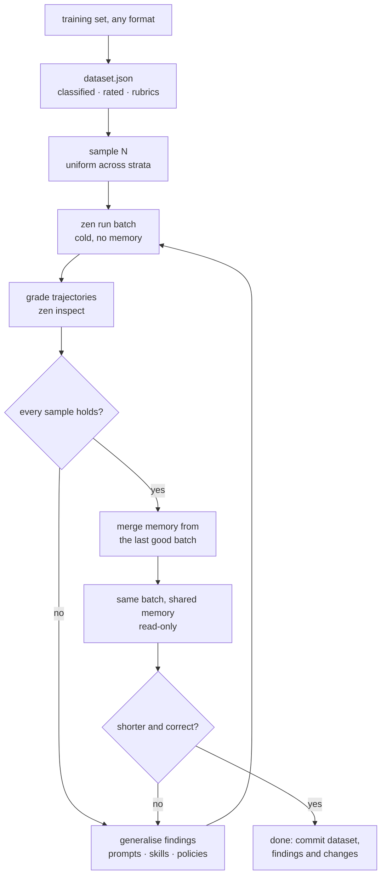

# Fine-tuning an agent project

Nothing here touches model weights. What gets tuned is the prose the project is
made of — the agent prompts, the skills, the house rules in `agents/` — and what
it is tuned against is a dataset of real queries and the trajectories they
produce. The model is fixed; the instructions around it are the parameters.

The reason it is a loop rather than a review is that an instruction's effect is
not legible from reading it. A rule that reads as obvious gets ignored; a rule
nobody expected to matter turns out to be load-bearing. The only way to know
which is which is to run the queries, read the graphs, change one thing, and run
them again — which is what everything below is about.



The dataset is built once and cached. Everything after it runs many times.

## What fine-tuning may change

| Artefact                                            | Changed by this loop                                                  |
| --------------------------------------------------- | --------------------------------------------------------------------- |
| `agents/prompts/<name>.md`                          | Yes — the usual place a per-agent finding lands                       |
| `agents/skills/<name>/SKILL.md`                     | Yes — when the fix is knowledge, not standing policy                  |
| `agents/instructions.md`                            | Yes — when the fix binds every agent in the project                   |
| `agents/<topic>-policy-instructions.md`             | Yes — new files are created here, one topic per file                  |
| `agents.yaml`                                       | Rarely — only when the finding is structural (wrong tools, wrong fan) |
| `agents/memory-instructions.md` and the other three | **Never.** They are `zen`'s copies; `zen check --fix` overwrites them |
| The dataset                                         | Only to add samples or fix a wrong rubric — never to make a run pass  |

Moving a failing sample's rubric to match what the agent did is not tuning. It
is deleting the test. If a rubric was wrong, say so in the round's notes and fix
it before the round, not after seeing the result.

## Phase 1 — Build the dataset

### The input is whatever the user has

A training set arrives as a section of `SPECIFICATION.md`, a markdown file of
headed examples, a transcript, a spreadsheet exported to CSV, a folder of
screenshots with captions. There is no format to parse, so do not try to write a
parser. Read the file, understand which parts are queries, and write out the
structure yourself. This is the one step in the loop that is a model's job and
not a script's.

What to look for:

| In the source                                                    | In the dataset                                                       |
| ---------------------------------------------------------------- | -------------------------------------------------------------------- |
| A heading like `## Query:` and a quoted string                   | One sample, `input` is the string                                    |
| A bullet list under `### Rubric:`                                | `rubric` — **verbatim**, one entry per bullet                        |
| An embedded image, a `` link, an audio or PDF attachment | A media part in `input`, path relative to the dataset file           |
| A paragraph of context before the query                          | `notes`, not `input` — unless the agent is meant to see it           |
| The expected answer                                              | `expected`, one string; it is context for grading, not a diff target |
| Nothing but a query                                              | A sample with no `rubric`. Still useful, ranked lower                |

Preserve the rubric word for word. A paraphrased rubric grades the paraphrase.

### The shape

Write `.finetune/dataset.json`:

```json
{
    "version": 1,
    "source": ["SPECIFICATION.md", "docs/examples/day-planning.md"],
    "extractedAt": "2026-03-04T10:12:00Z",
    "samples": [
        {
            "id": "planning-organize-day",
            "class": "planning",
            "complexity": "medium",
            "input": "organize my day",
            "rubric": [
                "calls api /mail/list",
                "calls api /calendar/list for today",
                "correlates emails with calendar events",
                "proposes a schedule, does not just list both"
            ],
            "expected": "A time-ordered plan naming the two conflicting meetings.",
            "notes": "From SPECIFICATION.md, worked example."
        },
        {
            "id": "receipts-photo-expense",
            "class": "extraction",
            "complexity": "simple",
            "input": ["file this expense", { "image": "./assets/receipt-014.jpg" }],
            "rubric": ["reads the total off the image", "does not invent a vendor"]
        }
    ]
}
```

`input` is exactly what `zen run batch` accepts: a string, or an array of parts.
A part is a string, `{ "text": "…" }`, or `{ "image" | "audio" | "video" | "file": "<path or url>" }`
with an optional `"mimeType"`. Relative paths resolve against the file they are
written in — so keep the generated `cases.json` in the same directory tree as the
media, or write absolute paths. Local media is inlined as base64 and capped at
20 MB per part, so reference a URL for anything large.

`id` names a directory under the batch dir. Letters, digits, dot, dash and
underscore only, unique across the dataset, and worth making readable:
`class-short-slug` means the batch directory listing is already an index.

### Classify only what the source already tells you

The instruction is "if obvious from the input" and it should be taken literally.
A class is a distinction the source makes — by section heading, by which agent or
API the example is about, by task type. Do not invent a taxonomy; six classes
over forty samples is useful, twenty classes over forty samples is one sample per
class and stratified sampling degenerates into taking everything. When a sample
fits nowhere, leave `class` out: the sampler groups those as `unclassified` and
they still get their share.

### Annotate complexity

Three levels, and rate the _trajectory_ the query demands, not the sentence:

| Level     | What it means                                                               |
| --------- | --------------------------------------------------------------------------- |
| `simple`  | One tool call or none; one agent; the answer is a lookup or a restatement   |
| `medium`  | Several calls that depend on each other, or one delegation, or one artefact |
| `complex` | Fan-out, multi-agent, ambiguity to resolve, or a plan that can go wrong     |

"organize my day" is three words and complex. Complexity is where the interesting
failures are, which is why the sampler spreads across it rather than letting the
easy majority set the score.

### It is a cache

Extraction is expensive and non-deterministic; re-doing it per round would make
two rounds incomparable. So `.finetune/dataset.json` is written once and read
thereafter. Re-extract only when the source files change, and when you do, keep
the existing ids stable — an id that moves breaks every previous round's
findings. Commit the dataset. It is the project's eval set from then on.

## Phase 2 — Sample

Input is limited: a batch of 100 complex runs is a lot of tokens and a long wait,
and nothing is learned from the eightieth one that the twentieth did not already
say. Pick a budget — 10 to 25 is a working round — and spend it evenly.

```sh
.github/skills/zen-finetune/scripts/sample.sh -n 16 -o .finetune/rounds/r1/cases.json
```

| Flag                   | Effect                                                    |
| ---------------------- | --------------------------------------------------------- |
| `-n <N>`               | Budget. Without it, everything, still in stratified order |
| `--class <name>`       | One class only — for a targeted round after a class fails |
| `--complexity <level>` | One level only                                            |
| `--rubric-only`        | Drop samples with no rubric                               |
| `--seed <n>`           | Deterministic. The same seed picks the same batch         |
| `-o <file>`            | Where to write; default stdout                            |

The sampler groups the dataset into strata of one class × one complexity, sorts
rubric-bearing samples to the front of each, and then takes one from each stratum
in turn until the budget runs out. Three consequences worth knowing:

- A budget smaller than the dataset still buys a cross-section of it, not the
  front of the file.
- Rare classes are over-represented relative to their share. That is deliberate.
  A class with two samples is the one most likely to be under-instructed.
- Graded samples come first, so a small budget is spent almost entirely on
  samples that can say _why_ they failed rather than only _what_ happened.

Keep the seed fixed across the rounds of one tuning session. Changing the sample
and the instructions at the same time means a difference in the score has two
possible causes and you cannot tell which.

## Phase 3 — Run cold

**Check the machine before the first cold batch, and again after any change to
`--concurrency`, to the indexes, or to the podman VM:**

```sh
.github/skills/zen-sandbox-capacity/scripts/preflight_sandbox.sh --concurrency 8 \
    && zen run batch …
```

It takes seconds, starts nothing you have to clean up, and exits non-zero when
the batch cannot fit. Skipping it is how five rounds get spent grading prose
that was never the cause. Load `zen-sandbox-capacity` if it refuses.

```sh
cd <project>
mkdir -p .finetune/rounds/r1
zen run batch \
    --input .finetune/rounds/r1/cases.json \
    --batch-dir .finetune/rounds/r1/batch \
    --memory .finetune/empty \
    --concurrency 8
```

`--memory` naming a directory that does not exist is how a batch is made cold:
each item gets its own empty graph, the project's real `memory/` is not read and
not touched, and every item still writes, so what it _chose_ to remember is
evidence. Never point a tuning batch at the project's live memory — a warm graph
means a run can succeed by recall instead of by instruction, which is precisely
the thing the cold phase exists to rule out.

Concurrency has two ceilings and the provider is only one of them. The default
is 16 and the cap is 32, but rate-limit errors turn a graded run into a retried
one — and the machine's ceiling is usually the lower of the two, because every
item is a container and the podman VM is not the host. Whichever binds first,
`--concurrency` is the dial; see `zen-sandbox-capacity` for the other ceiling.
`stdout` is the batch directory alone, so `BATCH="$(zen run batch …)"` is safe
to script. `<batch-dir>/README.md` is a live dashboard — open it while the
batch runs.

What lands:

```
.finetune/rounds/r1/batch/
    batch.json                   roster, counts, timings, memory mode, tokens per model
    README.md                    the dashboard
    <id>/output.json             the envelope: run.dir, run.graph, usage, output
    <id>/workspace/              anything the item wrote
    <id>/memory/                 what the item committed, if it committed anything
```

What a round cost is in both: `README.md` draws a `Tokens by model` table, and
`batch.json` carries the same split under `batch.models`. Read it per model — a
round that moved work onto a cheaper agent shows up there and nowhere else.

An item that fails is data, not an outage: its `output.json` holds
`{ "ok": false, "id", "error" }` and the rest of the batch still runs. Grade the
failures too — a crash is a finding.

## Phase 4 — Grade the trajectories

```sh
.github/skills/zen-finetune/scripts/collect.sh -d .finetune/rounds/r1/batch
.github/skills/zen-finetune/scripts/collect.sh -d .finetune/rounds/r1/batch graphs > /tmp/r1.mmd
```

`collect.sh index` prints one line per item — verdict, agent, stop reason,
tokens, duration, whether it has a rubric, and its run directory.
`collect.sh graphs` concatenates every item's `graph.mmd` with its id and rubric
as a header, which is one read instead of N invocations of `zen inspect graph`.

Then work item by item. Load **zen-inspect** for the mechanics; this is what to
look for.

### The three depths

| Depth                                                           | Answers                                           | Cost           |
| --------------------------------------------------------------- | ------------------------------------------------- | -------------- |
| The graph (`graph.mmd`, or `zen inspect graph --dir <run.dir>`) | What happened, in what order, and where it looped | Free           |
| `zen inspect node n13 --dir <run.dir>`                          | What a step actually said, sent or got back       | Free           |
| `zen inspect ask <llm_call-id> "…"`                             | Why the model chose this over that                | One model call |

Stay at the top for as long as it works. The `%%` header rows on the graph carry
`nodes`, `tokens`, `thinking`, `tools`, `branches`, `compacted` and `why` — and
the `tools` row is a loop detector: the same tool with the same arguments three
times is a finding without opening a single node.

Descend to `node` for evidence. A finding that does not cite node ids is an
impression, and impressions are how a tuning round produces a rule nobody needed.

`ask` is last, and it is worth the call in exactly one situation: the graph shows
a choice you cannot explain and the node contents do not explain it either. It
replays one `llm_call` with the same context, no tools, and writes nothing back —
so the answer is that call's own reasoning, not a reconstruction.

```sh
RUN="$(jq -r .run.dir .finetune/rounds/r1/batch/planning-organize-day/output.json)"
zen inspect graph --dir "$RUN"
zen inspect node n12 n13 --dir "$RUN" --part request --full
zen inspect ask n13 "why did you call /mail/list twice instead of paging the first result?" --dir "$RUN"
```

Treat the answer as testimony, not ground truth. It is the model's account of the
model's choice; it is useful because it names which instruction it was reading,
and that is the instruction you are about to change.

### The criteria

Grade each sample against all of these. The first is the user's; the rest apply
whether or not a rubric was written.

**1. Rubric compliance.** Every line of the rubric, checked against the graph.
Mark each `met` / `partial` / `missed` and cite the node. A rubric line naming an
API call is met by the call appearing with sensible arguments — not by the answer
claiming it was made.

**2. Optimality.** Did it take the short path? Symptoms, all visible in the
graph: the same read twice; a search that could have been one call made as four;
a tool loop; thinking tokens spent re-deriving something already in context; a
compaction that a shorter trajectory would not have needed. Record `nodes` and
`tokens` from the header — they are the round-over-round number.

**3. Memory hygiene.** Read `<id>/memory/` and the commit nodes. The rule is
commit what _produces_ the answer, not the material it was made from: a file
becomes a pointer, a call becomes the operation. So a run that stored the
_contents_ of `/mail/list` — today's inbox, a price, a status, a queue depth —
has cached a live reading as if it were a fact, and every later run is wrong.
What it should have stored is that the mail list is at that endpoint, what shape
it returns and what the useful filter was. The carve-outs are narrow: an answer
the agent assembled itself, and a source that genuinely cannot change. Also
check the other direction — a run that committed nothing at all when it learned
the shape of a new API has thrown the round away.

**4. Fork.** Independent work should fan out; dependent work must not. Look for:
serial calls with no data dependency between them (missed fork); branches that
read each other's output (a fork that should have been a sequence); a fork with
one branch (that is delegation, and should be written as delegation); branches
that all do the same thing with the same inputs. `branches` in the header and the
shape of the graph say all of it.

**5. Delegation.** Did it hand off to the right agent, and did it hand off at
all? Both failures are common: doing a specialist's job inline because the prompt
never said to delegate, and delegating a one-line question because the prompt
said to delegate too eagerly. Check the handoff carries enough context to be
answerable, and that the result comes back somewhere rather than ending the run.

**6. Tools and skills.** Did it use the tool it was given, or hand-roll the same
thing in a shell? Did it load the skill that covers the task — and if it loaded
it, did it then follow it? A skill loaded and ignored is a prose problem in the
skill, not a routing problem.

**7. Grounding.** Is every claim in the final answer traceable to something the
graph shows it read? An answer that is right by luck grades as a failure; it will
be wrong by luck next time.

**8. Failure handling.** When a tool returned an error, did it adapt, or did it
retry the identical call? The `tools` header row finds this in one line.

### Write it down

One file per round, `.finetune/rounds/r1/findings.md`, opening with the spec the
round was measured on and then one section per sample:

```md
# r1 — cold, --concurrency 8

machine: vm 12.0 GiB / 6 cpus · container 4096 MiB · index docs 3.2 GiB · host 36 GiB

## planning-organize-day — partial

| #   | Rubric                                  | Verdict | Evidence                      |
| --- | --------------------------------------- | ------- | ----------------------------- |
| 1   | calls api /mail/list                    | met     | n7                            |
| 2   | calls api /calendar/list for today      | met     | n9                            |
| 3   | correlates emails with calendar events  | partial | n14 — matched on subject only |
| 4   | proposes a schedule, does not just list | missed  | n21                           |

- optimality: 34 nodes, 61k tokens. n7 and n11 are the same /mail/list call (2)
- memory: committed the body of the 09:00 stand-up invite as a fact (3) — n18
- fork: n9 and n7 are independent and ran in sequence (4)
- delegation: none needed
```

Cite the criterion number. The next phase reads down the column.

The `machine:` line is not decoration. Token counts and wall clocks are only
comparable between rounds **measured on the same spec** — a resized VM
invalidates a baseline exactly as a prompt edit does, and a round with no spec
recorded cannot be compared to anything later. `preflight_sandbox.sh --json`
prints every figure on that line.

### A round with any exit 137 is void, not graded

Before grading anything, check how the round died:

```sh
.github/skills/zen-finetune/scripts/collect.sh <batch-dir> oom
```

An item killed at 137 ran out of memory; an item at 124 hit a timeout, which
under memory pressure is the same fault wearing a different number. Neither
produced evidence about the prompt. **Do not grade the round, do not change one
word of instruction on its basis, and do not compare its tokens to anything** —
fix the machine, then run it again. A round scored on OOM debris will send the
next round after a defect that does not exist.

`failures` will not catch this and neither will the dashboard. An item whose
command was killed usually recovers, answers anyway and is recorded `ok`; a
round can read `16 items, 16 ok, 0 failed` with six of them OOM-killed inside.
The kill is in the graph, not in the verdict, which is why this is a separate
mode and why it runs before grading rather than after.

## Phase 5 — Generalise

This is where a tuning round is won or lost. Collect every finding from every
item into one table before writing a single word of instruction, because the
unit of change is not a finding — it is a _pattern across findings_.

**One item is an anecdote.** A rule written from a single sample's failure fixes
that sample and adds a line every other run has to read. Three items missing the
same beat is a rule. Two items and a plausible mechanism is a judgement call.
One item is a note in `findings.md` and nothing else, unless the failure was
catastrophic.

Then, for each pattern, ask what the _generalisable_ form is. "Call
`/calendar/list` before answering a scheduling question" is not it — that is the
dataset written into the prompt, and it will not transfer to the next query. The
generalisable form is one level up: "when a request depends on the current state
of an external system, read that state before proposing anything that acts on
it." Same fix, and it covers the queries not in the dataset.

Two traps, both of which have cost whole rounds:

- **A prohibition with a self-judged exemption is a permission.** "Do not do X,
  except in rare cases where it is clearly warranted" is read by the model as
  "do X when you want to", because every case is clearly warranted from inside
  it. Either forbid it or do not.
- **Before rewriting a rule the agent keeps ignoring, grep the whole assembled
  prefix for the rule's own text.** House rules, the prompt and every preloaded
  skill are concatenated. A rule that is obeyed nowhere usually has a second,
  softer copy somewhere the agent reads more often. The contradiction is the
  bug; better adjectives are not the fix.

Prefer mechanical wording. Rules of the form "put X before Y", "if the path does
not end in `.py`, stop", "copy this literal verbatim" are followed. Rules that
require judgement — "be thorough", "generalise appropriately" — are followed
about half the time and are not worth their tokens.

## Phase 6 — Apply

Route each generalised rule by what kind of thing it is.

| The finding is…                               | It goes in                                          |
| --------------------------------------------- | --------------------------------------------------- |
| One agent's behaviour, one agent's job        | `agents/prompts/<agent>.md`                         |
| A fact, a format, an API shape, a procedure   | A skill — extend one, or create one                 |
| A standing rule every agent must obey         | `agents/instructions.md`                            |
| A standing rule about one capability          | `agents/<topic>-policy-instructions.md` — new file  |
| The wrong agent had the tool, or no agent did | `agents.yaml`, and say so loudly — it is structural |
| The dataset was wrong                         | `.finetune/dataset.json`, before the next round     |

New policy files are the usual output of a first round: `memory-policy-`,
`fork-policy-`, `tools-policy-`, `files-policy-instructions.md`. They sit beside
`zen`'s own four, they are yours, and `zen check --fix` does not touch them. Load
**zen-instructions** before writing one — in particular for two things it is easy
to get wrong: `requires:` is _not_ inherited, so a policy file must repeat the
condition of the file it sits next to (`requires: memory` beside
`memory-instructions.md`), and the files are prepended in filename order, so
`memory-policy-` reads after `memory-instructions.md`, which is what you want.

Never edit `agents/memory-instructions.md`, `agents/fork-instructions.md`,
`agents/tools-instructions.md` or `agents/files-instructions.md`. They are copies
of the runtime templates; `zen check` reports them stale when they drift and
`zen check --fix` replaces them wholesale, taking your edit with it. If a finding
genuinely belongs in one of those — that is, it is true of every Zenera project
and not just this one — change the master upstream in the CLI templates instead,
and note it in the round.

Record what changed and why in `.finetune/rounds/r1/changes.md`, one entry per
edit, each naming the finding numbers that motivated it. That file is what makes
the next round's diff interpretable, and it is what you read when a score goes
_down_.

Then, before re-running:

```sh
zen check
.github/skills/zen-review/scripts/check-paths.sh
```

A broken project fails every item for one reason, and a round spent discovering
that is a round wasted.

## Phase 7 — Re-run cold

Same cases file, same seed, new round directory, still no memory.

```sh
mkdir -p .finetune/rounds/r2
zen run batch --input .finetune/rounds/r1/cases.json \
    --batch-dir .finetune/rounds/r2/batch --memory .finetune/empty --concurrency 8
```

Re-use `r1/cases.json` rather than re-sampling — the point of the round is the
difference, and the difference only exists if the queries are identical. Compare
per sample and on the aggregate: verdicts, nodes, tokens.

Three things to watch for:

- **Regression.** A sample that passed in r1 and fails in r2 is the most valuable
  result in the round, and it is almost always the new instruction. Prose added
  for one agent is read by all of them.
- **The score going up for the wrong reason.** If the new rule names the
  dataset's own endpoints or entities, the batch passes and nothing generalises.
  Sample a query the dataset does not contain and try it by hand.
- **Prose growth.** If the instruction files have grown by a third and the score
  moved by one sample, the round was net negative. Delete something.

Loop until every sample in the batch behaves. Then widen: sample a _larger_ N
from the dataset with the same seed — the earlier items recur, so the previous
round's samples act as a regression set — and go again. Stop when a round
produces no generalisable pattern. That is the signal that the remaining failures
are the model's, not the prose's.

## Phase 8 — Memory

Only once the cold batch is green. Memory that compensates for a missing
instruction is a bug that looks like a feature: it works in the warm run, it
disappears whenever the graph is rebuilt, and it hides the real finding.

Note the division of labour, because it is the part most often confused:

- The **cold** phase grades what an agent _writes_ to memory. Each item has its
  own graph and writes freely, so criterion 3 is checked there.
- The **warm** phase grades what an agent _reads_. One shared graph, nobody
  writes, so every item sees the same memory and the comparison is clean.

Merge the last good round's memory into one graph, then run the same cases
against it read-only:

```sh
zen memory merge .finetune/rounds/r2/batch/*/memory --dir .finetune/rounds/r3/memory --yes
zen memory stats --dir .finetune/rounds/r3/memory

mkdir -p .finetune/rounds/r3
zen run batch --input .finetune/rounds/r1/cases.json \
    --batch-dir .finetune/rounds/r3/batch \
    --memory .finetune/rounds/r3/memory --memory-read-only --concurrency 8
```

The glob is safe: an item that committed nothing has its memory directory
deleted, so `*/memory` only ever matches real graphs. `--memory-read-only` shares
one graph across every item and clamps all writes — which is the only way to run
a batch against a single memory at all, since a writable graph is locked per
directory and would otherwise be copied per item.

Read `zen memory stats` before the run. A merged graph with forty near-duplicate
nodes says the cold phase's commit policy is too loose, and that is a phase-6 fix
before it is a phase-8 measurement.

### What "memory used correctly" looks like

| Good                                                                    | Bad                                                                  |
| ----------------------------------------------------------------------- | -------------------------------------------------------------------- |
| Fewer nodes and fewer tokens than the cold run, same verdict            | Same trajectory — memory was never consulted                         |
| Recall replaces a discovery step: it knows the endpoint without probing | Recall replaces a _reading_: it reports yesterday's inbox as today's |
| One recall near the top, then straight to work                          | Repeated searches of memory mid-run, finding nothing                 |
| Recalled facts are checked when they are cheap to check                 | A recalled fact contradicts a fresh reading and the recall wins      |
| The answer is at least as good                                          | The answer got worse — a stale fact short-circuited the work         |

The whole point is the second column of row one. Memory should shorten the
trajectory. If the warm batch costs more tokens than the cold one, memory is
being loaded and not used, and the fix is an instruction about _when_ to recall,
not more memory.

Compare warm against cold per sample:

```sh
for id in $(jq -r '.batch_results[].id' .finetune/rounds/r2/batch/batch.json); do
    cold=$(jq -r '.usage.inputTokens + .usage.outputTokens' ".finetune/rounds/r2/batch/$id/output.json")
    warm=$(jq -r '.usage.inputTokens + .usage.outputTokens' ".finetune/rounds/r3/batch/$id/output.json")
    printf '%-32s cold %8s  warm %8s\n' "$id" "$cold" "$warm"
done
```

Any sample that got longer or got worse goes back through phases 4 to 6, with
the fix landing in `agents/memory-policy-instructions.md`.

If the project will ship with a warm memory, the merged graph from the last good
round is the one to promote into `memory/`. Read **zen-memory-warmup** first —
seeding a project's memory deliberately is that skill's whole subject, and it has
the rules about what belongs in a shipped graph.

## The state directory

```
.finetune/
    dataset.json            built once, cached, committed
    rounds/
        r1/
            cases.json      the sample; re-used verbatim by later rounds
            batch/          zen run batch output
            findings.md     per-sample grading, with node citations
            changes.md      what was edited and which findings motivated it
        r2/ …
```

Commit `dataset.json`, `cases.json`, `findings.md` and `changes.md` — they are the
project's eval history and the reason a later reader can tell why an instruction
exists. The `batch/` directories are large, contain whole workspaces, and may
contain live API responses: ignore them. Add to `.gitignore`:

```
.finetune/rounds/*/batch/
.finetune/empty/
```

## Scripts this skill ships

| Script               | What it does                                                                                                   |
| -------------------- | -------------------------------------------------------------------------------------------------------------- |
| `scripts/sample.sh`  | `dataset.json` → `cases.json`, stratified, rubric-first, deterministic                                         |
| `scripts/collect.sh` | A batch directory → an index, the concatenated graphs, the run paths, or whether the round is gradeable at all |

Before the batch, `zen-sandbox-capacity` ships a third:
`.github/skills/zen-sandbox-capacity/scripts/preflight_sandbox.sh`, which
answers whether this machine can run the round you are about to start.

All find the project root from their own location and can be run from anywhere.
All are copies: `zen init` and `zen open` rewrite the whole `.github/` tree, so
an edit made here is gone at the next one. Change them upstream, in the CLI's
`templates/editor/.github/skills/` — that is the only place a change survives.

## Rules that are easy to get wrong

1. **Never tune against a warm memory.** A cold run is the only one whose result
   is attributable to the prose.
2. **Never change the sample and the instructions in the same round.** Two
   variables, one number, no conclusion.
3. **Never write a rule from one failing sample** unless the failure was
   catastrophic. Note it and wait for the pattern.
4. **Never edit `zen`'s four instruction files.** `zen check --fix` overwrites
   them. Project policy goes in a `-policy-` file beside them.
5. **Never adjust a rubric after seeing the run.** Fix a wrong rubric before the
   round and say so, or leave it.
6. **Never cite a finding without a node id.** If you cannot point at it in the
   graph, it did not happen.
7. **Never let a rule name the dataset.** Endpoints and entity names from the
   training set inside an instruction means the eval passes and the product does
   not.
8. **Re-run `zen check` after every edit round.** A load error fails every item
   identically and looks exactly like a catastrophic regression.
9. **Never grade a round that was OOM-killed.** `collect.sh oom` before
   anything else. An exit 137 is the machine, not the prose, and the items
   still report `ok`.
10. **Never compare two rounds measured on different machines.** Tokens and
    wall clock are only comparable within one spec; a resized VM invalidates a
    baseline exactly as a prompt edit does.

## When not to fine-tune

- **The project does not load.** `zen check` first; a round on a broken project
  measures nothing. Load **zen-review**.
- **The last round was OOM-killed.** Nothing about the prose is in question yet.
  Load **zen-sandbox-capacity**, size the machine, re-run the same round.
- **There is no training set.** Fewer than about eight queries is a debugging
  session, not a tuning loop — run them singly with `zen run` and read the graphs.
- **One run is behaving strangely.** That is diagnosis. Load **zen-inspect** and
  read that run.
- **The specification changed.** Reconciling prose with intent is
  **zen-spec-sync**'s job; tune after it, against what the project is meant to be.
- **The failure is the model's.** If three rounds of clear, mechanical
  instructions do not move a sample, the ceiling is the model. Change the model
  in `agents.yaml` and re-run the same batch — that is a legitimate experiment
  and the dataset is already set up for it.

## Related

- **zen-cli** — command surface, flags, exit codes, and what `--json` emits
- **zen-inspect** — the graph/node/ask loop, node kinds, and the symptom table
- **zen-instructions** — house rules, `requires:`, filename order, `zen check`
- **zen-memory** — the graph model, commit rules, audiences, `merge` and `stats`
- **zen-memory-warmup** — building a memory deliberately, and shipping one
- **zen-review** — the mechanical checks to run before and after every round
- **zen-sandbox-capacity** — whether the machine can run the batch; read it
  before the first cold round, and whenever one dies at 137 or 124
- **zen-spec-sync** — reconciling the project with its specification, before tuning
