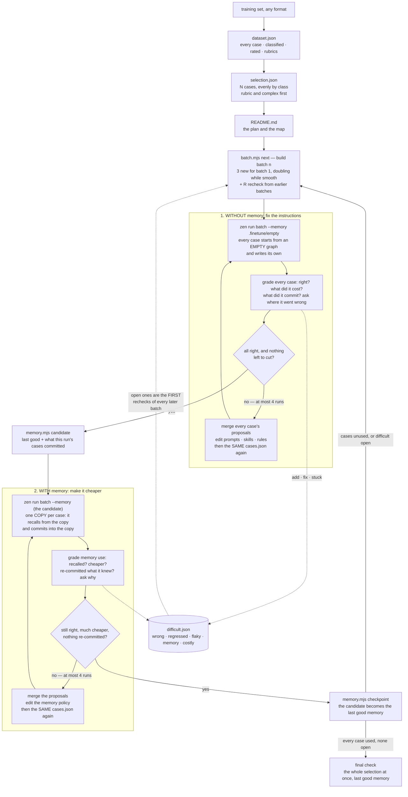
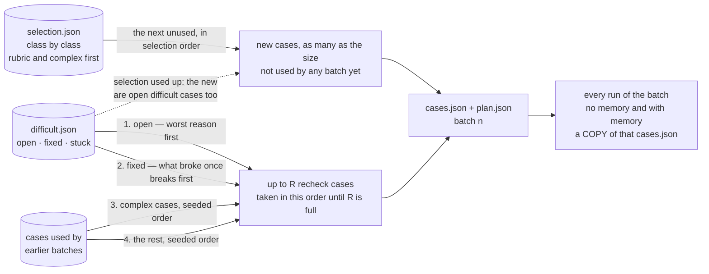
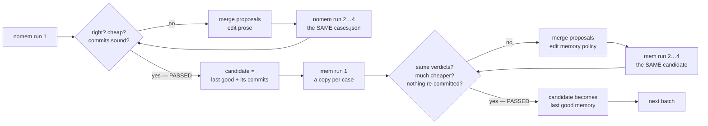
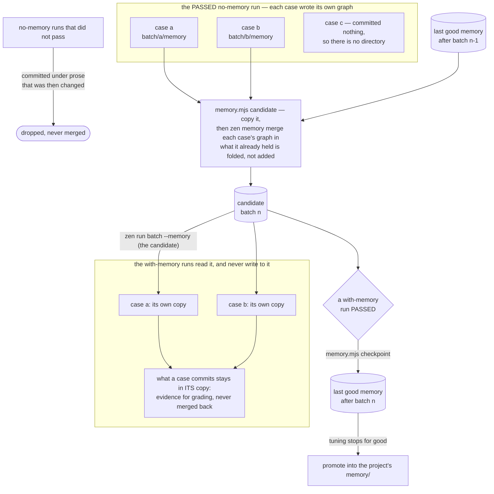

# Fine-tuning an agent project

Nothing here touches model weights. What gets tuned is the prose the project is
made of — the agent prompts, the skills, the house rules in `agents/` — and what
it is tuned against is a dataset of real queries and the trajectories they
produce. The model is fixed; the instructions around it are the parameters.

It is a loop rather than a review because an instruction's effect is not
legible from reading it. A rule that reads as obvious gets ignored; a rule nobody
expected to matter turns out to be load-bearing. The only way to know which is
which is to run the queries, read the graphs, change one thing, and run them
again — which is what everything below is about.

## Words

One word per idea, used everywhere — in findings, in the README, in reports.
When two words mean one thing, readers assume they mean two.

| Word                  | Means                                                                                                                 |
| --------------------- | --------------------------------------------------------------------------------------------------------------------- |
| **case**              | one query from the training set, with its rubric if it has one. `zen run batch` calls it an _item_                    |
| **dataset**           | every case in the training set — `.finetune/dataset.json`. Never cut down. Its size is written **T**                  |
| **limit** (N)         | how many cases this tuning uses — equal to T unless the user named a smaller number                                   |
| **selection**         | those N cases, chosen evenly by class, rubric and complex cases first — `.finetune/selection.json`                    |
| **batch**             | the cases worked on together until they pass without memory and then with it. See [What a batch is](#what-a-batch-is) |
| **batch size**        | how many new cases a batch takes: `minBatch` for batch 1, doubling after each smooth batch, up to `maxBatch`          |
| **recheck cases** (R) | cases from earlier batches, run again in a later one — difficult ones first, then complex ones                        |
| **run**               | one execution of a batch's cases — a no-memory run or a with-memory run                                               |
| **no-memory run**     | every case starts from an empty memory, and writes its own; tunes the instructions                                    |
| **with-memory run**   | every case starts from its own copy of the candidate memory; tunes the memory policy                                  |
| **proposal**          | one improvement a case's grading suggests — merged with the others before anything is edited                          |
| **passed**            | a run where every case is right AND its review found nothing left to cut                                              |
| **concurrency** (C)   | cases executing at the same time inside one run — 16 at most, halved on OOM, never below 4                            |
| **trajectory**        | what one case did in one run — its graph                                                                              |
| **difficult case**    | a case that caused real trouble — on `.finetune/difficult.json`, retested until `fixed` or `stuck`                    |
| **candidate memory**  | the last good memory plus what the batch's passing no-memory run committed — `memory.mjs path --candidate`            |
| **last good memory**  | every passed batch's candidate, in turn — `memory.mjs path`, always whole on disk                                     |

A run lives in `.finetune/runs/batch<NN>-<nomem|mem>-run<N>/` —
`batch03-nomem-run2` is batch 3's second run without memory, `batch03-mem-run1`
its first run with memory. Inside it, `batch/` is `zen run batch`'s own output
for that run: the command's name, not this method's.



The dataset is built once and cached. Everything after it runs many times.

## What a batch is

The selection is not run all at once, for two reasons. After forty trajectories
nobody reads the fortieth carefully. And after one big round of edits nobody can
say which edit helped and which hurt. A batch keeps both small enough to
handle: a few cases, read in full, fixed, and **confirmed** before anything else
starts.

### How big a batch is

Not fixed. The first batch is **3 cases** (`minBatch`): a smoke test of the
project, the sandbox, the scripts and the grading, on cases cheap enough to read
twice. A broken project, a missing key or a wrong rubric costs three trajectories
to find, not forty.

After that, `batch.mjs next` sizes each batch from how the one before went:

| The previous batch                                                                                      | This batch                           |
| ------------------------------------------------------------------------------------------------------- | ------------------------------------ |
| went smoothly — at most 2 no-memory runs, at most 2 with-memory runs, no case put on the difficult list | **twice** its size, up to `maxBatch` |
| needed more runs, or left a difficult case open                                                         | the **same** size                    |

So a project the prose already fits climbs 3 → 6 → 10 in three batches, and one
that fights every rule stays small, where each run is cheap and each edit
attributable. `-m <n>` overrides it for one batch; say why in the README.

### What is in a batch

There is no plan of batches drawn up in advance. `batch.mjs next` decides each
one when it is needed, from what has happened so far:



A `stuck` case is on none of those paths: it is out of the draw for good.

The selection is already ordered with classes taking turns, and inside a class
cases with a rubric first and the most complex first, so the first, smallest
batches are the hard, graded cases of every class — the ones that show the most
per trajectory read — and the large late batches are the simple ones. With 40
cases, a recheck of 3, and one case turning difficult in batch 3:

```
batch 1    3 new                     smoke test; nothing to recheck yet
batch 2    6 new  + 3 recheck        batch 1 was smooth: doubled; complex first
batch 3   10 new  + 3 recheck        doubled again, to maxBatch
batch 4   10 new  + 3 recheck        the difficult case first; size held at 10
batch 5   10 new  + 3 recheck        ...still first until it is fixed
batch 6    1 new  + 3 recheck        selection used up after this one
batch 7   open difficult cases only  + 3 recheck, if any are still open
```

`batch.mjs` with no arguments says where that stands: cases used, cases left,
the next size and why, difficult cases open, and the least number of batches
still ahead. `batch.mjs next -o <run>/cases.json` also writes `plan.json`
beside it — the size, why, which cases are new and which are rechecks — because
`cases.json` itself may hold nothing but cases.

The recheck cases are there to **fail**. A rule written for batch 3 is read by
every agent on every query, and the case it breaks is almost never in batch 3.
Without rechecks that breakage is found at the final check, five batches and a
dozen rules later, when nobody can say which rule did it. With them it is found
in the next batch, when the suspect is the handful of edits since. Complex
cases come before the rest because they touch the most rules.

A batch is built **once**, for its first no-memory run. Every later run — no
memory or with memory — gets a **copy** of that `cases.json`, never a rebuild:
the rechecks depend on the difficult list, which moves, and the copy is what
makes one run comparable to the next.

### What happens in a batch

Every case of the batch goes through the same fifteen steps, in two halves. The
first half fixes the instructions with memory out of the picture; the second
gives back the memory the first half wrote and makes the same work cheaper.

**Without memory** — runs `batch<NN>-nomem-run<N>`:

1. **Run** the batch with no memory: every case starts from an empty graph.
2. **Analyze** every trajectory: is it right, what did it cost, where is it
   suboptimal. At each critical point, `zen inspect ask` the model why.
3. **Read what it committed** to memory: durable facts and pointers, or live
   readings dressed up as facts?
4. **Propose** improvements, per case, each citing nodes and its `why` line.
5. **Merge** the proposals of every case into patterns — one rule per pattern,
   never one per case.
6. **Update** the prompts, skills, house rules and policy files — create the
   ones that do not exist yet.
7. **Run again**, no memory, the same cases.
8. **See** whether the edits worked: everything fixed, nothing broken, cheaper.
   If not, back to 2. At most 4 no-memory runs.

**With memory** — runs `batch<NN>-mem-run<N>`:

9. **Build the candidate memory** from the run that passed step 8: the last good
   memory, plus what each of its cases committed, merged — `zen memory merge`
   folds what the graph already held, so the same fact from two cases is one node.
10. **Run** the batch from the candidate. Every case gets **its own copy** of it,
    recalls from the copy and commits into the copy — nothing one case writes
    reaches another, or the candidate.
11. **Analyze the memory use**, against the no-memory run that passed: did it
    recall, did recall replace discovery, did it go cheaper, did it re-commit
    what it had just recalled? `zen inspect ask` where it did not.
12. **Merge** the proposals into patterns.
13. **Update** the memory policy — `agents/memory-policy-instructions.md`, and
    the memory paragraphs of a prompt or skill where a `why` line names one.
14. **Run again** from the same candidate, the same cases. Back to 11 until it
    passes. At most 4 with-memory runs.
15. **Keep it and move on**: the candidate becomes the last good memory, the
    difficult and complex cases are tracked for rechecks, and the next batch is
    built.



What each review looks at, and what a run must show to pass:

- **Correctness first, without memory.** A case that is wrong is the only work
  that run has: fix it, and grade the cost after the next run.
- **Cost next, in the same run** once every case is right: llm calls per case,
  missed forks, discovery it did not need. This is where most of the tuning
  happens. A batch right on run 1 has **not** passed — it has reached the cost
  work.
- **Memory last, with memory.** The same verdicts, a large saving, recall
  replacing discovery and never a live reading, and no commit of what memory
  already held.
- **Each next run is the identical `cases.json`.** The cases did not change, the
  machine did not change, the memory did not change; only the prose did. So the
  difference between two runs of one kind _is_ the edit — the one controlled
  experiment the whole method has.
- **Passed** is the first run of a kind where every case is right, new and
  recheck, **and** its review finds nothing more worth changing. That run applies
  no edits, so nothing unconfirmed is carried forward.

Each kind gets **at most 4 runs** per batch. By then either the rules are wrong
rather than under-worded, or the batch is as cheap as prose will make it. Stop,
revert what the last run did not confirm, put every case still wrong on the
difficult list, and pass it.

### Difficult cases, and why the number of batches is not fixed

A few cases cause most of the trouble, and passing their batch does not make
them easy. So they go on a list, and the list shapes every later batch.

**What makes a case difficult** — decided mechanically, after grading every run,
and recorded with `difficult.mjs add <id> --why <reason> --run <run>`:

| Reason      | When                                                                                       |
| ----------- | ------------------------------------------------------------------------------------------ |
| `wrong`     | still wrong after a run that tried to fix it — not merely wrong on run 1                   |
| `regressed` | a recheck case that failed                                                                 |
| `flaky`     | right in one run, wrong in a later run of the same cases, no rule aimed at it              |
| `memory`    | with memory: wrong, no cheaper, or re-committing what it recalled — after a run that tried |
| `costly`    | over 2x the batch's median llm calls in its passing run                                    |

**How they come back.** An open difficult case is the first recheck in every
later batch until it is fixed; with more open than R, the worst reason goes
first (`wrong`, `regressed`, `flaky`, `memory`, `costly`), then the fewest
retries. Once the selection is used up, a batch is made of open difficult cases
alone, up to the batch size, plus rechecks. A difficult case right in a
`PASSED` run is marked `difficult.mjs fix <id> --run <run>`, and stays ahead of
the other rechecks after that — what was hard once breaks again first. A case
added in a batch also keeps the next batch from growing.

**Stuck.** A case still open after `maxRetries` batches have held it since it was
added (default 3) is `stuck` — the model's ceiling, a wrong rubric, or a missing
tool. It is no longer picked, and it is reported at the end with what was tried.

**When the tuning ends.** When every case in the selection has been used and no
difficult case is open. So it takes at least limit ÷ `maxBatch` batches, plus
the small ones it starts with, plus as many as its difficult cases need — and
every difficult case ends `fixed` or `stuck`, so it always ends.

Before grading a batch that holds a difficult case, read its notes
(`difficult.mjs`) and every earlier `findings.md` that names it: the rules that
were already tried and did not work are the most useful thing known about it.

## The memory: candidate and last good

No-memory runs still write memory — each case into its own empty graph — and
what the passing no-memory run of a batch wrote is exactly what its with-memory
runs should be able to reuse. So when a no-memory run passes, it becomes a
**candidate**:

```sh
.github/skills/zen-finetune/scripts/memory.mjs candidate batch03-nomem-run2
```

That copies the last good memory into a new directory,
`.finetune/memory/candidate-batch03/`, and folds in what each of that run's
cases committed with `zen memory merge`. Merge drops what the graph already
holds, so the same endpoint learned by four cases is one node, and a fact an
earlier batch already knew is not added twice. The candidate is what every
with-memory run of the batch starts from: `zen run batch --memory` gives **every
case its own copy**, so a case recalls from its copy, commits into its copy, and
nothing it writes reaches another case or the candidate. Every with-memory run
of the batch starts from the same bytes.

When a with-memory run passes, the candidate is kept:

```sh
.github/skills/zen-finetune/scripts/memory.mjs checkpoint batch03-mem-run1
```

It renames the candidate to `.finetune/memory/after-batch03/` and only then
repoints `.finetune/memory/last-good.json` at it. A merge writes its files one
after another, so a merge killed half-way can leave a graph whose files
disagree — but only ever a candidate, never the graph the pointer names. The
last three graphs are kept to roll back to.



`next.mjs` will not let a with-memory run start without a candidate built from
the run that passed, nor the next batch be built until the candidate is kept.
So at any moment:

```sh
.github/skills/zen-finetune/scripts/memory.mjs                    # both, and what built them
.github/skills/zen-finetune/scripts/memory.mjs path               # the last good memory
.github/skills/zen-finetune/scripts/memory.mjs path --candidate   # the batch's candidate
```

names a whole graph holding everything the passed batches learned. If the
tuning stops for good it is the graph to promote into `memory/`. Only passing
runs go in: an earlier run of the same batch committed under prose that was then
changed, often while getting the answer wrong. And a with-memory run's copies
are never merged back — each holds the whole graph again, and what a case
committed there is graded, not kept.

A candidate with **0 nodes** means nothing was ever committed: the with-memory
run would measure nothing. That is a commit-policy finding for the no-memory
runs, and `memory.mjs candidate` says so.

### What may be compared to what

`report.mjs compare` will diff any two runs, so this is the rule most easily
broken:

| Comparison                                               | Valid   | Why                                                  |
| -------------------------------------------------------- | ------- | ---------------------------------------------------- |
| `batch03-nomem-run2` against `batch03-nomem-run1`        | **yes** | same cases, no memory, prose moved — the measurement |
| `batch03-mem-run2` against `batch03-mem-run1`            | **yes** | same cases, same candidate, memory policy moved      |
| `batch03-mem-run1` against the no-memory run that passed | **yes** | same cases, same prose, memory added — what it saves |
| `batch03-nomem-run1` against `batch02-nomem-run2`        | **no**  | different cases _and_ different prose                |

Never compare two different batches. If a number has to cover the whole tuning,
it is the per-batch table in the README, read as a trend, not an experiment.

## Why no memory first, then memory — in every batch

The two halves optimise different things and are graded on different evidence,
so they are never run together. But they are run **batch by batch**, not as two
long stages: the memory a batch builds is tested while the cases that built it,
and the rules that shaped it, are still in front of you.

|                    | **No-memory runs**                                                                 | **With-memory runs**                                                                        |
| ------------------ | ---------------------------------------------------------------------------------- | ------------------------------------------------------------------------------------------- |
| What is tuned      | agent prompts, skills, `agents/instructions.md`, policy files — and what to commit | the memory policy: when to recall, when to trust it, what not to commit again               |
| Memory at run time | `--memory .finetune/empty` — every case starts empty and **writes its own**        | `--memory "$(memory.mjs path --candidate)"` — every case starts from **its own copy**       |
| Graded on          | the eight criteria; the trajectory must be right _from nothing_                    | whether recall shortened the trajectory, and what was committed on top of a graph that knew |
| The win            | correctness — the right work for the right reason — then cost                      | speed and cost — the same verdicts for dramatically fewer tokens and less wall clock        |

**Both run the same tool surface, and that is the point.** A run given a memory
directory copies it per case and lets the case write — from an empty directory
without memory, from the candidate with it — so the agent sees the same tools
and the same house rules in both. `--memory-read-only` would share one graph
across the run instead, but it also clamps every agent's `access` to `read`,
which removes `memory_commit` from the schema and changes the memory prose. That
is two variables moving at once. Keep the flag for production-shaped runs; do
not tune with it.

**No-memory runs write memory but never read it.** That is half of what they
grade. Each case commits into its own empty graph, so the commits are a clean
record of what that run _thought was worth keeping_. Criterion 3 grades exactly
that: a run that cached today's inbox as a fact has poisoned every future run,
and a run that learned a new API's shape and committed nothing has wasted the
lesson. Fix those in the no-memory runs, because the candidate is built out of
these commits.

**With-memory runs never fix a no-memory problem.** A case that is wrong with no
memory is fixed before the batch reaches memory at all — memory would hide it,
and it would come back the day the graph is rebuilt. So a with-memory run edits
only the memory policy. A with-memory finding that needs any other prose is
noted, its cases go on the difficult list, and the next batch's no-memory runs
fix it, with those cases as rechecks.

A successful with-memory run is a large drop, not a small one. With no memory,
every run rediscovers the same endpoints, the same schema, the same layout,
every time. With memory it should recall them and go straight to work. A
with-memory run that is only a few percent cheaper has not used memory; it has
merely carried it.

## The settings

| Setting             | Is                                           | Chosen for                                                           |
| ------------------- | -------------------------------------------- | -------------------------------------------------------------------- |
| dataset size (T)    | every case in the training set               | nothing — it is whatever the training set holds                      |
| **limit** (N)       | cases this tuning uses, `N = T`              | nothing — the whole dataset, unless the user gives a number          |
| **minBatch**        | new cases in batch 1                         | a smoke test: 3                                                      |
| **maxBatch**        | the most new cases a batch grows to          | how many trajectories one grading pass can actually read; 8–12       |
| **recheck** (R)     | earlier cases re-run in each batch           | the regression guard and the difficult-case retest; 2–4              |
| **concurrency** (C) | the most cases running at once inside a run  | `min(maxBatch + recheck, 16)`; halved on an out-of-memory run, min 4 |
| **seed**            | makes the recheck order repeatable           | anything; just never change it mid-way                               |
| **maxRetries**      | batches a difficult case gets before `stuck` | 3                                                                    |

**Batch size is not concurrency**, and they are confused constantly because
both answer "how many at once". Batch size is how much evidence is collected
before prose may be edited; concurrency is how many of those cases run at one
time. A batch of 12 run 4 at a time is perfectly ordinary, and a batch of 3 at a
concurrency of 13 simply runs all three at once.

**Concurrency is not sized, it is backed off.** Start at
`min(maxBatch + recheck, 16)`. When a run is out of memory — `report.mjs oom`
finds an exit 137 — halve it, `C = max(4, floor(C / 2))`, write it to
`config.json` and run the same cases again. Nothing else changes it: no
preflight, no measuring, no raising it back. Out of memory at 4 means the
machine cannot run the batch — stop and tell the user.

Write them down once, in `.finetune/config.json`, so every script and every
resumed session agrees:

```json
{
    "datasetSize": 64,
    "limit": 64,
    "minBatch": 3,
    "maxBatch": 10,
    "recheck": 3,
    "concurrency": 13,
    "seed": 1,
    "maxRetries": 3
}
```

`limit`, `minBatch`, `maxBatch`, `recheck` and `seed` decide which cases go into
which batch. Changing any of them after batch 1 has run changes every batch
built after it — so fix them first and leave them alone. `concurrency` only ever
goes down, by halving, after an out-of-memory run; it is the machine, not the
experiment.

## The README

`.finetune/README.md` is the one page a person opens to understand the tuning.
**It is written by you, not generated**, and it is written for someone who has
never seen this project: plain words, real numbers, no jargon that is not in the
[Words](#words) table.

Start from [references/readme-template.md](references/readme-template.md). It has
every section, an example of each, and a comment saying when that section is
patched.

### Before the first run: write the plan

Once the settings are fixed and the cases selected, write the README whole:

- **What this is** — one paragraph: what is being tuned, against what, why.
- **Where we are** — one bold line: batch, run (no memory or with memory), and
  what is happening.
- **The plan** — the dataset by class (in the dataset / chosen / with a rubric,
  from `select.mjs`'s output); what a batch is, how it grows, and its two
  halves, in short paragraphs and the small loop diagram; how difficult cases
  come back; the memory; the settings, each with a one-line meaning.
- **Map** — a mermaid flowchart from the dataset to the final check: one node
  per batch, each with its two halves — `no memory` and `with memory` — and the
  last good memory it feeds; draw the batches the growth rule gives if every
  batch is smooth (3, 6, 10, 10, …). Four classes: `done`, `now`, `ahead`,
  `failed`. Before the first run, the dataset and selection are `done`, batch 1's
  no-memory half is `now`, everything else `ahead`. Batches the plan did not
  foresee — a batch that stayed small, the ones difficult cases add — are
  drawn when they are built, and a line under the map says what is left: unused
  cases, open difficult cases.
- **Batches**, **Difficult cases**, **Log**, **Results so far** — empty tables
  and headings.
- **Next** — the first run, in words, then the command.

### After every step: patch it

A step is: a run finishing, a run graded, edits applied, a candidate built, a
batch passing. After each, patch — do not rewrite — these parts:

| Part                | Patch                                                                                                                                                                                                                     |
| ------------------- | ------------------------------------------------------------------------------------------------------------------------------------------------------------------------------------------------------------------------- |
| **Where we are**    | always                                                                                                                                                                                                                    |
| **Map**             | always — move node ids between the `class` lines; update labels (`▶ run 2`, `✔ passed · 2 runs`, `✘ 1 unfixed`); add a node for each batch the plan did not foresee and fix the sizes drawn ahead; update the "left" line |
| **Batches**         | the current batch's row: size, new and recheck ids, runs so far of each kind, status, cases right (`7/8 + 3/3`), llm calls and tokens run to run, and with memory against without                                         |
| **Difficult cases** | whenever `difficult.mjs` changes: the list as it prints, with each case's reason and what has been tried                                                                                                                  |
| **Log**             | a new entry, newest first: what ran, what was found, what changed, links to `findings.md` and `changes.md`                                                                                                                |
| **Results so far**  | when a batch passes: cases used and passing out of N, instruction files changed, memory size and saving, open problems                                                                                                    |
| **Next**            | always — what `next.mjs` says, in words, then the command                                                                                                                                                                 |

The map must always have **exactly one** `now` node, everything before it
`done` or `failed`, everything after it `ahead`. A batch that passed with a case
the prose could not fix is `failed`, not `done`, and its label says how many.

`next.mjs` checks the README's age: if a run's `batch.json`, `findings.md` or
`changes.md`, or a memory pointer, is newer than the README, its first line says
`first: patch .finetune/README.md`. Do that before anything else. A README that is
only right at the end is one nobody trusts in the middle, which is the only time
it is useful.

The Plan section changes only if a setting changes — and then the Log says so
and why.

## What fine-tuning may change

| File                                                | Run kind    | Changed by this loop                                                  |
| --------------------------------------------------- | ----------- | --------------------------------------------------------------------- |
| `agents/prompts/<name>.md`                          | no memory   | Yes — the usual place a per-agent finding lands                       |
| `agents/skills/<name>/SKILL.md`                     | no memory   | Yes — when the fix is knowledge, not standing policy                  |
| `agents/instructions.md`                            | no memory   | Yes — when the fix binds every agent in the project                   |
| `agents/<topic>-policy-instructions.md`             | no memory   | Yes — new files are created here, one topic per file                  |
| `agents/memory-policy-instructions.md`              | both        | Yes — what to commit without memory; recall and re-commit with it     |
| the memory paragraph of a prompt or skill           | with memory | Only where an ask's `why` line names it                               |
| `agents.yaml`                                       | —           | No — a structural finding is an open problem in the README            |
| `agents/memory-instructions.md` and the other three | —           | **Never.** They are `zen`'s copies; `zen check --fix` overwrites them |
| The dataset                                         | —           | Only to add cases or fix a wrong rubric — never to make a run pass    |

Moving a failing case's rubric to match what the agent did is not tuning. It is
deleting the test. If a rubric was wrong, say so in the run's findings and fix it
before the next run, not after seeing the result.

## Phase 1 — Build the dataset: every case

### All of it

Read **the whole training set** and write **every case** into the dataset. No
limit, no sampling, no "the first twenty to get going". The dataset is the
record of everything the project is meant to handle, and it is cached and reused
by every tuning after this one; cutting it here loses cases for good. How many
of them this tuning _uses_ is the limit, and the limit is applied in phase 2,
by `select.mjs`, evenly across classes — never here.

### The input is whatever the user has

A training set arrives as a section of `SPECIFICATION.md`, a markdown file of
headed examples, a transcript, a spreadsheet exported to CSV, a folder of
screenshots with captions. There is no format to parse, so do not write a
parser. Read the file, understand which parts are queries, and write out the
structure yourself. This is the one step in the loop that is a model's job and
not a script's. Large sources are read in parts; the dataset is appended to as
you go, and the count is checked against the source at the end.

| In the source                                                    | In the dataset                                                       |
| ---------------------------------------------------------------- | -------------------------------------------------------------------- |
| A heading like `## Query:` and a quoted string                   | One case, `input` is the string                                      |
| A bullet list under `### Rubric:`                                | `rubric` — **verbatim**, one entry per bullet                        |
| An embedded image, a `` link, an audio or PDF attachment | A media part in `input`, path relative to the dataset file           |
| A paragraph of context before the query                          | `notes`, not `input` — unless the agent is meant to see it           |
| The expected answer                                              | `expected`, one string; it is context for grading, not a diff target |
| Nothing but a query                                              | A case with no `rubric`. Still useful, selected after graded ones    |

Preserve the rubric word for word. A paraphrased rubric grades the paraphrase.

### The shape

Write `.finetune/dataset.json`:

```json
{
    "version": 1,
    "source": ["SPECIFICATION.md", "docs/examples/day-planning.md"],
    "extractedAt": "2026-03-04T10:12:00Z",
    "cases": [
        {
            "id": "planning-organize-day",
            "class": "planning",
            "complexity": "medium",
            "input": "organize my day",
            "rubric": [
                "calls api /mail/list",
                "calls api /calendar/list for today",
                "correlates emails with calendar events",
                "proposes a schedule, does not just list both"
            ],
            "expected": "A time-ordered plan naming the two conflicting meetings.",
            "notes": "From SPECIFICATION.md, worked example."
        },
        {
            "id": "receipts-photo-expense",
            "class": "extraction",
            "complexity": "simple",
            "input": ["file this expense", { "image": "./assets/receipt-014.jpg" }],
            "rubric": ["reads the total off the image", "does not invent a vendor"]
        }
    ]
}
```

`input` is exactly what `zen run batch` accepts: a string, or an array of parts.
A part is a string, `{ "text": "…" }`, or `{ "image" | "audio" | "video" | "file": "<path or url>" }`
with an optional `"mimeType"`. Relative paths resolve against the file they are
written in — so keep the generated `cases.json` in the same directory tree as the
media, or write absolute paths. Local media is inlined as base64 and capped at
20 MB per part, so reference a URL for anything large.

`id` names a directory under the batch dir. Letters, digits, dot, dash and
underscore only, unique across the dataset, and worth making readable:
`class-short-slug` means the batch directory listing is already an index.

### Classify only what the source already tells you

A class is a distinction the source makes — by section heading, by which agent or
API the example is about, by task type. Do not invent a taxonomy. The limit is
spread evenly by class, so the classes decide what "a fair share" means: six
classes over sixty cases is useful, twenty classes over sixty is three cases each
and the limit spreads too thin to say anything about any of them. A case that
fits nowhere gets no `class`; it is selected as `unclassified` and still gets its
share.

### Rate complexity

Three levels, and rate the _trajectory_ the query demands, not the sentence:

| Level     | What it means                                                               |
| --------- | --------------------------------------------------------------------------- |
| `simple`  | One tool call or none; one agent; the answer is a lookup or a restatement   |
| `medium`  | Several calls that depend on each other, or one delegation, or one artefact |
| `complex` | Fan-out, multi-agent, ambiguity to resolve, or a plan that can go wrong     |

"organize my day" is three words and complex. The selection puts the complex
cases of each class first, so a rating that is too low hides a case in the late
batches; when unsure, rate up.

### It is a cache

Extraction is expensive and non-deterministic; re-doing it per tuning would make
two tunings incomparable. So `.finetune/dataset.json` is written once and read
thereafter. Re-extract only when the source changes, and keep existing ids
stable — an id that moves breaks every earlier run's findings. Commit it. It is
the project's eval set from then on. When done, report the count per class and
confirm it matches the source.

## Phase 2 — Select the cases, write the README

### Select

```sh
.github/skills/zen-finetune/scripts/select.mjs -o .finetune/selection.json
```

| Flag                   | Effect                                                             |
| ---------------------- | ------------------------------------------------------------------ |
| `-n`, `--limit <n>`    | How many cases. Default `config.json` `limit`, else all            |
| `--class <name>`       | One class only — for a targeted pass after a class fails           |
| `--complexity <level>` | One level only                                                     |
| `--rubric-only`        | Only cases with a rubric                                           |
| `--seed <n>`           | Default `config.json` `seed`. The same seed chooses the same cases |
| `-o <file>`            | Where to write; default stdout                                     |

It chooses from **the whole dataset**, evenly by class:

1. Cases are grouped by class.
2. Inside a class, cases with a rubric come first, and among those the most
   complex first — complex, medium, simple — then the cases with no rubric in
   the same order.
3. Classes take turns: one case from each class, then a second from each, and so
   on until the limit is spent.

So a limit of 12 over 4 classes is 3 of each, however lopsided the dataset is;
a class with fewer cases than its share gives all it has and the others carry on.
Small classes are therefore over-represented relative to their share of the
dataset. That is deliberate: a class with three cases is the one most likely to
be under-instructed. It prints chosen / available per class — put that table in
the README.

`limit` is `datasetSize` — every case is tuned against. A smaller limit is only
ever the user's choice: write one only when they give a number, never to save
cost or time on your own judgement, and then say in the README which classes
lost the most. A limit below the dataset silently drops cases the project is
meant to handle, and nothing downstream will notice.

The order `select.mjs` writes is also the order batches take new cases in, so
every batch is already a mix of classes — and the first, small batches hold the
graded, complex case of each class. A graded case says _why_ it failed; a
complex one exercises the most rules per trajectory read. That is where the
first edits should come from. The simple cases arrive last, in the large
batches, when the prose has settled and they mostly confirm it.

### Write the README

Now, before anything runs — see [The README](#the-readme).

## Phase 3 — Build a batch, run it without memory (step 1)

```sh
.github/skills/zen-finetune/scripts/batch.mjs            # progress: used, left, next size, difficult open
.github/skills/zen-finetune/scripts/batch.mjs next -o .finetune/runs/batch01-nomem-run1/cases.json
```

| Flag         | Effect                                                        |
| ------------ | ------------------------------------------------------------- |
| _(none)_     | Progress: cases used, left, next size and why, difficult open |
| `next`       | Build the next batch; with `-o`, also `plan.json` beside it   |
| `-m <size>`  | New cases in this batch, overriding the growth rule — say why |
| `-r <count>` | Recheck cases; default `config.json` `recheck`                |
| `-o <file>`  | Where to write; default stdout                                |
| `--seed <n>` | Default `config.json` `seed`                                  |

`next` prints the size and why, which cases are new, which are rechecks and what
is left after it — put that in the README's batch row. It is built **once**, for
the first no-memory run; every later run of the batch copies that file.

```sh
RUN=.finetune/runs/batch01-nomem-run1
C=$(node -p 'require("./.finetune/config.json").concurrency')
.github/skills/zen-finetune/scripts/batch.mjs next -o "$RUN/cases.json"
zen run batch \
    --input "$RUN/cases.json" \
    --batch-dir "$RUN/batch" \
    --memory .finetune/empty \
    --concurrency "$C"
```

Then patch the README.

`--memory` naming a directory that does not exist is how a run gets no memory:
each case gets its own empty graph, the project's real `memory/` is not read and
not touched, and every case still writes, so what it _chose_ to remember is
evidence. Never point a tuning run at the project's live memory — a graph with
content means a run can succeed by recall instead of by instruction, which is
exactly what a no-memory run exists to rule out.

Concurrency always comes from `config.json` — read it fresh for every run.
`zen run batch`'s own default is 16 and its cap 32; the tuning never goes above 16. `stdout` is the batch directory
alone, so `BATCH="$(zen run batch …)"` is safe to script. `<batch-dir>/README.md`
is a live dashboard of the run — open it while it runs.

What lands:

```
.finetune/runs/batch01-nomem-run1/
    cases.json                   new + recheck; built once here, copied for every later run
    plan.json                    size, why, which are new, which are rechecks
    batch/
        batch.json               roster, counts, timings, memory mode, tokens per model
        README.md                the batch's own live dashboard
        <id>/output.json         the envelope: run.dir, run.graph, usage, output
        <id>/workspace/          anything the case wrote
        <id>/memory/             what the case committed, if anything
```

`batch.json` carries tokens per model under `batch.models`. Read it per model — a
run that moved work onto a cheaper agent shows up there and nowhere else.

A case that fails is data, not an outage: its `output.json` holds
`{ "ok": false, "id", "error" }` and the rest of the run still goes on. Grade the
failures too — a crash is a finding. In batch 1 a crash is most likely the
project, the sandbox or a key, not the prose: that is what the smoke test is
for. Fix it and run the three cases again before anything is graded.

## Phase 4 — Grade without memory (steps 2–4)

### A run with any exit 137 is void, not graded

Before grading anything, check how the run died:

```sh
.github/skills/zen-finetune/scripts/report.mjs -d "$RUN/batch" oom
```

A case killed at 137 ran out of memory; a case at 124 hit a timeout, which under
memory pressure is the same fault wearing a different number. Neither produced
evidence about the prompt. **Do not grade the run, do not change one word of
instruction on its basis, and do not compare its tokens to anything**. Write
`## VOID` in its `findings.md`, halve `concurrency` in `.finetune/config.json`
(never below 4), and run a copy of its `cases.json` as the next run. A void run
does not count toward the run cap. `next.mjs` prints the exact value to set. Out
of memory at concurrency 4 is the one machine failure that stops the tuning:
stop and tell the user.

A 124 with no 137 is not void by itself; if timeouts repeat in the next run,
halve the concurrency the same way.

`failures` will not catch this. A case whose command was killed usually
recovers, answers anyway and is recorded `ok`; a run can read `16 items, 16 ok,
0 failed` with six of them OOM-killed inside. The kill is in the graph, which is
why `oom` is a separate mode and runs first.

### Read

```sh
.github/skills/zen-finetune/scripts/report.mjs -d "$RUN/batch"
.github/skills/zen-finetune/scripts/report.mjs -d "$RUN/batch" answers
.github/skills/zen-finetune/scripts/report.mjs -d "$RUN/batch" graphs > /tmp/batch01-run1.mmd
```

`report.mjs` with no mode prints one line per case — ok, agent, stop reason,
tokens, seconds, rubric lines. `answers` prints each case's final answer under
its rubric. `graphs` concatenates every case's `graph.mmd`
with its id and rubric above it: one read instead of one `zen inspect graph` per
case. `compare` is the per-case cost table the findings open with, and it is the
last thing this phase does — read the trajectories before the numbers, or the
numbers decide what you look at.

**Every question about a run has a command.** Never open `output.json`,
`batch.json`, `state.json` or a memory's `graph.json` with `node -e`,
`python -c` or `jq` — the formats are the CLI's, and a guess at one costs a
probe call to find out it was wrong.

| Question                                               | Command                                                    |
| ------------------------------------------------------ | ---------------------------------------------------------- |
| A case's trajectory directory                          | `report.mjs -d "$RUN/batch" paths <id>`                    |
| What it answered, under its rubric                     | `report.mjs -d "$RUN/batch" answers <id>`                  |
| What it committed (against the candidate, with memory) | `report.mjs -d "$RUN/batch" commits <id>`                  |
| Every recall and memory tool step, top recalls         | `report.mjs -d "$RUN/batch" recalls <id>`                  |
| One memory node in full, with its links                | `zen memory show <node-id> --dir "$RUN/batch/<id>/memory"` |
| A whole memory                                         | `zen memory ls --dir <dir> --limit 200`                    |
| What one memory holds that another did not             | `zen memory diff <base> --dir <dir>`                       |
| One step of a trajectory                               | `zen inspect node <nN> --dir <trajectory dir>`             |

Then work case by case. Load **zen-inspect** for the mechanics,
**zen-analyze-run** for how to read one trajectory's decisions, and
**zen-inspect-ask** before the first `zen inspect ask` - which node, what to
rule out first, how to word the question. The audit checklist of
zen-analyze-run (memory used and saved, delegation, forking, tool use, cost) is
what to look for under criteria 2-8 below, and its section on `zen inspect ask`
says when to question the model at a critical point. Do not write its full
report per case - `findings.md` is the report here.

### The three depths

| Depth                                                           | Answers                                                  | Cost           |
| --------------------------------------------------------------- | -------------------------------------------------------- | -------------- |
| The graph (`graph.mmd`, or `zen inspect graph --dir <run.dir>`) | What happened, in what order, and where it looped        | Free           |
| `zen inspect node n13 --dir <run.dir>`                          | What a step actually said, sent or got back              | Free           |
| `zen inspect ask <llm_call-id> --question-file <f>`             | Why the model chose this over that - the sentence to fix | One model call |

Stay at the top for as long as it works. The `%%` header rows on the graph carry
`nodes`, `tokens`, `thinking`, `tools`, `branches`, `compacted` and `why` — and
the `tools` row is a loop detector: the same tool with the same arguments three
times is a finding without opening a single node.

Descend to `node` for evidence. A finding that does not cite node ids is an
impression, and impressions are how a run produces a rule nobody needed.

`ask` is for the **critical points** - the `llm_call` where the trajectory
went wrong: research started without searching memory, recalled memory ignored,
independent lookups run in series instead of forked, a handoff too early, a
tool misused or a failing call repeated, a loaded skill not followed. The graph
and the nodes show **what** it did there; only the replay says **which
sentence** made it do it, and that sentence is what phase 5 will change.

Load **zen-inspect-ask** before the first ask, then follow it for every ask:
rule out the cheap causes first
(tool not offered, instruction file absent, skill not loaded, context
compacted), pick the `llm_call` that made the choice, and word the question for
a model that sees only its own context - no node ids, "why didn't you ...", the
fixed answer shape. Never ask every call. Across a batch, ask **once per
pattern, not once per case**: the clearest case of the pattern, at the call
that made the choice. A replay carries the whole conversation up to that call,
so one ask at the right node covers the steps before it.

```sh
DIR="$(.github/skills/zen-finetune/scripts/report.mjs \
    -d .finetune/runs/batch01-nomem-run1/batch paths planning-organize-day | cut -f2)"
zen inspect graph --dir "$DIR"
zen inspect node n12 n13 --dir "$DIR" --part request --full
# .tmp/ask/planning-organize-day/n13-paging.md, written with your file tool:
#   Why did you call /mail/list a second time instead of paging the first result?
#   (then the answer shape from zen-inspect-ask)
zen inspect ask n13 --question-file .tmp/ask/planning-organize-day/n13-paging.md --dir "$DIR"
```

Treat the answer as testimony, not ground truth. It is useful because it names
which instruction the model was reading, and that is the instruction you are
about to change. Grep every quote it gives in the node's `request` before using
it; an answer whose quote is not there is discarded.

### The criteria

Grade each case against all of these. The first is the user's; the rest apply
whether or not a rubric was written.

They are listed in the order to act on them. **Correctness gates everything**: a
run where a rubric line is missed, or where a recheck case regressed, has no
optimisation work in it at all — fix the correctness and grade the cost next run.
Once every case is right, criteria 2 and 4 become the objective **in that same
run** — not in some later pass — and in that order: fewer llm calls first,
because it is the number that moves most and is read straight off the graph
header; then fan-out, because a fork turns a long trajectory into a wide one.
The [cost review](#the-cost-review) below is how that is written down.

**1. Rubric compliance.** Every line of the rubric, checked against the graph.
Mark each `met` / `partial` / `missed` and cite the node. A rubric line naming an
API call is met by the call appearing with sensible arguments — not by the answer
claiming it was made. **Recheck cases are graded exactly as hard as new ones.**
One of them failing ends the batch's progress: a rule written since is the
suspect, and it is reverted or narrowed before anything else is written.

**2. Optimality — the short path, and the assumptions that shorten it.** Three
separable faults, all visible in the graph:

- _Repeated work._ The same read twice; a search that could have been one call
  made as four; a tool loop; thinking tokens spent re-deriving something already
  in context; a compaction a shorter trajectory would not have needed.
- _Discovery it did not need._ A probe for something it had already been told —
  it lists a directory to find a file the skill names, queries to learn a shape
  the prompt states, or reads a config to confirm a default. This is the
  assumption fault, and it is nearly always fixed in a skill rather than a
  prompt: the agent guessed conservatively because nothing authoritative said
  otherwise.
- _Assumptions that were wrong._ The mirror image, and worse — it went straight
  to an answer it had no grounds for. That is criterion 7, not this one.

Record `nodes`, `llm` and `tokens` from the header. The llm-call count is the
run-to-run number; tokens are the one that swings.

**3. Memory hygiene — what it committed (step 3).** Start from
`report.mjs -d "$RUN/batch" memory` — commits per case — then
`report.mjs -d "$RUN/batch" commits` — every node each case committed, kind,
audience and text — and the commit nodes. Every commit becomes part of the candidate
the with-memory runs start from, so this is graded as hard as the answer. The rule is
commit what _produces_ the answer, not the material it was made from: a file
becomes a pointer, a call becomes the operation. A run that stored the
_contents_ of `/mail/list` — today's inbox, a price, a status, a queue depth —
has cached a live reading as if it were a fact, and every later run is wrong.
What it should have stored is that the mail list is at that endpoint, what shape
it returns and what the useful filter was. The carve-outs are narrow: an answer
the agent assembled itself, and a source that genuinely cannot change. Also
check the other direction — a run that committed nothing when it learned the
shape of a new API has wasted the lesson, and its with-memory run will have
nothing to recall.

**4. Fork.** Independent work should fan out; dependent work must not. Look for:
serial calls with no data dependency between them (missed fork); branches that
read each other's output (a fork that should have been a sequence); a fork with
one branch (that is delegation, and should be written as delegation); branches
that all do the same thing with the same inputs. `branches` in the header and the
shape of the graph say all of it.

**5. Delegation.** Did it hand off to the right agent, and did it hand off at
all? Both failures are common: doing a specialist's job inline because the prompt
never said to delegate, and delegating a one-line question because the prompt
said to delegate too eagerly. Check the handoff carries enough context to be
answerable, and that the result comes back somewhere rather than ending the run.

**6. Tools and skills.** Did it use the tool it was given, or hand-roll the same
thing in a shell? Did it load the skill that covers the task — and if it loaded
it, did it then follow it? A skill loaded and ignored is a prose problem in the
skill, not a routing problem.

**7. Grounding.** Is every claim in the final answer traceable to something the
graph shows it read? An answer that is right by luck grades as a failure; it will
be wrong by luck next time.

**8. Failure handling.** When a tool returned an error, did it adapt, or did it
retry the identical call? The `tools` header row finds this in one line.

### Write it down: findings.md

One file per run, `.finetune/runs/batch01-nomem-run1/findings.md`. It opens
with a **verdict block** — a plain answer to "are we making progress", what was
changed to get there, and the per-case table that supports it or does not — and
only then the per-case grading.

Write the verdict block last and put it first. Someone who has not read the
earlier runs should learn from the top of the page whether the work is moving;
someone who has should be able to stop after it.

The table is not typed by hand. `compare` builds it against the previous run and
prints markdown ready to paste:

```sh
.github/skills/zen-finetune/scripts/report.mjs \
    -d .finetune/runs/batch03-nomem-run2/batch \
    -p .finetune/runs/batch03-nomem-run1/batch compare
```

Every column comes from the run itself — tokens from `output.json`, llm calls,
tool calls and forks from the graph's own `%% nodes` header row, memory reads
and commits from its `%% tools` row, the `known` count from what the commit
results said, time from `durationMs`. The one column it leaves as `?` is
**verdict**: whether a case is right is the judgement grading made, and no
script can read it off a trajectory.

Above the table it prints a `memory:` line for this run and, when comparing, a
`prev memory:` line for the other. Paste both. The same numbers mean opposite
things with and without memory, and `batch.json` records
`--memory .finetune/empty` as mode `copied` exactly like a with-memory run — so
do not read the mode out of the JSON by eye; `report.mjs` decides it by whether
the source is a real graph.

```md
# batch03-nomem-run2 — NO MEMORY, --concurrency 7

## PROGRESS — one case fixed, none broken

memory: NO MEMORY — every case started from an empty graph and wrote its own (.finetune/empty)
prev memory: NO MEMORY — every case started from an empty graph and wrote its own (.finetune/empty)

**Changed since run 1:** one paragraph in `agents/skills/rag_search/SKILL.md`
(+11 lines) — a question naming two products is two lookups, and the worst
verdict decides.

| case                             | verdict | tokens                   | llm calls | tool calls | forks   | memory reads | commits (known) | time               |
| -------------------------------- | ------- | ------------------------ | --------- | ---------- | ------- | ------------ | --------------- | ------------------ |
| info-upgrade-pair-4100-4110      | ✘ → ✔   | 923k → 2.04M (+121%)     | 23 → 49   | 24 → 47    | 1 (=)   | 1 (=)        | 1 → 2           | 74s → 128s (+73%)  |
| info-intel-4120-compat-420 _(r)_ | ✔ → ✔   | 676k → 1.09M (+61%)      | 24 → 33   | 21 → 30    | 1 (=)   | 1 (=)        | 1 → 1           | 70s → 79s (+13%)   |
| info-malware-profiles-medium-412 | ✘ → ✘   | 3.40M → 1.00M (−70%)     | 65 → 41   | 61 → 36    | 2 (=)   | 2 → 1 (−1)   | 3 → 1           | 222s → 107s (−52%) |
| code-can-vms-talk _(r)_          | ✔ → ✔   | 1.20M → 4.80M (+302%)    | 35 → 124  | 32 → 113   | 1 → 5   | 1 (=)        | 0 → 0           | 93s → 463s (+398%) |
| **total**                        | 14 → 15 | **19.7M → 24.3M (+23%)** | 585 → 717 | 517 → 637  | 27 → 31 | 18 → 17      | 21 → 19         | 1602s → 1922s      |

_(r)_ marks a recheck case. Both still pass, so the rule broke nothing earlier —
which is the first thing this table has to answer.

**Effect:** `info-upgrade-pair-4100-4110` is fixed and nothing regressed. The
+121% on it is the second lookup the rule asks for — the cost of the fix.

**Not the rule's doing:** `code-can-vms-talk` alone is +3.6 M of the +4.5 M, and
124 llm calls against 35 is a loop, not variance — the rule cannot reach that
case. Without it the run moves +5%, inside the noise floor.

**Verdict:** keep. One case fixed for eleven lines. Fix the loop next run.

machine: concurrency 8 · vm 12.0 GiB / 6 cpus · host 36 GiB

## Cost review

llm calls per case: median 33; above 1.5x: `code-can-vms-talk` 124 — loop, see below.

- repeated work: `code-can-vms-talk` n40–n118 re-runs `rag_search` with the same
  query 27 times after an empty result; `info-malware-profiles-medium-412` n12
  and n19 are the same lookup. Pattern (2 cases + 1 in batch 1): no rule says
  what to do on an empty result → rule for the rag_search skill.
- missed forks: `info-upgrade-pair-4100-4110` n8–n31 looks the two products up
  one after the other; they are independent → fork rule in the researcher prompt.
- unneeded discovery: none — checked all four; every listing (n5, n6, n4, n7) is
  of a directory the skill does not name.

## planning-organize-day — partial

| #   | Rubric                                  | Verdict | Evidence                      |
| --- | --------------------------------------- | ------- | ----------------------------- |
| 1   | calls api /mail/list                    | met     | n7                            |
| 2   | calls api /calendar/list for today      | met     | n9                            |
| 3   | correlates emails with calendar events  | partial | n14 — matched on subject only |
| 4   | proposes a schedule, does not just list | missed  | n21                           |

- optimality: 34 nodes, 61k tokens. n7 and n11 are the same /mail/list call (2)
- memory: committed the body of the 09:00 stand-up invite as a fact (3) — n18
- fork: n9 and n7 are independent and ran in sequence (4)
- delegation: none needed
- why (ask n6, fork): steered-by [system prompt: planner.md › Method]
  "Work through the request one step at a time" — verified in the request
- proposals:
    - P1 (4) planner.md › Method: narrow "one step at a time" to dependent steps;
      independent reads go out together
    - P2 (3) memory-policy: commit where a listing lives and how it is filtered,
      never what it listed
```

Cite the criterion number. The next phase reads down the column. A `why` line
is the answer of an `ask` at a critical point: the node asked, the finding it
explains, and the `steered-by` / `should-have-applied` / `missing` citation,
marked verified or not.

Each case ends with its **proposals** (step 4): what that case alone says
should change, each with the criterion, the file and the sentence its `why` line
named. They are not edits. Phase 5 merges them across every case of the run —
and the earlier runs' — into patterns, and only a pattern becomes an edit.

The `##` heading carries the verdict in one word, so a folder of runs shows the
shape of the work without anything being opened. The `#` title carries the run
name and `NO MEMORY` or `WITH MEMORY`. Use exactly one of:

| Heading      | Means                                                                         |
| ------------ | ----------------------------------------------------------------------------- |
| `PROGRESS`   | at least one case fixed, none broken                                          |
| `NO CHANGE`  | the run was clean and moved nothing — the change did not work                 |
| `REGRESSION` | a case that passed now fails, whatever else improved                          |
| `MIXED`      | something fixed and something broken in the same run                          |
| `CORRECT`    | every case right, but the review found something to cut                       |
| `PASSED`     | **this half of the batch has passed** — every case right, nothing left to cut |
| `VOID`       | any exit 137 — halve concurrency, re-run the same cases; not graded           |
| `VERIFIED`   | the final check: nothing regressed and nothing was changed                    |

`PASSED` is the one the tooling reads: a no-memory run that says `PASSED` sends
the batch to its candidate memory, and a with-memory run that says it sends the
batch on. Write it only when every case in the batch is right, recheck cases
included, **and** the run's review found nothing worth changing — the
`## Cost review` without memory, the `## Memory review` with it — so the run
that says `PASSED` applies no edits. `next.mjs` refuses a `PASSED` from a run
that has a `changes.md` (its edits are unconfirmed) or no review section. A run
that is all correct with something to cut is `CORRECT`, not `PASSED`.

### The cost review

Every run where all cases are right has a `## Cost review` section, straight
after the verdict block, as in the example above. It is what makes the cost work
happen rather than be skipped, so it has a fixed shape:

- **llm calls per case**: the median, and every case above 1.5x it with the
  reason it cost that much, citing nodes.
- **repeated work**: the same call with the same arguments twice, a loop, a
  search made as four calls that could have been one — the pattern, or `none`.
- **missed forks**: independent calls or sub-tasks run one after another — the
  pattern, or `none`.
- **unneeded discovery**: listing, probing or reading to learn something a prompt
  or skill could simply have stated — the pattern, or `none`.

`none` needs its evidence: which trajectories were checked and what was found in
place of the fault. A batch averaging 40+ llm calls per case almost never has
`none` on all three, and "every case was right" is not evidence about cost. Each
pattern found is generalised and applied exactly like a correctness finding
(phases 5 and 6), and the next run confirms it.

Five rules keep the block honest; each is a run that was wasted once:

- **Say which memory the run had, in the title and in the `memory:` line.** A
  with-memory run graded as a no-memory one reads as an agent that knew things it
  was never told. If `compare` warns that the two runs had different memory,
  either that _is_ the measurement (a with-memory run against the no-memory run
  that passed) and the title says so, or the wrong `-p` was given.
- **The verdict column decides, not the token column.** Tokens swing ±2× between
  identical runs of this kind of project. Say what noise floor you measured and
  treat anything under it as unchanged — an aggregate move of 20% is usually
  nothing.
- **Localise an aggregate change before attributing it to the edit.** Growth
  concentrated in the cases the rule touches is the price of the rule; growth
  spread evenly across all of them is prose leaking into every agent, which is a
  regression even when every case still passes.
- **Read the call columns, not only the tokens.** Tool calls up with tokens is
  more work; tokens up with tool calls flat is a longer prefix; llm calls at
  three times the previous run is a loop that no token arithmetic will name.
- **Name the fixed and broken cases.** "14 → 15" is not actionable and
  `info-upgrade-pair-4100-4110` is. A run that fixes one and breaks one is
  `MIXED`, not a draw — the broken one is the more valuable finding, because it
  is almost always the new instruction.

`Verdict:` ends in keep or revert, judged by prose added per case fixed. A run
that added forty lines and fixed nothing is reverted, not built on.

The `machine:` line is not decoration. Tokens and wall clock are only comparable
between runs **on the same spec** — a resized VM invalidates a baseline exactly
as a prompt edit does. Concurrency is `batch.concurrency` in the run's
`batch.json`; `podman info` gives the VM figures.

### Update the difficult list

After every graded run, before anything else is written, apply the table in
[Difficult cases, and why the number of batches is not fixed](#difficult-cases-and-why-the-number-of-batches-is-not-fixed) to every
case in it — mechanically, not by feel:

```sh
D=.github/skills/zen-finetune/scripts/difficult.mjs
$D add planning-organize-day --why wrong --run batch03-nomem-run2 \
    --note "lists mail and calendar, never proposes a schedule; rule in planner.md did not move it"
$D add code-can-vms-talk --why costly --run batch03-nomem-run2 --note "124 llm calls, rag_search loop"
$D add info-intel-4120-compat-420 --why memory --run batch03-mem-run2 \
    --note "recalls the endpoint, then lists the directory anyway; recall rule did not move it"
$D fix info-upgrade-pair-4100-4110 --run batch05-nomem-run2
$D
```

The note is for the batch that will face the case again: say what goes
wrong and what has already been tried. `add` on a case that was fixed puts it
back on the list — it was not fixed.

Then patch the README.

## Phase 5 — Merge the proposals (step 5)

**First, the recheck cases.** If one failed, this phase does not happen yet. A
case that passed in an earlier batch and fails now was broken by a rule written
since, and the fix is to revert or narrow that rule — not to add another on top.
Find it in the earlier batches' `changes.md`, undo or qualify it, note the
over-reach in this run's findings, and go straight to the next run.

Otherwise, collect every case's proposals into one table before writing a
single word of instruction — the correctness findings and the cost review's
patterns alike — because the unit of change is not a proposal — it is a _pattern
across proposals_. Two cases proposing the same sentence in different words are
one pattern; two cases proposing opposite edits to one sentence are a conflict,
and the conflict is the finding. Write the merged table into `findings.md`,
under `## Proposals, merged`: one row per pattern, the cases and nodes behind
it, the file, and the edit. A cost pattern becomes a rule the same way a
correctness one does: three cases listing a directory to find a file the skill
could name is a line in that skill; three cases running independent lookups in
sequence is a fan-out rule in the prompt.

**One case is an anecdote.** A rule written from a single failure fixes that
case and adds a line every other run has to read. Three cases missing the same
beat is a rule. Two cases and a plausible mechanism is a judgement call. One case
is a note in `findings.md` and nothing else, unless the failure was catastrophic.

The three do not have to be in this batch. A batch is often too small to show
a pattern on its own, which is why the notes matter: one case here plus two in
earlier batches is still three. Grep the earlier runs' `findings.md` before
deciding something is an anecdote.

Then, for each pattern, find the _generalisable_ form. Start from the pattern's
`why` line: a verified `steered-by` quote is the sentence to narrow or delete,
a `should-have-applied` quote is a rule that exists but was not reached in time,
and `no instruction — my own default` or `missing` is a rule to add. A pattern
with no `why` line yet gets one before it gets a rule - ask at its clearest
case's critical point, as in phase 4. "Call `/calendar/list`
before answering a scheduling question" is not it — that is the dataset written
into the prompt, and it will not transfer. The generalisable form is one level
up: "when a request depends on the current state of an external system, read
that state before proposing anything that acts on it." Same fix, and it covers
the queries not in the dataset.

Two traps, both of which have cost whole batches:

- **A prohibition with a self-judged exemption is a permission.** "Do not do X,
  except in rare cases where it is clearly warranted" is read as "do X when you
  want to", because every case is clearly warranted from inside it. Either forbid
  it or do not.
- **Before rewriting a rule the agent keeps ignoring, grep the whole assembled
  prefix for the rule's own text.** House rules, the prompt and every preloaded
  skill are concatenated. A rule obeyed nowhere usually has a second, softer copy
  somewhere the agent reads more often. The contradiction is the bug.

Prefer mechanical wording. "Put X before Y", "if the path does not end in `.py`,
stop", "copy this literal verbatim" are followed. "Be thorough", "generalise
appropriately" are followed about half the time and are not worth their tokens.

## Phase 6 — Apply (step 6)

Route each rule by what kind of thing it is. When the pattern's `why` line
cites a source - a prompt heading, a skill, a tool description, a house rule -
that file is where the change goes, whatever the table below would have
guessed; find it the way **zen-analyze-run** finds its sources of trouble, by
grepping the quote in the request and then in `agents.yaml` and `agents/`.

| The finding is…                               | It goes in                                                                   |
| --------------------------------------------- | ---------------------------------------------------------------------------- |
| One agent's behaviour, one agent's job        | `agents/prompts/<agent>.md`                                                  |
| A fact, a format, an API shape, a procedure   | A skill — extend one, or create one                                          |
| A standing rule every agent must obey         | `agents/instructions.md`                                                     |
| A standing rule about one capability          | `agents/<topic>-policy-instructions.md` — new file                           |
| The wrong agent had the tool, or no agent did | not changed — structural: an open problem in the README, reported at the end |
| The dataset was wrong                         | `.finetune/dataset.json`, before the next run                                |

New policy files are the usual output of a first batch: `memory-policy-`,
`fork-policy-`, `tools-policy-`, `files-policy-instructions.md`. They sit beside
`zen`'s own four, they are yours, and `zen check --fix` does not touch them. Load
**zen-instructions** before writing one — in particular: `requires:` is _not_
inherited, so a policy file must repeat the condition of the file it sits next to
(`requires: memory` beside `memory-instructions.md`), and the files are prepended
in filename order, so `memory-policy-` reads after `memory-instructions.md`.

Never edit `agents/memory-instructions.md`, `agents/fork-instructions.md`,
`agents/tools-instructions.md` or `agents/files-instructions.md`. They are copies
of the runtime templates; `zen check --fix` replaces them wholesale. If a finding
genuinely belongs in one — true of every Zenera project, not just this one —
change the master upstream in the CLI templates, and note it in the run.

Record what changed and why in the run's own `changes.md` —
`.finetune/runs/batch01-nomem-run1/changes.md` — one entry per edit, each
naming the merged pattern and the proposals behind it. It is what makes the next
run's difference interpretable, and it is what you read when a number goes
_down_. `next.mjs` looks for it to tell whether a graded run is waiting to be
confirmed.

Then:

```sh
zen check
.github/skills/zen-review/scripts/check-paths.sh
```

and patch the README. A broken project fails every case for one reason.

## Phase 7 — Confirm without memory, build the candidate (steps 7–9)

Run the **same batch** again as the next run — a copy of its cases file,
never a rebuild — still with no memory:

```sh
RUN=.finetune/runs/batch01-nomem-run2
mkdir -p "$RUN" && cp .finetune/runs/batch01-nomem-run1/cases.json "$RUN/"
C=$(node -p 'require("./.finetune/config.json").concurrency')
zen run batch --input "$RUN/cases.json" \
    --batch-dir "$RUN/batch" --memory .finetune/empty --concurrency "$C"
.github/skills/zen-finetune/scripts/report.mjs \
    -d "$RUN/batch" -p .finetune/runs/batch01-nomem-run1/batch compare
```

Same cases, same machine, same memory, one thing changed. Read it in this order:

1. **The recheck cases.** They passed before. If one now fails, the batch's new
   rule broke it — revert or narrow it and run again. Nothing else in the table
   matters until this row is clean.
2. **The new cases the run set out to fix.** Did the rule do what it was written
   to do?
3. **The new cases it was not about.** A rule aimed at one agent is read by all
   of them; something getting worse here is the same regression arriving early.
4. **The cost columns**, localised, as in phase 4. A cost edit that did not cut
   llm calls or tokens in the cases it was aimed at by more than the noise floor
   is reverted — prose that does not pay is a cost on every future run. A cost
   edit that made any case wrong is reverted whatever it saved.
5. **The commits.** A commit-policy edit should show in what the cases wrote:
   fewer live readings, the durable shape committed where it was missing.

Three things to watch across the whole tuning:

- **The score going up for the wrong reason.** If the new rule names the
  dataset's own endpoints or entities, the batch passes and nothing
  generalises. Try a query the dataset does not contain, by hand.
- **Prose growth.** If the instruction files grew by a third and one case moved,
  the batch was net negative. Delete something.
- **A batch that will not pass.** Each kind of run gets at most 4 per batch.
  After the 4th no-memory run, stop: revert what it did not confirm, put every
  case still wrong on the difficult list, and write `PASSED` on it. If a case is
  still wrong its map node is `failed`, not `done` — the case comes back first in
  the next batches.

Then grade the run exactly as in phase 4, cost review and commits included. When
every case — new and recheck — is right and the cost review finds nothing more
worth changing, write `PASSED` at the top of that run's `findings.md` and build
the candidate from it, before anything else:

```sh
.github/skills/zen-finetune/scripts/memory.mjs candidate batch01-nomem-run2
zen memory stats --dir "$(.github/skills/zen-finetune/scripts/memory.mjs path --candidate)"
```

Read the stats before the first with-memory run. A graph with near-duplicate
nodes or live readings in it says the commit policy is too loose — and the
candidate is built from the run that just passed, so that is a commit-policy
finding the no-memory grading missed. Note it; it is the first thing the
with-memory grading will confirm or rule out.

Then patch the README (the batch's no-memory half `done`, its with-memory half
`now`) and go straight on. Do not stop to ask between halves or between
batches. The only stops are a run out of memory at concurrency 4, or the user
asking for a pause.

## Phase 8 — With memory (steps 10–15)

What the with-memory runs optimise is not correctness — the no-memory runs
settled that — but **cost and speed through reuse**. A run with no memory
rediscovers, every single time, things that do not change: where an endpoint
is, what shape it returns, which filter was useful, how a repository is laid
out, which agent owns what. Learned once and recalled thereafter, that work
disappears from the trajectory. A with-memory run should therefore be
_dramatically_ cheaper than the no-memory run that passed the same batch —
fewer llm calls, fewer tool calls, less wall clock — with every verdict where it
was.

The division of labour, because it is the part most often confused:

- **No-memory runs grade what an agent writes into nothing.** Each case has its
  own empty graph, so criterion 3 asks whether the commit was worth making at all.
- **With-memory runs grade what an agent reads, and what it writes on top of a
  graph that already knew.** Every case starts from an identical copy of the
  candidate, so the comparison is clean — and because the copies are per case,
  nothing one case commits can reach another.

That second half cannot be seen without memory. There every graph is empty, so
there is nothing to duplicate and nothing to supersede. Here, a case that
commits a near-copy of a node it just recalled is spending a call to grow the
graph by nothing, and a case that learns an old fact was wrong and does not
supersede it leaves the next run reading the wrong thing.

### Run from the candidate (step 10)

```sh
RUN=.finetune/runs/batch01-mem-run1
mkdir -p "$RUN" && cp .finetune/runs/batch01-nomem-run1/cases.json "$RUN/"
C=$(node -p 'require("./.finetune/config.json").concurrency')
zen run batch --input "$RUN/cases.json" \
    --batch-dir "$RUN/batch" \
    --memory "$(.github/skills/zen-finetune/scripts/memory.mjs path --candidate)" \
    --concurrency "$C"
```

The no-memory run's `--memory .finetune/empty` and this run's
`--memory "$(memory.mjs path --candidate)"` differ in one thing only: whether
the directory being copied holds a graph. Same cases, same seed, same machine,
same flags.

The new cases of the batch are recalling what they themselves committed in the
run that passed — the easiest recall there is, and so the first test. The
recheck cases recall what an earlier batch committed, and are where a stale
fact, or recall replacing a live reading, shows up first.

Five things follow from copying rather than sharing:

- **The candidate is never written.** Each case copies it, writes into the copy,
  and leaves the copy at `<id>/memory/`. It is the same bytes after every
  with-memory run as before the first, so run 2 starts where run 1 did.
- **`<id>/memory/` existing means nothing here.** Without memory a directory is
  there only if the case committed. With it every copy arrives with the
  candidate's manifest, so every case has one. What a case actually added is
  `report.mjs commits`: it diffs each copy against the candidate the batch
  started from (`zen memory diff`), marks every commit the candidate already
  held, and lists the nodes `memory_load` read.
- **Never fold a with-memory run's copies back in.** Each copy holds the whole
  graph again; `memory.mjs candidate` refuses a with-memory run for exactly that
  reason.
- **Copies cost disk and a pause.** They are made serially, before the first
  model call, one per case, and kept: check `zen memory stats` and multiply by
  the case count before running on a large graph.
- **The source must not be locked.** `zen run batch` refuses a memory another
  process holds, so close any `zen memory` session first.

### Analyze the memory use (step 11)

With the same tools as phase 4, and write `findings.md` the same way — the title
says `WITH MEMORY` — comparing against **the no-memory run that passed the same
batch**, and from run 2 on also against the previous with-memory run:

```sh
R=.finetune/runs
.github/skills/zen-finetune/scripts/report.mjs -d $R/batch01-mem-run1/batch oom
.github/skills/zen-finetune/scripts/report.mjs -d $R/batch01-mem-run1/batch memory
.github/skills/zen-finetune/scripts/report.mjs -d $R/batch01-mem-run1/batch recalls
.github/skills/zen-finetune/scripts/report.mjs -d $R/batch01-mem-run1/batch commits
.github/skills/zen-finetune/scripts/report.mjs \
    -d $R/batch01-mem-run1/batch -p $R/batch01-nomem-run2/batch compare
```

That is the one comparison where the two runs are _meant_ to differ in memory,
and `compare` says so in the note under it. Grade correctness first, exactly as
in phase 4: a case that was right without memory and is wrong with it is the
worst finding a with-memory run can have.

| Good                                                                    | Bad                                                                  |
| ----------------------------------------------------------------------- | -------------------------------------------------------------------- |
| Far fewer nodes and tokens than without memory, same verdict            | Same trajectory — memory was never consulted                         |
| Recall replaces a discovery step: it knows the endpoint without probing | Recall replaces a _reading_: it reports yesterday's inbox as today's |
| One recall near the top, then straight to work                          | Repeated searches of memory mid-run, finding nothing                 |
| Recalled facts are checked when they are cheap to check                 | A recalled fact contradicts a fresh reading and the recall wins      |
| Nothing is committed that memory already held — `known` is 0            | A near-copy of a node it recalled this run, committed again          |
| A fact found to be wrong is superseded, not merely added to             | The correction sits beside the stale node with no SUPERSEDES         |
| The answer is at least as good                                          | The answer got worse — a stale fact short-circuited the work         |

**Re-committing is a cost finding, not a hygiene nicety.** Every
`memory_commit` of something the graph held is an llm turn and a tool call that
bought nothing — `zen memory merge` would have folded it anyway. The `commits
(known)` column and `report.mjs memory` count them per case, and
`report.mjs commits` names them — `ALREADY HELD as <id>`, with the nearest
candidate node and its score beside every other commit; the target with
memory is **zero known**, and commits only of what the run genuinely learned
that the graph did not have. A case that recalled a node and then committed the
same fact in its own words is the pattern to ask about.

If a with-memory run costs more than the no-memory run, memory is being loaded
and not used; the fix is an instruction about _when_ to recall, not more memory.
It is `NO CHANGE` at best. And a large saving is only good news once explained:
open at least one cheap case's trajectory and confirm the calls that must hit
the live system still did.

The bad column is where to ask. A trajectory that never consulted memory,
recalled and then redid the work, or committed what it had recalled, has a
critical point at the first research call, the call right after the recall, or
the call that chose to commit: ask it why, following the memory rows of
**zen-analyze-run** §5 and the wording rules of **zen-inspect-ask**, before
writing a word of policy.

Every with-memory `findings.md` has a `## Memory review` straight after the
verdict block — `next.mjs` refuses a `PASSED` without one — with a fixed shape:

- **saving**: llm calls, tool calls, tokens and wall clock against the no-memory
  run that passed, per case and in total, and the noise floor it is read against.
- **recall**: per case, whether recall replaced discovery, citing the recall node
  and the discovery it saved — or `none`, with the trajectory checked.
- **live readings**: any recalled fact used in place of a reading that must be
  live — the pattern, or `none`.
- **re-commits**: commits of what the graph held (`known`), and near-copies of
  recalled nodes — the pattern, or `none`.
- **corrections**: facts found wrong and whether they were superseded — or `none`.

Then the per-case grading, each case ending in its proposals, as in phase 4.

### Merge, update the memory policy, run again (steps 12–14)

Merge the proposals into patterns exactly as in phase 5, and write the merged
table under `## Proposals, merged`. Then apply them — to
`agents/memory-policy-instructions.md`, or to the memory paragraph of a prompt
or skill where an ask's `why` line names one: rules about _when_ to recall, when
to trust a recalled fact, when to go and look anyway, and when **not** to
commit because memory already holds it. Record them in this run's `changes.md`
and run `zen check`.

A pattern that cannot be written as one of those is a no-memory finding that
escaped: the with-memory runs do not fix it. Write it under "Open problems" in
the README, put its cases on the difficult list, and leave the prose alone — the
next batch's no-memory runs, with those cases as rechecks, are where it is
fixed. A pattern about what is _in_ the candidate — a live reading committed as
a fact — is a commit-policy rule in `agents/memory-policy-instructions.md`, and
the offending nodes may be removed from the candidate with
`zen memory forget --dir "$(memory.mjs path --candidate)" <id>…`, recorded in
`changes.md`; nothing else edits the candidate by hand.

Then run **the same batch** again from **the same candidate**:
`batch01-mem-run2`, a copy of the batch's cases. Read it against the previous
with-memory run (the effect of the policy edit) and against the no-memory run
that passed (the saving). A with-memory run passes on `PASSED` exactly as a
no-memory one does, with at most 4 runs, and the difficult list is updated after
every graded run — a case memory makes wrong or no cheaper, still, after a run
that tried to fix it, is `--why memory`.

### Keep it, and move on (step 15)

A with-memory run passes when, against the no-memory run that passed:

1. no verdict regressed;
2. the run is materially cheaper — a saving obvious next to the noise floor;
3. every large saving is traced to recall replacing discovery, not a live
   reading;
4. what the cases committed is either nothing or a genuine addition — `known`
   is 0, no near-copies of what they recalled, every correction linked with
   `SUPERSEDES`.

Write `PASSED`, then keep the candidate before anything else:

```sh
.github/skills/zen-finetune/scripts/memory.mjs checkpoint batch01-mem-run1
```

Then patch the README (the batch `done`, the next one `now`), mark any difficult
case right in both passing runs `fixed`, and build the next batch as `next.mjs`
says — straight away. It goes on while the selection has unused cases or the
difficult list has open ones; then comes the final check.

## The final check

When every case in the selection has been used and no difficult case is open,
run **the whole selection** as one batch — the last good memory, the same flags,
the same machine — into `.finetune/runs/final-check/`. It is the only run that
measures every case under the final prose and the final memory at once: the
first batches were tuned against prose that later batches changed, and only
their rechecks have seen it since.

```sh
RUN=.finetune/runs/final-check
mkdir -p "$RUN"
cp .finetune/selection.json "$RUN/cases.json"
C=$(node -p 'require("./.finetune/config.json").concurrency')
zen run batch --input "$RUN/cases.json" --batch-dir "$RUN/batch" \
    --memory "$(.github/skills/zen-finetune/scripts/memory.mjs path)" --concurrency "$C"
```

Grade it, and head `findings.md` with `VERIFIED` if no verdict regressed and the
saving holds. Change nothing. If something regressed, that is a real finding:
write it under "Open problems" with the batch whose rules are the suspect, and
report it. Then patch the README into its
final form: every map node `done` or `failed`, "Results so far" as the summary of
the whole tuning, and every `stuck` case with what was tried.

If the project will ship with a memory, `memory.mjs path` is the graph to promote
into `memory/` — and it is that graph whenever the tuning stops, finished or not.
Read **zen-memory-warmup** first — it has the rules about what belongs in a
shipped graph.

## The state directory

```
.finetune/
    dataset.json            every case in the training set; built once, cached, committed
    config.json             limit, minBatch, maxBatch, recheck, concurrency, seed, maxRetries
    selection.json          the cases up to the limit, evenly by class, rubric and complex first
    difficult.json          the difficult cases: why, when, notes, fixed — written by difficult.mjs
    README.md               the plan, the map and the progress — written by you, patched every step
    USAGE.md                tokens per model, batch, run and stage — written by usage.mjs, never by hand
    usage.json              the same numbers, for a script
    usage/
        ledger.jsonl        one line per meta agent call, run, batch and inspect ask — appended by zen
    empty/                  never created; naming it is what gives a run no memory
    memory/
        candidate.json      the batch being tuned: its candidate, and the run it was built from
        candidate-batch<NN>/    last good + that run's commits; what the with-memory runs copy
        last-good.json      which graph is last good, and which batches built it
        after-batch<NN>/    a kept candidate, one per passed batch; the last three are kept
    runs/
        batch01-nomem-run1/
            cases.json      new + recheck; built once, copied for every later run of the batch
            plan.json       the size and why, which cases are new, which are rechecks
            batch/          zen run batch output
            findings.md     the verdict block, the cost review, per-case grading, proposals merged
            changes.md      what was edited and which merged proposals motivated it
        batch01-nomem-run2/     same cases, new prose. PASSED here builds the candidate
        batch01-mem-run1/       same cases, from the candidate; findings.md has a memory review
        batch01-mem-run2/       same candidate, new memory policy. PASSED here keeps it
        batch02-nomem-run1/     the next batch: twice as many new cases + rechecks
        batch07-nomem-run1/     past the selection: open difficult cases only
        final-check/            the whole selection at once, with the last good memory
```

The `batch<NN>-<nomem|mem>-run<N>` naming is not cosmetic: `next.mjs` parses it
to find which batch a run belongs to, which half it is in and whether it has
passed, and `batch.mjs` and `difficult.mjs` read which cases each batch held
from its first no-memory run. Any other directory under `runs/` is ignored.

Commit `dataset.json`, `config.json`, `selection.json`, `difficult.json`,
`README.md`, `USAGE.md`, `usage.json`, every `cases.json`, `plan.json`,
`findings.md` and `changes.md` —
they are the
project's eval history. The `batch/` directories are large, contain whole
workspaces, and may contain live API responses: ignore them, and the memory
graphs built from them, and the raw usage ledger. Add to `.gitignore`:

```
.finetune/runs/*/batch/
.finetune/memory/
.finetune/empty/
.finetune/usage/
```

## The usage report

`.finetune/USAGE.md` says what the tuning has cost in tokens — in total, by
model, by batch, by run, the costliest cases, and the meta
agent's own spend by stage and session. Three things spend tokens, and only one
is the project under test: the **project agents** (every case of every run, read
off `batch.json`, so runs from before the ledger count too), the **meta agent**
doing the tuning, and the **`zen inspect ask`** calls of the grading.

Nobody writes it by hand: `next.mjs` regenerates it on every call, and a running
`zen meta` does every five minutes and when it exits. `zen meta`, `zen run`,
`zen run batch` and `zen inspect ask` append to `.finetune/usage/ledger.jsonl`
whenever the project has a `.finetune/`. Link it from the README instead of
copying its numbers; `usage.json` holds the same numbers for a script.

## Scripts this skill ships

| Script                  | What it does                                                                                                                                                                                                                                         |
| ----------------------- | ---------------------------------------------------------------------------------------------------------------------------------------------------------------------------------------------------------------------------------------------------- |
| `scripts/select.mjs`    | `dataset.json` → `selection.json`: up to the limit, evenly by class, rubric then complex first — the order batches take new cases in                                                                                                                 |
| `scripts/batch.mjs`     | builds the next batch's `cases.json` and `plan.json`: its size by the growth rule, new cases from the selection + rechecks, difficult then complex first; only difficult ones once the selection is used. No command: progress                       |
| `scripts/report.mjs`    | one run's `batch/` → an index, the concatenated graphs, the trajectory paths, the failures, the OOM check, memory use per case, each case's commits (against the candidate, with memory), recalls and answers, or the comparison against another run |
| `scripts/difficult.mjs` | the difficult list: `add` / `fix` a case with its reason and run; with no command, the list with `open` / `fixed` / `stuck` and retry counts                                                                                                         |
| `scripts/memory.mjs`    | `candidate <run>` builds a batch's candidate from a passed no-memory run; `checkpoint <run>` keeps it after a passed with-memory run; `path [--candidate]` names a graph; no command says what built them                                            |
| `scripts/next.mjs`      | reads `.finetune/` and prints the next step — including when a candidate or checkpoint is missing and when the final check is due — and whether the README has fallen behind; refreshes `USAGE.md` on the way                                        |
| `scripts/usage.mjs`     | the ledger and every run's `batch.json` → `USAGE.md` and `usage.json`: tokens by who spent them, model, batch, run and stage; `--stdout` prints it instead                                                                                           |

The README template is `references/readme-template.md`.

All seven are Node programs and run on the Node that `zen` itself requires — no
`jq`, and they work the same on Windows. `memory.mjs` also needs `zen` on PATH. They find the project root from their
own location and can be run from anywhere. They are copies: `zen init` and
`zen open` rewrite the whole `.github/` tree, so an edit made here is gone at the
next one. Change them upstream, in the CLI's `templates/editor/.github/skills/`.

## Rules that are easy to get wrong

1. **Never give a no-memory run memory.** A run with no memory is the only one
   whose result is attributable to the prose.
2. **Never run a batch with memory before it has passed without it.** Memory
   will paper over the defect, and it returns the day the graph is rebuilt.
3. **Never edit anything but the memory policy in a with-memory run.**
   `agents/memory-policy-instructions.md`, or the memory paragraph a `why` line
   names. Anything else goes to "Open problems" and the next batch's no-memory
   runs.
4. **Never tune with `--memory-read-only`.** It clamps `access` to `read`, which
   takes `memory_commit` out of the schema and changes the memory prose — two
   differences from the no-memory baseline, not one.
5. **Never build a candidate from anything but a PASSED no-memory run, and never
   fold a with-memory run's copies into it.** Each copy holds the whole graph
   again. Every case of a with-memory run gets its own copy of the candidate;
   the candidate itself is never written by a run.
6. **Never change the cases and the instructions in the same run.** Two
   variables, one number, no conclusion. Edits go in after a run is graded, and
   the next run re-runs a **copy** of the batch's `cases.json`.
7. **Never compare two different batches.** Only run to run within a batch and
   kind, and a with-memory run against the no-memory run that passed the same
   batch.
8. **Never treat batch size as concurrency.** Batch size is chosen so every
   trajectory in the batch gets read; concurrency is
   `min(maxBatch + recheck, 16)`, halved on each out-of-memory run, never below 4.
9. **Never let a recheck case's failure be outranked.** A new case failing is
   work to do; a recheck case failing means a recent rule broke something that
   worked. Revert or narrow it before writing anything new.
10. **Never change `limit`, `minBatch`, `maxBatch`, `recheck` or `seed` once
    batch 1 has run, and never rebuild a batch for a later run — copy its
    `cases.json`.** What goes into a batch depends on all five and on the
    difficult list at the time it was built. `concurrency` only goes down, by
    halving after an OOM. A batch's size comes from `batch.mjs`, not from you —
    `-m` only with a reason in the README.
11. **Never write `PASSED` on a run that is only correct.** It means every case is
    right, recheck cases included, **and** the run's review — cost without
    memory, memory with it — found nothing to cut, so the run applies no edits.
    All right with something to cut is `CORRECT`.
12. **Never cut the dataset, and never set `limit` below `datasetSize` on your
    own.** Every case in the training set goes into `dataset.json`, and every
    case is tuned against unless the user named a smaller limit.
13. **Patch the README after every step, by hand.** Exactly one `now` node on the
    map. When `next.mjs` says `first: patch .finetune/README.md`, do that first.
14. **Never edit from one case's proposal.** Merge every case's proposals first;
    a rule needs a pattern, unless the failure was catastrophic.
15. **Never edit `zen`'s four instruction files.** `zen check --fix` overwrites
    them. Project policy goes in a `-policy-` file beside them.
16. **Never adjust a rubric after seeing the run.** Fix a wrong rubric before the
    run and say so, or leave it.
17. **Never cite a finding without a node id.** If you cannot point at it in the
    graph, it did not happen.
18. **Never let a rule name the dataset.** Endpoints and entity names from the
    training set inside an instruction means the eval passes and the product does
    not.
19. **Run `zen check` after every round of edits.** A load error fails every case
    identically and looks exactly like a catastrophic regression.
20. **Never grade a run that was OOM-killed.** `report.mjs oom` before anything
    else. An exit 137 is the machine, not the prose, and the cases still report
    `ok`. Halve the concurrency and run the same cases again.
21. **Never compare two runs measured on different machines.** Tokens and wall
    clock are only comparable within one spec.
22. **Never build the next batch before `memory.mjs checkpoint`.** A passed
    batch's candidate becomes the last good memory before anything else, or a
    stop at the wrong moment loses it. `next.mjs` insists.
23. **Never let a difficult case go unrecorded.** Wrong after a fix, a failed
    recheck, flaky, made worse or no cheaper by memory, or over 2x the median:
    `difficult.mjs add`, with a note saying what was tried. A case forgotten when
    its batch passes is the one that fails in production.
24. **Never retry a `stuck` case again.** It had `maxRetries` batches. Report it
    with what was tried; more prose will not move the model's ceiling.
25. **Never pass a with-memory run that re-commits what it recalled.** `known`
    above 0 is a call spent on nothing, in every future run. It is a finding for
    the memory policy, not noise.

## When not to fine-tune

- **The project does not load.** `zen check` first; a run on a broken project
  measures nothing. Load **zen-review**.
- **The last run was OOM-killed.** Nothing about the prose is in question yet.
  Halve the concurrency (never below 4) and run the same cases again; at 4, stop
  and tell the user.
- **There is no training set.** Fewer than about eight queries is a debugging
  session, not a tuning loop — run them singly with `zen run` and read the graphs.
- **One run is behaving strangely.** That is diagnosis. Load **zen-analyze-run**
  and analyze that run.
- **The specification changed.** Reconciling prose with intent is
  **zen-spec-sync**'s job; tune after it, against what the project is meant to be.
- **The failure is the model's.** If three runs of clear, mechanical instructions
  do not move a case, the ceiling is the model. Change the model in `agents.yaml`
  and run the same batch again — a legitimate experiment, and the cases are
  already set up for it.

## Related

- **zen-cli** — command surface, flags, exit codes, and what `--json` emits
- **zen-inspect** — the graph/node/ask loop, node kinds, and the symptom table
- **zen-analyze-run** — auditing one trajectory, and asking the model why at its critical points
- **zen-instructions** — house rules, `requires:`, filename order, `zen check`
- **zen-memory** — the graph model, commit rules, audiences, `merge` and `stats`
- **zen-memory-warmup** — building a memory deliberately, and shipping one
- **zen-review** — the mechanical checks to run before and after every batch
- **zen-spec-sync** — reconciling the project with its specification, before tuning
