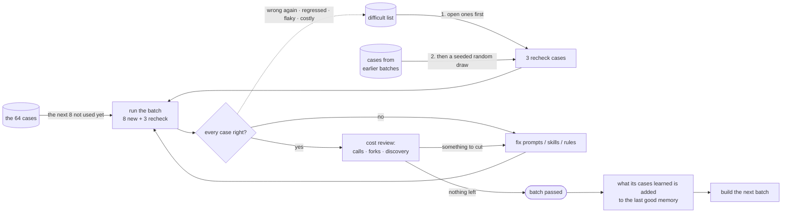
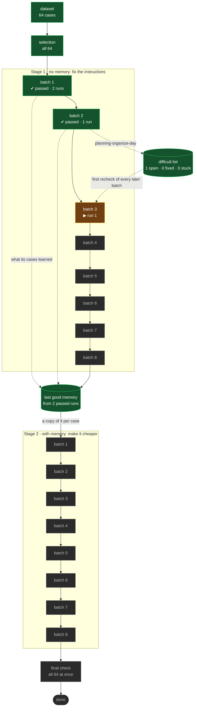

<!--
This is the template for .finetune/README.md. It is not generated: the agent
writes it once, before the first run, and patches it after every step.

Copy it, replace every <angle-bracket> placeholder with the real value, and
delete this comment. The example numbers below (64 cases, all 64 used, batches
of 8, recheck 3) are there to show the shape - use the project's own. The limit
is the whole dataset unless the user named a smaller number.

What gets patched after each step is listed in the SKILL, "The README".
-->

# Fine-tuning <project name>

<One paragraph, for someone who has never seen this project: what is being
tuned, against which training set, and why. E.g. "This tunes the prompts and
skills of the support-desk agents against the 64 example questions in
SPECIFICATION.md §4. Nothing touches the model; what changes is the text the
agents are given.">

## Where we are

<!-- Patched after EVERY step. Two or three lines, plain words. -->

**Stage 1 (no memory) · batch 3 · run 1 - waiting to be graded.**
Batches 1-2 passed. 16 of 64 cases used, 48 to go; 1 difficult case open.

## The plan

<!-- Written once, before the first run. Only changed if the numbers change,
     and then say so under "Log". -->

### What we are testing against

The training set holds **64 cases** (the dataset). Every one of them was read
into `dataset.json`; none was dropped.

This tuning uses **all 64** of them (limit 64 of 64), in an order where the
classes take turns, so every kind of question is worked on from the start, not
just the most common:

| class      | in the dataset |   used | with a rubric |
| ---------- | -------------: | -----: | ------------: |
| planning   |             22 |     22 |            15 |
| extraction |             18 |     18 |             7 |
| search     |             14 |     14 |            12 |
| billing    |             10 |     10 |             5 |
| **total**  |         **64** | **64** |        **39** |

### How the 64 are worked through: batches

We do not run all 64 and then try to fix everything at once - after one big run
there is too much to read, and after one big edit nobody can say which change
helped. Instead they are worked through a **batch** at a time. Each batch takes
**8 new cases** - the classes take turns, so every batch is a mix - plus **3
recheck cases** from earlier batches:

1. **Run** the batch's cases.
2. **Grade** every trajectory: is the answer right? Then, what did it cost - how
   many model calls, could independent steps have run in parallel, did it
   explore for things it could have been told?
3. **Fix** the prompts, skills or house rules the grading points at - wrong
   answers first, then cost.
4. **Run the same cases again** to confirm the fix worked. This is the only fair
   test - the questions are identical and only the instructions changed.
5. When every case is right **and** nothing is left worth cutting, the batch
   has **passed** and the next one is built. At most 4 runs per batch.

The recheck cases are the regression guard: a fix written for batch 3 that
breaks something from batch 1 shows up straight away.



64 cases at 8 per batch is **at least 8 batches** in each stage.

### Difficult cases keep coming back

Some cases cause most of the trouble: still wrong after a fix, breaking again
as a recheck case, or far more expensive than the rest. They go on a
**difficult list** and are not forgotten when their batch passes:

- they are the **first recheck cases** in every later batch until fixed, and
  still preferred after that;
- once all 64 have been used, the next batches hold **only the open difficult
  cases** - so 8 batches may become 10 or 11;
- a case still wrong after 3 more batches is marked **stuck** and reported,
  rather than retried forever.

A stage ends when all 64 have been used and no difficult case is open.

### Nothing learned is lost

Each time a batch passes, what its runs learned is added to the **last good
memory**, built so that it is never half-written. If the tuning stops at any
point, that memory is complete and usable.

### Two stages

- **Stage 1 - no memory.** Every run starts with an empty memory, so a right
  answer is the instructions' doing and not something remembered. This is where
  the prompts and skills are fixed.
- **Stage 2 - with memory.** The instructions are frozen. Every case starts from
  the last good memory, and the stage-1 batches are run again in the same order,
  so each is compared with itself. The goal is the same answers for far fewer
  calls and tokens; the only file changed is the memory policy.

A **final check** runs all 64 cases at once with everything frozen, and is the
last step.

### Settings

| setting     | value | meaning                                                                           |
| ----------- | ----: | --------------------------------------------------------------------------------- |
| limit       |    64 | every case in the dataset                                                         |
| batch size  |     8 | new cases per batch                                                               |
| recheck     |     3 | earlier cases re-run in each batch, difficult ones first                          |
| concurrency |     8 | cases running at the same time: min(batch size, 16), halved on OOM, never below 4 |
| seed        |     1 | makes the choice of cases and rechecks repeatable                                 |
| maxRetries  |     3 | batches a difficult case gets before it is stuck                                  |

## Map

<!-- Patched after EVERY step: move node ids between the `class` lines, and
     update labels (runs so far, ✔ / ✘). `now` is exactly one node. Only the
     minimum number of batches is drawn ahead; each batch beyond it is ADDED as a
     node when it is built. Every PASSED stage-1 batch also gets a dotted edge to
     `MEM`, and the difficult cases it left get one to `DIF`. Keep the "left"
     line under the map current. -->



**Left in stage 1:** 48 unused cases (at least 6 more batches), 1 difficult case open.

## Batches

<!-- One row per batch, patched when a run finishes or is graded. -->

| stage | batch | new + recheck         | runs | status    | cases right | llm calls | tokens      | what changed                                   |
| ----- | ----- | --------------------- | ---: | --------- | ----------- | --------- | ----------- | ---------------------------------------------- |
| 1     | 1     | `<8 ids>`             |    2 | ✔ passed  | 8/8 + 0/0   | 212 → 180 | 6.1M → 5.2M | [2 rules](runs/stage1-batch01-run1/changes.md) |
| 1     | 2     | `<8 ids>` + `<3 ids>` |    1 | ✔ passed  | 8/8 + 3/3   | 240       | 7.0M        | -                                              |
| 1     | 3     | `<8 ids>` + `<3 ids>` |    1 | ▶ grading | -           | -         | -           | -                                              |

"cases right" is new + recheck, e.g. `7/8 + 3/3`.

## Difficult cases

<!-- Patched whenever difficult.mjs changes. Copy its list; add what was tried. -->

| case                    | why    | status | retries | what goes wrong, and what was tried                                                   |
| ----------------------- | ------ | ------ | ------: | ------------------------------------------------------------------------------------- |
| `planning-organize-day` | wrong  | open   |       0 | lists mail and calendar, never proposes a schedule; planner rule 1 did not move it    |
| `billing-refund-late`   | costly | fixed  |       1 | 90 llm calls reading every policy file; fixed by naming the file in the billing skill |

Last good memory: 14 nodes, from 3 passed runs (`memory.mjs`).

## Log

<!-- Newest first. One entry per run, added when it is graded; a line when the
     batch finishes. Link the run's findings.md and changes.md. -->

### stage1-batch01-run2 - PASSED

- Same 8 cases as run 1, with the 2 rules from run 1 applied.
- All 8 right (run 1: 6). llm calls 212 → 180, tokens −15%.
- [findings](runs/stage1-batch01-run2/findings.md)

### stage1-batch01-run1 - PROGRESS

- First run of batch 1. 6 of 8 right.
- `planning-organize-day` listed mail and calendar but never proposed a
  schedule; `billing-refund-late` guessed the refund policy instead of reading
  it.
- Changed: 2 rules - [changes](runs/stage1-batch01-run1/changes.md).
- [findings](runs/stage1-batch01-run1/findings.md)

## Results so far

<!-- Patched when a batch passes. -->

- **Cases passing:** 8 of 64 (batch 1).
- **Instructions changed:** `agents/prompts/planner.md` (+6 lines),
  `agents/skills/billing/SKILL.md` (+4 lines).
- **Difficult cases:** 1 open, 1 fixed, 0 stuck.
- **Open problems:** none yet.

## Next

<!-- Patched after EVERY step. What `next.mjs` says, in words, then the command. -->

Grade batch 2's first run: check it was not killed for memory, then read every
trajectory.

```sh
.github/skills/zen-finetune/scripts/report.mjs -d .finetune/runs/stage1-batch02-run1/batch oom
```
