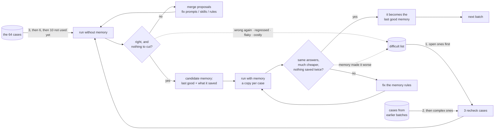
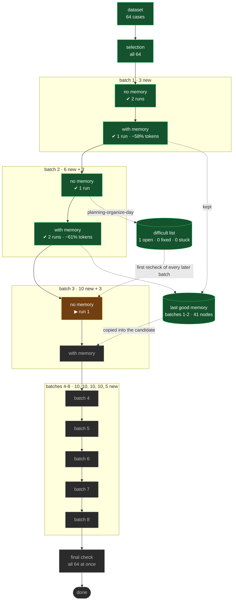

<!--
This is the template for finetune/README.md. It is not generated: the agent
writes it once, before the first run, and patches it after every step.

Copy it, replace every <angle-bracket> placeholder with the real value, and
delete this comment. The example numbers below (64 cases, all 64 used, batches
growing 3 -> 6 -> 10, recheck 3) are there to show the shape - use the
project's own. The limit is the whole dataset unless the user named a smaller
number.

What gets patched after each step is listed in the SKILL, "The README".
-->

# Fine-tuning <project name>

<One paragraph, for someone who has never seen this project: what is being
tuned, against which training set, and why. E.g. "This tunes the prompts and
skills of the support-desk agents against the 64 example questions in
SPECIFICATION.md §4. Nothing touches the model; what changes is the text the
agents are given.">

## Where we are

<!-- Patched after EVERY step. Two or three lines, plain words. -->

**Batch 3 (10 new + 3 recheck) · without memory · run 1 - waiting to be graded.**
Batches 1-2 passed, both halves. 9 of 64 cases used, 55 to go; 1 difficult case open.

## The plan

<!-- Written once, before the first run. Only changed if the numbers change,
     and then say so under "Log". -->

### What we are testing against

The training set holds **64 cases** (the dataset). Every one of them was read
into `dataset.json`; none was dropped.

This tuning uses **all 64** of them (limit 64 of 64), in an order where the
classes take turns, so every kind of question is worked on from the start, not
just the most common - and inside each class the cases with a rubric and the
most complex ones come first, because they show the most per run:

| class      | in the dataset |   used | with a rubric | complex |
| ---------- | -------------: | -----: | ------------: | ------: |
| planning   |             22 |     22 |            15 |       8 |
| extraction |             18 |     18 |             7 |       4 |
| search     |             14 |     14 |            12 |       5 |
| billing    |             10 |     10 |             5 |       2 |
| **total**  |         **64** | **64** |        **39** |  **19** |

### How the 64 are worked through: batches

We do not run all 64 and then try to fix everything at once - after one big run
there is too much to read, and after one big edit nobody can say which change
helped. Instead they are worked through a **batch** at a time.

**Batches start small and grow.** Batch 1 is **3 cases** - a smoke test that the
project, the sandbox and the grading all work. Each batch that goes smoothly
(at most 2 runs of each kind, no case added to the difficult list) makes the
next one **twice as big**, up to **10**; a batch that struggles keeps the next
one the same size. Each batch also re-runs **3 recheck cases** from earlier
batches - difficult ones first, then complex ones - to catch a fix that broke
something.

**Every batch goes through the same steps, first without memory, then with it:**

1. **Run** the batch with an empty memory - a right answer is then the
   instructions' doing, not something remembered.
2. **Grade** every run: is the answer right? What did it cost - how many model
   calls, could independent steps have run in parallel, did it explore for
   things it could have been told? What did it save to memory? Where it went
   wrong, ask the model why.
3. **Collect** the improvements each case suggests, **merge** them into
   patterns, and **fix** the prompts, skills or rules they point at.
4. **Run the same cases again** to confirm. The questions are identical and only
   the instructions changed, so the difference is the fix. Repeat until every
   case is right and nothing is left worth cutting - at most 4 runs.
5. **Build the batch's memory**: everything the cases saved in that passing run,
   added to the memory of the earlier batches.
6. **Run the same cases with that memory** - each case gets its own copy. The
   answers should not change, but the work should get **much cheaper**: what
   was rediscovered every time is now remembered - and nothing it already knew
   should be saved again.
7. **Grade the memory use**, fix the memory rules, run again - at most 4 runs.
8. When that passes, the batch's memory becomes the **last good memory**, and
   the next batch is built.



64 cases growing 3 → 6 → 10 is **at least 8 batches**: 3 + 6 + 10 × 5 + 5.

### Difficult cases keep coming back

Some cases cause most of the trouble: still wrong after a fix, breaking again
as a recheck case, made worse by memory, or far more expensive than the rest.
They go on a **difficult list** and are not forgotten when their batch passes:

- they are the **first recheck cases** in every later batch until fixed, and
  still preferred after that;
- once all 64 have been used, the next batches hold **only the open difficult
  cases** - so 8 batches may become 10 or 11;
- a case still wrong after 3 more batches is marked **stuck** and reported,
  rather than retried forever.

The tuning ends when all 64 have been used and no difficult case is open. A
**final check** then runs all 64 at once, with the last good memory and nothing
changed.

### Nothing learned is lost

The last good memory is only ever replaced by a complete one. If the tuning
stops at any point, it holds everything the passed batches learned, and is the
memory to ship.

### Settings

| setting     | value | meaning                                                                         |
| ----------- | ----: | ------------------------------------------------------------------------------- |
| limit       |    64 | every case in the dataset                                                       |
| minBatch    |     3 | new cases in batch 1, the smoke test                                            |
| maxBatch    |    10 | the most new cases a batch grows to                                             |
| recheck     |     3 | earlier cases re-run in each batch, difficult then complex first                |
| concurrency |    13 | most cases running at the same time: min(maxBatch + recheck, 16), halved on OOM |
| seed        |     1 | makes the choice of rechecks repeatable                                         |
| maxRetries  |     3 | batches a difficult case gets before it is stuck                                |

## Map

<!-- Patched after EVERY step: move node ids between the `class` lines, and
     update labels (runs so far, ✔ / ✘). `now` is exactly one node. Each batch
     is two nodes, its no-memory half (xN) and its with-memory half (xM). The
     batches the growth rule gives if every batch is smooth are drawn ahead;
     when a batch stays small, or difficult cases add batches, change the sizes
     ahead and ADD nodes. Keep the "left" line under the map current. -->



**Left:** 55 unused cases (at least 6 more batches), 1 difficult case open.

## Batches

<!-- One row per batch, patched when a run finishes or is graded. "without"
     is the no-memory runs, first to last; "with" is the with-memory run that
     passed, against the no-memory run that passed. -->

| batch | size | new + recheck          | runs (no mem / mem) | status    | cases right | llm calls without | llm calls with | tokens with vs without | saved twice | what changed                                      |
| ----- | ---: | ---------------------- | ------------------: | --------- | ----------- | ----------------- | -------------- | ---------------------- | ----------: | ------------------------------------------------- |
| 1     |    3 | `<3 ids>`              |               2 / 1 | ✔ passed  | 3/3 + 0/0   | 96 → 71           | 31             | −58%                   |           0 | [2 rules](runs/batch01-nomem-run1/changes.md)     |
| 2     |    6 | `<6 ids>` + `<3 ids>`  |               1 / 2 | ✔ passed  | 6/6 + 3/3   | 240               | 98             | −61%                   |       4 → 0 | [1 memory rule](runs/batch02-mem-run1/changes.md) |
| 3     |   10 | `<10 ids>` + `<3 ids>` |               1 / - | ▶ grading | -           | -                 | -              | -                      |           - | -                                                 |

"cases right" is new + recheck, e.g. `9/10 + 3/3`. "saved twice" is how many
memories a with-memory run saved that it already had - the target is 0.

## Difficult cases

<!-- Patched whenever difficult.mjs changes. Copy its list; add what was tried. -->

| case                    | why    | status | retries | what goes wrong, and what was tried                                                   |
| ----------------------- | ------ | ------ | ------: | ------------------------------------------------------------------------------------- |
| `planning-organize-day` | wrong  | open   |       0 | lists mail and calendar, never proposes a schedule; planner rule 1 did not move it    |
| `billing-refund-late`   | costly | fixed  |       1 | 90 llm calls reading every policy file; fixed by naming the file in the billing skill |

Last good memory: 41 nodes, from batches 1-2 (`memory.mjs`).

## Log

<!-- Newest first. One entry per run, added when it is graded; a line when the
     batch passes. Link the run's findings.md and changes.md. -->

### batch02-mem-run2 - PASSED

- Same 9 cases, with memory, after 1 memory rule.
- Same answers as without memory; tokens −61%, llm calls 240 → 98.
  Nothing saved twice (run 1: 4).
- Batch 2 passed; its memory is now the last good memory. Batch 3 grows to 10.
- [findings](runs/batch02-mem-run2/findings.md)

### batch02-mem-run1 - CORRECT

- First run of batch 2 with memory. All right, −55% tokens, but 4 cases saved
  again the endpoint they had just recalled.
- Changed: 1 rule in the memory policy - [changes](runs/batch02-mem-run1/changes.md).
- [findings](runs/batch02-mem-run1/findings.md)

## Results so far

<!-- Patched when a batch passes. -->

- **Cases passing:** 9 of 64 (batches 1-2).
- **Instructions changed:** `agents/prompts/planner.md` (+6 lines),
  `agents/skills/billing/SKILL.md` (+4 lines),
  `agents/memory-policy-instructions.md` (+5 lines).
- **Memory:** 41 nodes; with memory, batches run 58-61% cheaper with the same
  answers.
- **Difficult cases:** 1 open, 1 fixed, 0 stuck.
- **Open problems:** none yet.
- **Tokens:** [USAGE.md](USAGE.md) - by model, batch and run; written by
  `usage.mjs`, never by hand.

## Next

<!-- Patched after EVERY step. What `next.mjs` says, in words, then the command. -->

Grade batch 3's first run without memory: check it was not killed for memory,
then read every trajectory.

```sh
.github/skills/zen-finetune/scripts/report.mjs -d finetune/runs/batch03-nomem-run1/batch oom
```
