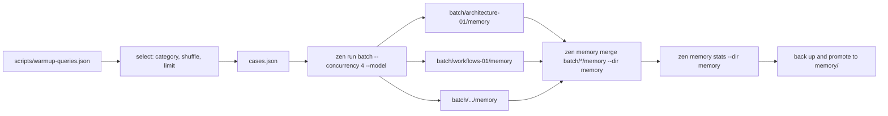
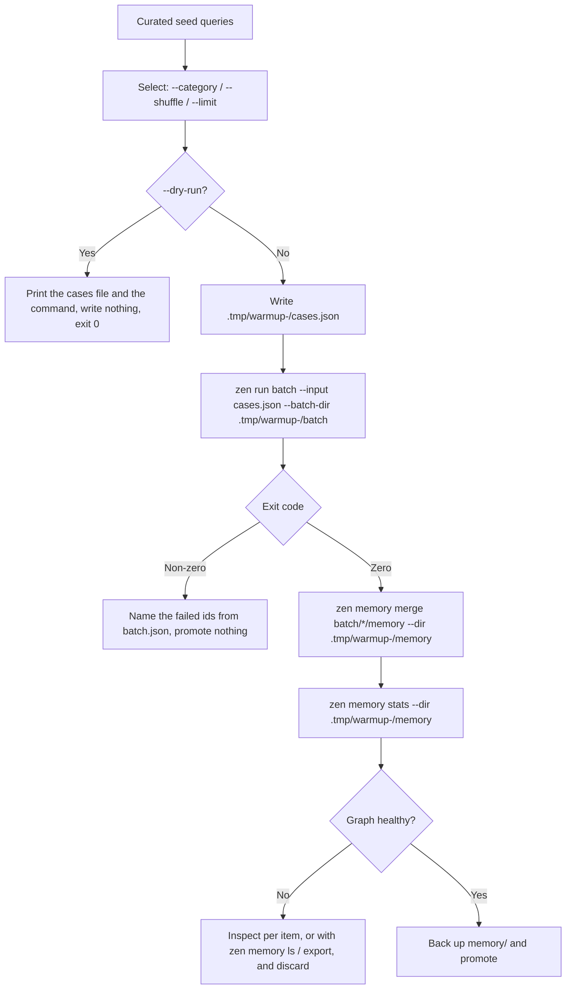

# Memory Warmup

Memory warmup is the process of pre-populating an agent project's knowledge
graph before deploying it or exposing it to end users.

In Zenera Neo an agent's memory graph (`memory/`) starts empty. A cold start
means early runs cannot recall prior approaches, domain facts, verified plans
or tool schemas. Warming up addresses this by asking a curated set of
representative domain questions ahead of time, so the agents synthesise, link
and commit high-value knowledge nodes before a user is waiting on them.

Warmup is one command: **`zen run batch`**. A file of questions goes in, a
directory of memories comes out, and `zen memory merge` folds them into one.

---

## Why Warm Up Memory?

1. **Eliminate cold starts.** Instead of struggling through initial discovery,
   the agent recalls established patterns, known schemas and proven plans on
   its very first user-facing turn.
2. **A better graph, from a stronger model.** Warmup runs are infrequent, so
   they can afford a flagship reasoning model (`--model`) that the day-to-day
   runtime model cannot. The superior structure it leaves behind is then
   recalled by the cheaper model.
3. **Consistency and alignment.** Conventions, domain boundaries and operating
   rules are seeded as durable `fact` and `plan` nodes, rather than being
   rediscovered inconsistently across random user sessions.

---

## What the Command Already Does

Warmup used to be a script's problem: a memory per run because the lock is per
directory, a fresh workspace per run, a bounded number of background jobs, and
a merge at the end. `zen run batch` is that fan-out made into a command, so
none of it is the script's problem any more.

| What warmup needs                    | What `zen run batch` does                                                   |
| :----------------------------------- | :-------------------------------------------------------------------------- |
| A memory no other run is writing     | Each item gets its own copy at `<batch-dir>/<id>/memory`                    |
| The project's own graph left alone   | It is the source to copy from, and is never written                         |
| A clean working directory per query  | Each item gets `<batch-dir>/<id>/workspace`                                 |
| Parallelism the machine can stand    | `--concurrency <n>`, default 16, ceiling 32                                 |
| One bad query not costing the others | The failure is written to its `output.json`; the rest still answer          |
| A record of what happened            | `batch.json`, the index: every item, whether it worked, where its answer is |
| The fold back                        | It prints the `zen memory merge <batch-dir>/*/memory` line when it is done  |

What is left for the warmup script is the part that is actually about warmup:
**which questions to ask, which graph to start from, which model to ask with,
and whether the result is good enough to promote.**

---

## Core Safety Rules

### 1. Never warm up into the project's active `memory/`

A batch never writes the source graph - it copies it - so the default is
already safe. Keep the whole staging tree in `.tmp/` under a timestamp so that
repeated or concurrent warmups cannot collide, and so a failed one can be read
afterwards rather than being lost:

```sh
STAMP="$(date +%Y%m%d-%H%M%S)"
zen run batch --input cases.json --batch-dir ".tmp/warmup-$STAMP/batch"
```

Without `--batch-dir` the batch picks `<project>/batches/<stamp>` and prints
the path on stdout, which is the other way to write it:

```sh
DIR="$(zen run batch --input cases.json)"
```

### 2. Choose the graph every item starts from

`--memory <dir>` names the source. There are two warmups, and they differ only
in what they point it at:

| Warmup                    | Source                            | Every item starts from      |
| :------------------------ | :-------------------------------- | :-------------------------- |
| Building on what is known | the project's `memory/` (default) | a copy of the current graph |
| From nothing              | a directory that does not exist   | an empty graph              |

A source that is not there yet is not an error in the copying mode: a project
declares its memory directory and the first run makes it, so a cold project is
warmed by copying from nothing, and nothing is what each item gets.

**`--memory-read-only` is not a warmup flag.** It means nobody writes, which is
exactly what a warmup is for. It is for asking a batch of questions _of_ a
warmed graph afterwards - sixteen runs recalling from the one memory, changing
nothing.

### 3. Use a stronger model during population

Day-to-day execution might use a fast, cost-effective model (e.g.
`google:gemini-2.5-flash` or `anthropic:claude-3-5-haiku`). Warm up with a
flagship reasoning model instead:

```sh
--model anthropic:claude-sonnet-4-5
```

It applies to every item in the batch.

### 4. Read the result before promoting it

The staging graph is inspected with `zen memory stats --dir ...`, and nothing
overwrites the project's `memory/` until it holds what it should. Because each
item kept its own memory, this can be done **per query** as well as in total -
see below.

### 5. Promote atomically, and keep the old graph

Back the current `memory/` up under a timestamp and move the staging graph into
place. A warmup that turns out to have been a bad idea is then one `mv` away
from being undone.

---

## The Shape of a Warmup





---

## The Queries File

Keep the seed queries in the repository, in the shape the command already
reads, so warmup is reproducible across environments and model upgrades:

```json
{
    "batch": [
        {
            "id": "architecture-layout",
            "input": "Investigate the project architecture and summarize the main components and data flow."
        },
        {
            "id": "architecture-boundaries",
            "input": "Analyze module boundaries, dependency graphs, and core interfaces."
        },
        {
            "id": "workflows-triage",
            "input": "Formulate standard operational plans for triaging and resolving common domain tasks."
        },
        {
            "id": "integrations-services",
            "input": "Identify external services, APIs, and key credential dependencies."
        },
        {
            "id": "errors-handling",
            "input": "Analyze error handling strategies, recovery routines, and failure modes."
        },
        {
            "id": "conventions-house-rules",
            "input": "Document project-specific coding standards, house rules, and commit policies."
        }
    ]
}
```

An item takes `input`, an optional `id` and an optional `workspace`, and
nothing else. `memory`, `model` and `project` belong to the whole batch, so
they are flags on the line rather than keys in the file.

**The `id` is the category.** It names the directory the item's answer and
memory land in, so `architecture-layout` makes `batch/architecture-layout/` -
readable in a directory listing, greppable in `batch.json`, and selectable by
prefix. That is the whole of the category mechanism; no extra key is needed.

### Recommended Categories

| Category       | Objective                                                    | Example prompt                                                             |
| :------------- | :----------------------------------------------------------- | :------------------------------------------------------------------------- |
| `architecture` | Map high-level layout, component boundaries, and data flow   | "Investigate project architecture and summarize component flow."           |
| `workflows`    | Formulate multi-step operational plans for common tasks      | "Formulate standard operational plans for triaging common tasks."          |
| `integrations` | Index external services, APIs, and credentials               | "Identify external services, APIs, and key credential dependencies."       |
| `errors`       | Capture error handling, recovery routines, and failure modes | "Analyze error handling strategies, recovery routines, and failure modes." |
| `conventions`  | Record coding styles, house rules, and constraints           | "Document project-specific coding standards and house rules."              |

### Why Selection Still Matters

Everything runs at once now, so ordering no longer decides what gets asked -
but a budget still does.

1. **Balanced coverage.** A 20-query suite cut to the first four with a limit
   would warm `architecture` and leave `workflows` and `integrations` cold.
   Shuffle before limiting so a partial budget draws a cross-section.
2. **`--category <name>`** re-warms one subsystem after it changes - the
   `integrations` queries alone once a new API is wired up - without paying for
   the rest.
3. **`--limit <n>`** caps what a verification pass costs. With sixteen in
   flight the wall clock stops being the thing that limits you, so the cap has
   to be deliberate.
4. **`--dry-run`** prints the selected cases file and the exact command, writes
   nothing, creates nothing, and bills nothing. Frontier models are expensive
   enough that the plan is worth reading first.

---

## Reading What Each Query Learned

Because every item kept its own memory, a warmup is auditable per question -
which a sequential run into one graph never was.

```sh
DIR=".tmp/warmup-$STAMP/batch"

# Which items worked, and what each was asked
jq -r '.batch_results[] | "\(.id)\t\(if .ok then "ok" else "FAILED" end)"' "$DIR/batch.json"

# What one query actually committed
zen memory stats --dir "$DIR/architecture-layout/memory"
zen memory ls --dir "$DIR/architecture-layout/memory"

# What one query answered, and what it cost
jq '.stopReason, .usage' "$DIR/architecture-layout/output.json"
```

A query that taught the graph nothing useful is excluded by leaving its
directory out of the merge. Nothing else has to be re-run.

An item that committed nothing leaves no `memory/` at all, so
`<batch-dir>/*/memory` never names a directory `merge` would refuse.

---

## Generating the Warmup Script in `scripts/`

A project should keep its warmup under version control as two files:

- `scripts/warmup-queries.json` - the curated seed queries, in the shape above.
- `scripts/memory_warmup.sh` - selection, one batch, merge, validate, promote.

The script should:

1. Accept `--category`, `--limit`, `--shuffle`, `--concurrency`, `--model`,
   `--fresh`, `--dry-run` and `-y/--yes`.
2. Select from the queries file and write the selection to a timestamped
   staging directory under `.tmp/`.
3. Stop before touching disk under `--dry-run`, having printed the plan.
4. Run **one** `zen run batch`, letting it own the parallelism, the per-item
   workspaces and the per-item memories.
5. Refuse to promote anything if any item failed, naming the ids from
   `batch.json` and leaving the staging tree for inspection.
6. Merge the item memories, print `zen memory stats`, then back up and promote.

### Recommended Script Template (`scripts/memory_warmup.sh`)

```bash
#!/usr/bin/env bash
#
# scripts/memory_warmup.sh — Warm this project's memory with one parallel batch.
#
# Usage:
#   ./scripts/memory_warmup.sh [options]
#
# Options:
#   --category <name>    Only queries whose id starts with "<name>-"
#   --limit <n>          Run at most n queries
#   --shuffle            Randomize order before applying --limit
#   --concurrency <n>    How many at a time (default 4; zen allows up to 32)
#   --model <ref>        Warm up with a stronger model than the runtime one
#   --fresh              Start every item from an empty graph, not from memory/
#   --dry-run            Print the plan and exit; write nothing, bill nothing
#   -y, --yes            Promote without asking
#   -h, --help           Show this help
#
# Examples:
#   ./scripts/memory_warmup.sh --dry-run
#   ./scripts/memory_warmup.sh --category integrations
#   ./scripts/memory_warmup.sh --shuffle --limit 5 --model anthropic:claude-sonnet-4-5
#   ./scripts/memory_warmup.sh --fresh -y
#

set -euo pipefail

ROOT="$(cd "$(dirname "${BASH_SOURCE[0]}")/.." && pwd)"
cd "$ROOT"

QUERIES="scripts/warmup-queries.json"
PROJECT_MEM="memory"

CATEGORY=""
LIMIT=0
SHUFFLE=false
CONCURRENCY=4
MODEL="${ZEN_WARMUP_MODEL:-}"
FRESH=false
DRY_RUN=false
ASSUME_YES=false

usage() {
    sed -n '2,25p' "$0" | sed 's/^# \{0,1\}//'
}

while [[ $# -gt 0 ]]; do
    case "$1" in
        --category) CATEGORY="$2"; shift 2 ;;
        --limit) LIMIT="$2"; shift 2 ;;
        --shuffle) SHUFFLE=true; shift ;;
        --concurrency) CONCURRENCY="$2"; shift 2 ;;
        --model) MODEL="$2"; shift 2 ;;
        --fresh) FRESH=true; shift ;;
        --dry-run) DRY_RUN=true; shift ;;
        -y|--yes) ASSUME_YES=true; shift ;;
        -h|--help) usage; exit 0 ;;
        *) echo "Error: unknown option $1" >&2; exit 2 ;;
    esac
done

command -v jq >/dev/null 2>&1 || { echo "Error: jq is required." >&2; exit 1; }
[ -f "$QUERIES" ] || { echo "Error: $QUERIES not found." >&2; exit 1; }

# --- Select -----------------------------------------------------------------
# One compact JSON object per line, so ordering and limiting are line work.
SELECTED="$(jq -c --arg cat "$CATEGORY" \
    '.batch[] | select($cat == "" or (.id // "" | startswith($cat + "-")))' \
    "$QUERIES")"

if [ "$SHUFFLE" = true ]; then
    if command -v shuf >/dev/null 2>&1; then
        SELECTED="$(printf '%s\n' "$SELECTED" | shuf)"
    else
        SELECTED="$(printf '%s\n' "$SELECTED" | sort -R)"
    fi
fi

# awk rather than head: head closes the pipe early, and a SIGPIPE inside a
# command substitution takes the whole script down under `set -e`.
if [ "$LIMIT" -gt 0 ]; then
    SELECTED="$(printf '%s\n' "$SELECTED" | awk -v n="$LIMIT" 'NR <= n')"
fi

COUNT="$(printf '%s\n' "$SELECTED" | awk 'NF { n++ } END { print n + 0 }')"
if [ "$COUNT" -eq 0 ]; then
    echo "Error: no queries matched${CATEGORY:+ category '$CATEGORY'}." >&2
    exit 1
fi
CASES="$(printf '%s\n' "$SELECTED" | jq -s '{ batch: . }')"

STAMP="$(date +%Y%m%d-%H%M%S)"
STAGE=".tmp/warmup-$STAMP"
BATCH_DIR="$STAGE/batch"
STAGING_MEM="$STAGE/memory"
CASES_FILE="$STAGE/cases.json"

CMD=(zen run batch --input "$CASES_FILE" --batch-dir "$BATCH_DIR"
     --concurrency "$CONCURRENCY")
if [ -n "$MODEL" ]; then
    CMD+=(--model "$MODEL")
fi
if [ "$FRESH" = true ]; then
    # A source that does not exist yet: every item starts from an empty graph
    # instead of a copy of what the project already knows.
    CMD+=(--memory "$STAGE/from-nothing")
fi

# --- Dry run ----------------------------------------------------------------
if [ "$DRY_RUN" = true ]; then
    echo "=== DRY RUN: warmup plan ==="
    echo "Project root:    $ROOT"
    echo "Staging:         $STAGE"
    echo "Target memory:   $PROJECT_MEM"
    echo "Model:           ${MODEL:-<project default>}"
    echo "Category:        ${CATEGORY:-<all>}"
    echo "Shuffled:        $SHUFFLE"
    echo "Limit:           $([ "$LIMIT" -gt 0 ] && echo "$LIMIT" || echo none)"
    echo "Concurrency:     $CONCURRENCY"
    echo "Starting from:   $([ "$FRESH" = true ] && echo "an empty graph" || echo "a copy of $PROJECT_MEM")"
    echo "Queries:         $COUNT"
    echo ""
    printf '%s\n' "$CASES" | jq -r '.batch[] | "  [\(.id)] \(.input)"'
    echo ""
    echo "Would run:"
    printf '  '; printf '%q ' "${CMD[@]}"; echo ""
    echo "  zen memory merge $BATCH_DIR/*/memory --dir $STAGING_MEM --yes"
    echo "  zen memory stats --dir $STAGING_MEM"
    echo ""
    echo "Dry run complete. Nothing created, nothing billed."
    exit 0
fi

# --- Run --------------------------------------------------------------------
mkdir -p "$STAGE"
printf '%s\n' "$CASES" >"$CASES_FILE"

echo "=== Zenera Neo memory warmup ==="
echo "Staging:  $STAGE"
echo "Queries:  $COUNT, $CONCURRENCY at a time"
echo ""

# The batch prints its directory on stdout; we chose it, so we do not need it
# repeated. Progress and per-item results are on stderr and stay visible.
if ! "${CMD[@]}" >/dev/null; then
    echo "" >&2
    echo "Some queries failed; nothing was promoted." >&2
    jq -r '.batch_results[] | select(.ok | not) | "  \(.id): \(.error.message)"' \
        "$BATCH_DIR/batch.json" >&2
    echo "Staging left for inspection at: $STAGE" >&2
    exit 1
fi

# --- Merge ------------------------------------------------------------------
# An item that committed nothing leaves no memory behind, so this glob only
# ever names real graphs.
MERGE=()
for mem in "$BATCH_DIR"/*/memory; do
    [ -d "$mem" ] && MERGE+=("$mem")
done

if [ ${#MERGE[@]} -eq 0 ]; then
    echo "No query committed anything to memory; nothing to promote." >&2
    echo "Answers are still at: $BATCH_DIR" >&2
    exit 1
fi

echo ""
echo "Merging ${#MERGE[@]} memories into $STAGING_MEM..."
zen memory merge "${MERGE[@]}" --dir "$STAGING_MEM" --yes

echo ""
echo "Warmed graph:"
zen memory stats --dir "$STAGING_MEM"
echo ""

# --- Promote ----------------------------------------------------------------
if [ "$ASSUME_YES" = false ]; then
    read -r -p "Promote this graph to '$PROJECT_MEM'? [y/N] " CONFIRM
    if [[ ! "$CONFIRM" =~ ^[Yy]$ ]]; then
        echo "Not promoted. Staging left at $STAGE."
        exit 0
    fi
fi

if [ -d "$PROJECT_MEM" ]; then
    BACKUP="memory.bak.$STAMP"
    echo "Backing up current memory to $BACKUP..."
    mv "$PROJECT_MEM" "$BACKUP"
fi

mv "$STAGING_MEM" "$PROJECT_MEM"
rm -rf "$STAGE"

echo "Warmup complete. Project memory is ready."
```

---

## When Not to Batch

A batch gives every item its own graph, so no item can recall what another one
just learned. When the queries genuinely build on each other - a later question
that only makes sense once an earlier one has committed its answer - run those
few in sequence with plain `zen run --memory`, and batch the rest.

`merge` gives back everything except that cross-query recall. Reach for the
sequence only where the recall is the point; it costs the wall clock that
warming in parallel is for.

---

## Best Practices for Seed Queries

1. **Name ids by category.** `architecture-layout`, `workflows-triage`. The id
   is the directory name, the selector, and the label in every report.
2. **Dry-run first.** Verify the selection, the model and the source graph
   before spending a flagship model on twenty questions at once.
3. **Write prompts that induce plan formation.** "Analyze and determine the
   recommended pattern for..." stores durable `plan` and `fact` nodes; "list
   the files in src/" stores nothing worth keeping.
4. **Verify vectorisation.** In `zen memory stats`, the vector count should
   equal the node count. If it does not, the embedding model is not configured
   and recall will fall back to text alone.
5. **Keep the queries under version control.** `scripts/warmup-queries.json` is
   the record of what the project's memory was built from, and the thing to
   re-run after a model upgrade.
6. **Warm in one batch, not many.** A second batch cannot see what the first
   learned unless it has been merged and promoted first - so either merge in
   between, or ask everything at once.
