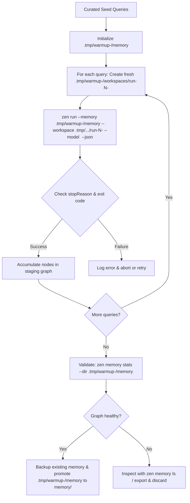

# Memory Warmup

Memory warmup is the process of pre-populating an agent project's knowledge graph
before deploying it or exposing it to end users.

In Zenera Neo, an agent's memory graph (`memory/`) starts completely empty. A cold
start means early runs cannot recall prior approaches, domain facts, verified
plans, or tool schemas. Warming up the memory addresses this by executing a
curated set of representative domain queries ahead of time, allowing agents to
synthesize, connect, and commit high-value knowledge nodes.

---

## Why Warm Up Memory?

1. **Eliminate Cold Starts**: Instead of failing or struggling through initial
   discovery, the agent recalls established patterns, known schemas, and
   proven plans on its very first user-facing turn.
2. **Higher-Quality Graph via Stronger Models**: You can run warmup turns using
   a more capable reasoning model (`--model`) than your day-to-day runtime
   model. A smarter model creates cleaner abstractions, links causal relations
   accurately, and produces superior plans.
3. **Consistency & Alignment**: Foundational conventions, domain boundaries,
   and operational rules are seeded as durable `fact` and `plan` nodes rather
   than rediscovered inconsistently across random user sessions.

---

## Core Architecture & Safety Rules

Warmup is an offline staging process. It must adhere to five safety rules:

### 1. Never warm up directly into the project's active `memory/`

If a warmup query fails, hallucinates, or aborts mid-turn, committing directly
to the project's memory directory corrupts the knowledge graph. Always point
`zen run` to a timestamped staging directory in `.tmp/` via `--memory` so that
repeated or concurrent runs never collide:

```sh
STAMP="$(date +%Y%m%d-%H%M%S)"
--memory ".tmp/warmup-$STAMP/memory"
```

### 2. Isolate workspaces in `.tmp/` with per-run timestamps

Warmup queries often instruct agents to investigate repositories, write test
scripts, or run commands. Running them in the actual project or repository
working directory risks modifying tracked files or creating untracked clutter.

Always isolate the workspace per run into a fresh, timestamped subdirectory
under `.tmp/`:

```sh
--workspace ".tmp/warmup-$STAMP/workspaces/run-01-$(date +%s)"
```

Using timestamps on both the root staging directory and each individual run
workspace ensures:

- Concurrent or repeated warmup attempts never overwrite each other's state.
- Stale or corrupted files from an earlier failed run cannot leak into subsequent
  queries.
- Every turn begins from a completely pristine, deterministic working directory.

### 3. Use stronger models during population

Day-to-day execution might use a fast, cost-effective model (e.g.
`google:gemini-2.5-flash` or `anthropic:claude-3-5-haiku`). Warmup runs are
performed infrequently, so it makes sense to use a flagship reasoning model
(e.g. `anthropic:claude-sonnet-4-5`, `openai:gpt-5`, or
`google:gemini-3.5-flash`):

```sh
--model anthropic:claude-sonnet-4-5
```

The superior graph structure created by the flagship model is then recalled and
utilized by the runtime model.

### 4. Execute non-interactively with `--json`

Using `--json` guarantees:

- Interactive TUI and confirmation prompts are disabled (assumes `--yes`).
- Progress narration on stderr is silenced.
- Machine-readable JSON output on stdout containing `stopReason`, `usage`,
  `mounts`, run artifact paths (`run.dir`, `run.output`), and the answer.
- The population script can programmatically verify whether the run finished
  successfully (`stopReason === "final"`).

### 5. Validate before promotion

Do not overwrite the project's `memory/` until the generated graph in
`.tmp/warmup-<timestamp>/memory` has been inspected with `zen memory stats` and
verified to contain expected nodes and vector embeddings.

---

## The Warmup Cycle



---

## Generating the Warmup Script in `./script`

A project should maintain a dedicated warmup script located in `./script/`
(or `./scripts/`), typically named `script/warmup.sh`.

The script should automate the entire pipeline:

1. Accept optional flags (e.g. `--model`, `--dry-run`, `--force`).
2. Create timestamped staging paths under `.tmp/` (e.g.
   `.tmp/warmup-$(date +%Y%m%d-%H%M%S)/`) and timestamped per-query workspaces
   to avoid any conflicts across concurrent or repeated runs.
3. Optionally copy existing project memory into staging if performing an
   incremental warmup.
4. Iterate through an array of curated seed queries.
5. Invoke `zen run` with `--memory`, `--workspace`, `--model`, and `--json`.
6. Parse each outcome with `jq` and halt if a turn fails.
7. Print graph statistics via `zen memory stats --dir ...`.
8. Safely replace the project's `memory/` directory with the warmed graph upon
   success.

### Recommended Script Template (`script/warmup.sh`)

When generating a warmup script for a project, use the following production-ready
pattern:

```bash
#!/usr/bin/env bash
#
# script/warmup.sh — Pre-populate project memory using curated seed queries.
#
# Usage:
#   ./script/warmup.sh [--model <provider:model>] [--incremental] [--yes]
#
# Examples:
#   ./script/warmup.sh
#   ./script/warmup.sh --model anthropic:claude-sonnet-4-5
#   ./script/warmup.sh --incremental
#

set -euo pipefail

# Find project root regardless of invocation directory
ROOT="$(cd "$(dirname "${BASH_SOURCE[0]}")/.." && pwd)"
cd "$ROOT"

# Default configuration
MODEL="${ZEN_WARMUP_MODEL:-}"
INCREMENTAL=false
ASSUME_YES=false

# Parse arguments
while [[ $# -gt 0 ]]; do
    case "$1" in
        --model)
            MODEL="$2"
            shift 2
            ;;
        --incremental)
            INCREMENTAL=true
            shift
            ;;
        -y|--yes)
            ASSUME_YES=true
            shift
            ;;
        -h|--help)
            echo "Usage: ./script/warmup.sh [--model <ref>] [--incremental] [--yes]"
            exit 0
            ;;
        *)
            echo "Error: Unknown option $1" >&2
            exit 2
            ;;
    esac
done

SCRATCH_DIR=".tmp/warmup-$(date +%Y%m%d-%H%M%S)"
STAGING_MEM="$SCRATCH_DIR/memory"
WORKSPACES_DIR="$SCRATCH_DIR/workspaces"
PROJECT_MEM="memory"

echo "=== Zenera Neo Memory Warmup ==="
echo "Project root:      $ROOT"
echo "Staging directory: $SCRATCH_DIR"
if [ -n "$MODEL" ]; then
    echo "Model override:    $MODEL"
fi
echo ""

# Cleanup scratch on trap unless preserved for inspection on failure
cleanup() {
    local rc=$?
    if [ $rc -ne 0 ]; then
        echo "" >&2
        echo "Warmup FAILED (exit code $rc)." >&2
        echo "Staging files preserved for inspection at: $SCRATCH_DIR" >&2
    fi
}
trap cleanup EXIT

# 1. Prepare staging memory
mkdir -p "$STAGING_MEM" "$WORKSPACES_DIR"

if [ "$INCREMENTAL" = true ] && [ -d "$PROJECT_MEM" ]; then
    echo "Copying existing memory for incremental warmup..."
    cp -R "$PROJECT_MEM/." "$STAGING_MEM/"
fi

# 2. Define curated seed queries
# Customize these prompts to cover your project's core capabilities,
# APIs, architecture, common troubleshooting paths, and workflows.
QUERIES=(
    "Investigate the project architecture and summarize the main components and data flow."
    "Analyze common error handling strategies and key interfaces."
    "Identify external services, APIs, and dependencies used across the codebase."
    "Formulate standard operational plans for triaging and resolving common domain tasks."
)

echo "Running ${#QUERIES[@]} warmup queries..."
echo "----------------------------------------"

COUNT=0
for QUERY in "${QUERIES[@]}"; do
    COUNT=$((COUNT + 1))
    RUN_STAMP="$(date +%s)"
    RUN_WORKSPACE="$WORKSPACES_DIR/run-$COUNT-$RUN_STAMP"
    mkdir -p "$RUN_WORKSPACE"

    echo "[$COUNT/${#QUERIES[@]}] Running: \"$QUERY\""
    echo "  -> Workspace: $RUN_WORKSPACE"

    # Assemble arguments
    CMD=(zen run --memory "$STAGING_MEM" --workspace "$RUN_WORKSPACE" --json)
    if [ -n "$MODEL" ]; then
        CMD+=(--model "$MODEL")
    fi
    CMD+=("$QUERY")

    # Run query and capture JSON output
    JSON_OUT="$("${CMD[@]}")"
    EXIT_CODE=$?

    if [ $EXIT_CODE -ne 0 ]; then
        echo "  -> Command exited with code $EXIT_CODE" >&2
        exit $EXIT_CODE
    fi

    # Parse outcome via jq if available, otherwise check JSON string
    if command -v jq >/dev/null 2>&1; then
        STOP_REASON=$(echo "$JSON_OUT" | jq -r '.stopReason // empty')
        AGENT=$(echo "$JSON_OUT" | jq -r '.agent // empty')
        DURATION=$(echo "$JSON_OUT" | jq -r '.durationMs // empty')
        echo "  -> Completed: agent=$AGENT stopReason=$STOP_REASON (${DURATION}ms)"

        if [ "$STOP_REASON" != "final" ]; then
            echo "  -> Unexpected stop reason: $STOP_REASON" >&2
            exit 1
        fi
    else
        echo "  -> Turn completed successfully."
    fi
done

echo "----------------------------------------"
echo "All warmup queries finished successfully."
echo ""

# 3. Inspect and validate staging memory
echo "Validating staging memory graph:"
zen memory stats --dir "$STAGING_MEM"
echo ""

# 4. Confirmation and promotion
if [ "$ASSUME_YES" = false ]; then
    read -r -p "Promote staging memory to '$PROJECT_MEM'? [y/N] " CONFIRM
    if [[ ! "$CONFIRM" =~ ^[Yy]$ ]]; then
        echo "Warmup cancelled. Staging files left in $SCRATCH_DIR."
        exit 0
    fi
fi

# Backup existing project memory if present
if [ -d "$PROJECT_MEM" ]; then
    BACKUP_MEM="memory.bak.$(date +%Y%m%d-%H%M%S)"
    echo "Backing up current memory to $BACKUP_MEM..."
    mv "$PROJECT_MEM" "$BACKUP_MEM"
fi

# Promote staging memory to project root
echo "Promoting warmed memory to $PROJECT_MEM..."
mv "$STAGING_MEM" "$PROJECT_MEM"

# Clean up remaining scratch workspaces
rm -rf "$SCRATCH_DIR"

echo "Warmup complete! Project memory is ready."
```

---

## Best Practices for Seed Queries

When authoring or generating queries for the warmup script:

1. **Cover Breadth First, Then Depth**:
    - Begin with catalog/schema exploration queries.
    - Follow with common end-to-end task simulations that trigger `memory_commit`.
2. **Prompts That Induce Plan Formation**:
    - Instruct the agent to "analyze and determine the recommended pattern for..." so
      it stores durable `plan` and `fact` nodes rather than transient output.
3. **Verify Node Vectorisation**:
    - Confirm in `zen memory stats --dir ...` that vector count equals node count
      (ensuring your embedding model is configured and active).
4. **Keep Seed Queries Under Version Control**:
    - Store the seed prompts inside the script or an adjacent `script/warmup-queries.txt`
      so warmup is reproducible across environments and model upgrades.
