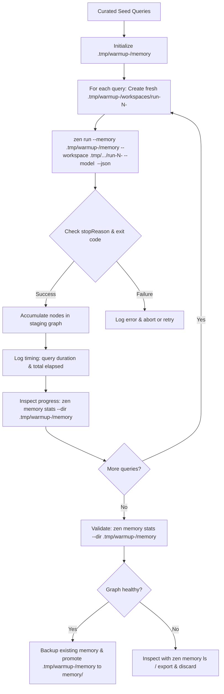

# Memory Warmup

Memory warmup is the process of pre-populating an agent project's knowledge graph
before deploying it or exposing it to end users.

In Zenera Neo, an agent's memory graph (`memory/`) starts completely empty. A cold
start means early runs cannot recall prior approaches, domain facts, verified
plans, or tool schemas. Warming up the memory addresses this by executing a
curated set of representative domain queries ahead of time, allowing agents to
synthesize, connect, and commit high-value knowledge nodes.

---

## Why Warm Up Memory?

1. **Eliminate Cold Starts**: Instead of failing or struggling through initial
   discovery, the agent recalls established patterns, known schemas, and
   proven plans on its very first user-facing turn.
2. **Higher-Quality Graph via Stronger Models**: You can run warmup turns using
   a more capable reasoning model (`--model`) than your day-to-day runtime
   model. A smarter model creates cleaner abstractions, links causal relations
   accurately, and produces superior plans.
3. **Consistency & Alignment**: Foundational conventions, domain boundaries,
   and operational rules are seeded as durable `fact` and `plan` nodes rather
   than rediscovered inconsistently across random user sessions.

---

## Core Architecture & Safety Rules

Warmup is an offline staging process. It must adhere to five safety rules:

### 1. Never warm up directly into the project's active `memory/`

If a warmup query fails, hallucinates, or aborts mid-turn, committing directly
to the project's memory directory corrupts the knowledge graph. Always point
`zen run` to a timestamped staging directory in `.tmp/` via `--memory` so that
repeated or concurrent runs never collide:

```sh
STAMP="$(date +%Y%m%d-%H%M%S)"
--memory ".tmp/warmup-$STAMP/memory"
```

### 2. Isolate workspaces in `.tmp/` with per-run timestamps

Warmup queries often instruct agents to investigate repositories, write test
scripts, or run commands. Running them in the actual project or repository
working directory risks modifying tracked files or creating untracked clutter.

Always isolate the workspace per run into a fresh, timestamped subdirectory
under `.tmp/`:

```sh
--workspace ".tmp/warmup-$STAMP/workspaces/run-01-$(date +%s)"
```

Using timestamps on both the root staging directory and each individual run
workspace ensures:

- Concurrent or repeated warmup attempts never overwrite each other's state.
- Stale or corrupted files from an earlier failed run cannot leak into subsequent
  queries.
- Every turn begins from a completely pristine, deterministic working directory.

### 3. Use stronger models during population

Day-to-day execution might use a fast, cost-effective model (e.g.
`google:gemini-2.5-flash` or `anthropic:claude-3-5-haiku`). Warmup runs are
performed infrequently, so it makes sense to use a flagship reasoning model
(e.g. `anthropic:claude-sonnet-4-5`, `openai:gpt-5`, or
`google:gemini-3.5-flash`):

```sh
--model anthropic:claude-sonnet-4-5
```

The superior graph structure created by the flagship model is then recalled and
utilized by the runtime model.

### 4. Execute non-interactively with `--json`

Using `--json` guarantees:

- Interactive TUI and confirmation prompts are disabled (assumes `--yes`).
- Progress narration on stderr is silenced.
- Machine-readable JSON output on stdout containing `stopReason`, `usage`,
  `mounts`, run artifact paths (`run.dir`, `run.output`), and the answer.
- The population script can programmatically verify whether the run finished
  successfully (`stopReason === "final"`).

### 5. Validate before promotion

Track graph accumulation by inspecting `zen memory stats --dir ...` in between
warmup queries, and do not overwrite the project's `memory/` until the final
graph in `.tmp/warmup-<timestamp>/memory` has been verified to contain expected
nodes and vector embeddings.

---

## The Warmup Cycle



---

## Query Categories, Sampling & Dry-Run Preview

Warmup suites should be organized across distinct domain categories rather than
an unstructured flat list of ad-hoc prompts.

### Recommended Categories

| Category       | Objective                                                    | Example Prompt                                                             |
| :------------- | :----------------------------------------------------------- | :------------------------------------------------------------------------- |
| `architecture` | Map high-level layout, component boundaries, and data flow   | "Investigate project architecture and summarize component flow."           |
| `workflows`    | Formulate multi-step operational plans for common tasks      | "Formulate standard operational plans for triaging common tasks."          |
| `integrations` | Index external services, APIs, and credentials               | "Identify external services, APIs, and key credential dependencies."       |
| `errors`       | Capture error handling, recovery routines, and failure modes | "Analyze error handling strategies, recovery routines, and failure modes." |
| `conventions`  | Record coding styles, house rules, and constraints           | "Document project-specific coding standards and house rules."              |

### Why Sampling, Shuffling, and Limits Matter

1. **Balanced Graph Coverage**: If a warmup suite contains 20+ queries, running
   them sequentially with a limit (e.g. `--limit 4`) would only execute the
   first category (`architecture`), leaving workflows and integrations
   completely cold.
2. **`--shuffle`**: Randomizes the query sequence before limits are applied,
   ensuring that a limited budget run draws an even cross-section across
   different categories.
3. **`--category <name>`**: Enables focused warmup on a single subsystem (e.g.
   warming up only `integrations` after adding new API capabilities).
4. **`--limit <n>`**: Prevents unintended token expenditure by capping the total
   number of queries executed during test or verification passes.

### Dry Run Mode (`--dry-run`)

Warming up memory with frontier reasoning models (`--model`) can be resource
intensive. A `--dry-run` flag is essential for:

- Verifying resolved staging paths and backup targets.
- Inspecting which queries and categories were selected after filtering,
  shuffling, and limits.
- Checking the exact `zen run ...` commands that would be executed.
- Guaranteeing that zero files are written, zero directories are created, and
  zero model tokens are billed.

---

## Generating the Warmup Script in `scripts/`

A project should maintain a dedicated warmup script located in `scripts/`
(e.g. `scripts/memory_warmup.sh` or `scripts/memory-warmup.sh`).

The script should automate the entire pipeline:

1. Accept command-line flags:
    - `--dry-run`: Preview selected queries, categories, and commands without executing.
    - `--limit <n>`: Run at most $n$ queries.
    - `--shuffle`: Randomize query order before applying limits.
    - `--category <name>`: Filter queries to a specific category.
    - `--model <provider:model>`: Override model with a reasoning flagship.
    - `--incremental`: Copy existing project memory into staging before warming up.
    - `-y`, `--yes`: Promote memory without interactive confirmation.
2. Create timestamped staging paths under `.tmp/` (e.g.
   `.tmp/warmup-$(date +%Y%m%d-%H%M%S)/`) and timestamped per-query workspaces.
3. Filter, shuffle, and sample from categorized query definitions.
4. If `--dry-run` is active, print the execution plan and exit 0 before touching disk.
5. Invoke `zen run` with `--memory`, `--workspace`, `--model`, and `--json`.
6. Parse each outcome with `jq`, halt if a turn fails, and report per-query execution time and total elapsed time since start.
7. Print graph statistics via `zen memory stats --dir ...` between queries to track graph growth, followed by a final validation.
8. Safely backup and replace the project's `memory/` directory with the warmed graph.

### Recommended Script Template (`scripts/memory_warmup.sh`)

When generating a warmup script for a project, use the following production-ready
pattern:

```bash
#!/usr/bin/env bash
#
# scripts/memory_warmup.sh — Pre-populate project memory using curated seed queries.
#
# Usage:
#   ./scripts/memory_warmup.sh [options]
#
# Options:
#   --dry-run               Preview selected queries and commands without executing
#   --limit <n>             Maximum number of queries to run
#   --shuffle               Randomize query order before applying limits
#   --category <name>       Filter queries to a specific category
#   --model <ref>           Override model (e.g. anthropic:claude-sonnet-4-5)
#   --incremental           Seed staging memory with current memory/ before runs
#   -y, --yes               Assume yes for memory promotion
#   -h, --help              Show this help
#
# Examples:
#   ./scripts/memory_warmup.sh --dry-run
#   ./scripts/memory_warmup.sh --dry-run --category workflows --limit 2
#   ./scripts/memory_warmup.sh --shuffle --limit 5 --model anthropic:claude-sonnet-4-5
#   ./scripts/memory_warmup.sh --incremental
#

set -euo pipefail

# Find project root regardless of invocation directory
ROOT="$(cd "$(dirname "${BASH_SOURCE[0]}")/.." && pwd)"
cd "$ROOT"

# Default configuration
MODEL="${ZEN_WARMUP_MODEL:-}"
INCREMENTAL=false
ASSUME_YES=false
DRY_RUN=false
LIMIT=0
SHUFFLE=false
CATEGORY_FILTER=""

# Helper to format seconds as human-readable duration
format_duration() {
    local total_sec=$1
    local hours=$((total_sec / 3600))
    local mins=$(((total_sec % 3600) / 60))
    local secs=$((total_sec % 60))
    if [ $hours -gt 0 ]; then
        echo "${hours}h ${mins}m ${secs}s"
    elif [ $mins -gt 0 ]; then
        echo "${mins}m ${secs}s"
    else
        echo "${secs}s"
    fi
}

# Parse arguments
while [[ $# -gt 0 ]]; do
    case "$1" in
        --dry-run)
            DRY_RUN=true
            shift
            ;;
        --limit)
            LIMIT="$2"
            shift 2
            ;;
        --shuffle)
            SHUFFLE=true
            shift
            ;;
        --category)
            CATEGORY_FILTER="$2"
            shift 2
            ;;
        --model)
            MODEL="$2"
            shift 2
            ;;
        --incremental)
            INCREMENTAL=true
            shift
            ;;
        -y|--yes)
            ASSUME_YES=true
            shift
            ;;
        -h|--help)
            echo "Usage: ./scripts/memory_warmup.sh [options]"
            echo ""
            echo "Options:"
            echo "  --dry-run          Preview selected queries and commands without executing"
            echo "  --limit <n>        Maximum number of queries to run"
            echo "  --shuffle          Randomize query order before applying limits"
            echo "  --category <name>  Filter queries to a specific category"
            echo "  --model <ref>      Override model (e.g. anthropic:claude-sonnet-4-5)"
            echo "  --incremental      Seed staging memory with current memory/ before runs"
            echo "  -y, --yes          Assume yes for memory promotion"
            echo "  -h, --help         Show this help"
            exit 0
            ;;
        *)
            echo "Error: Unknown option $1" >&2
            exit 2
            ;;
    esac
done

STAMP="$(date +%Y%m%d-%H%M%S)"
SCRATCH_DIR=".tmp/warmup-$STAMP"
STAGING_MEM="$SCRATCH_DIR/memory"
WORKSPACES_DIR="$SCRATCH_DIR/workspaces"
PROJECT_MEM="memory"

# Define curated seed queries structured by category ("category|prompt")
ALL_QUERIES=(
    "architecture|Investigate the project architecture and summarize the main components and data flow."
    "architecture|Analyze module boundaries, dependency graphs, and core interfaces."
    "workflows|Formulate standard operational plans for triaging and resolving common domain tasks."
    "workflows|Trace the end-to-end user request lifecycle and hand-off points."
    "integrations|Identify external services, APIs, and key credential dependencies."
    "integrations|Verify database and storage schemas, access patterns, and persistence rules."
    "errors|Analyze error handling strategies, recovery routines, and failure modes."
    "errors|Identify retry policies, rate limits, and fallback behaviors."
    "conventions|Document project-specific coding standards, house rules, and commit policies."
)

# 1. Filter by category if requested
FILTERED=()
for item in "${ALL_QUERIES[@]}"; do
    cat="${item%%|*}"
    if [ -z "$CATEGORY_FILTER" ] || [ "$cat" = "$CATEGORY_FILTER" ]; then
        FILTERED+=("$item")
    fi
done

if [ ${#FILTERED[@]} -eq 0 ]; then
    echo "Error: No queries matched category '$CATEGORY_FILTER'." >&2
    exit 1
fi

# 2. Shuffle if requested
if [ "$SHUFFLE" = true ]; then
    TEMP=()
    if command -v python3 >/dev/null 2>&1; then
        while IFS= read -r line; do
            [ -n "$line" ] && TEMP+=("$line")
        done < <(printf '%s\n' "${FILTERED[@]}" | python3 -c 'import sys, random; lines = [l for l in sys.stdin.read().splitlines() if l]; random.shuffle(lines); print("\n".join(lines))')
    elif command -v shuf >/dev/null 2>&1; then
        while IFS= read -r line; do
            [ -n "$line" ] && TEMP+=("$line")
        done < <(printf '%s\n' "${FILTERED[@]}" | shuf)
    elif sort -R </dev/null >/dev/null 2>&1; then
        while IFS= read -r line; do
            [ -n "$line" ] && TEMP+=("$line")
        done < <(printf '%s\n' "${FILTERED[@]}" | sort -R)
    else
        TEMP=("${FILTERED[@]}")
    fi
    FILTERED=("${TEMP[@]}")
fi

# 3. Apply limit if requested
SELECTED=()
if [ "$LIMIT" -gt 0 ] && [ "$LIMIT" -lt "${#FILTERED[@]}" ]; then
    for ((i = 0; i < LIMIT; i++)); do
        SELECTED+=("${FILTERED[i]}")
    done
else
    SELECTED=("${FILTERED[@]}")
fi

# 4. Handle Dry Run mode
if [ "$DRY_RUN" = true ]; then
    echo "=== DRY RUN: Previewing Warmup Plan ==="
    echo "Project root:      $ROOT"
    echo "Staging memory:    $STAGING_MEM"
    echo "Target memory:     $PROJECT_MEM"
    echo "Model override:    ${MODEL:-<default>}"
    echo "Category filter:   ${CATEGORY_FILTER:-<all>}"
    echo "Shuffled:          $SHUFFLE"
    echo "Limit:             ${LIMIT:-none}"
    echo "Selected queries:  ${#SELECTED[@]} of ${#ALL_QUERIES[@]}"
    echo ""
    echo "Planned queries:"
    for item in "${SELECTED[@]}"; do
        cat="${item%%|*}"
        q="${item#*|}"
        printf '  [%-14s] %s\n' "$cat" "$q"
    done
    echo ""
    echo "Sample command that would execute:"
    SAMPLE_Q="${SELECTED[0]#*|}"
    echo "  zen run --memory \"$STAGING_MEM\" --workspace \"$WORKSPACES_DIR/run-1-<timestamp>\" ${MODEL:+--model \"$MODEL\" }--json \"$SAMPLE_Q\""
    echo "  zen memory stats --dir \"$STAGING_MEM\""
    echo ""
    echo "Post-run validation that would run:"
    echo "  zen memory stats --dir \"$STAGING_MEM\""
    echo ""
    echo "Dry run complete. No files created, no commands executed."
    exit 0
fi

WARMUP_START=$(date +%s)

echo "=== Zenera Neo Memory Warmup ==="
echo "Project root:      $ROOT"
echo "Staging directory: $SCRATCH_DIR"
if [ -n "$MODEL" ]; then
    echo "Model override:    $MODEL"
fi
echo "Selected queries:  ${#SELECTED[@]}"
echo ""

# Cleanup scratch on trap unless preserved for inspection on failure
cleanup() {
    local rc=$?
    if [ $rc -ne 0 ]; then
        echo "" >&2
        echo "Warmup FAILED (exit code $rc)." >&2
        echo "Staging files preserved for inspection at: $SCRATCH_DIR" >&2
    fi
}
trap cleanup EXIT

# Prepare staging memory
mkdir -p "$STAGING_MEM" "$WORKSPACES_DIR"

if [ "$INCREMENTAL" = true ] && [ -d "$PROJECT_MEM" ]; then
    echo "Copying existing memory for incremental warmup..."
    cp -R "$PROJECT_MEM/." "$STAGING_MEM/"
fi

echo "Running ${#SELECTED[@]} warmup queries..."
echo "----------------------------------------"

COUNT=0
for item in "${SELECTED[@]}"; do
    COUNT=$((COUNT + 1))
    CATEGORY="${item%%|*}"
    QUERY="${item#*|}"

    RUN_STAMP="$(date +%s)"
    RUN_WORKSPACE="$WORKSPACES_DIR/run-$COUNT-$RUN_STAMP"
    mkdir -p "$RUN_WORKSPACE"

    echo "[$COUNT/${#SELECTED[@]}] [$CATEGORY] \"$QUERY\""
    echo "  -> Workspace: $RUN_WORKSPACE"

    # Assemble arguments
    CMD=(zen run --memory "$STAGING_MEM" --workspace "$RUN_WORKSPACE" --json)
    if [ -n "$MODEL" ]; then
        CMD+=(--model "$MODEL")
    fi
    CMD+=("$QUERY")

    QUERY_START=$(date +%s)

    # Run query and capture JSON output
    JSON_OUT="$("${CMD[@]}")"
    EXIT_CODE=$?

    QUERY_END=$(date +%s)
    QUERY_DURATION=$((QUERY_END - QUERY_START))
    TOTAL_ELAPSED=$((QUERY_END - WARMUP_START))

    if [ $EXIT_CODE -ne 0 ]; then
        echo "  -> Command exited with code $EXIT_CODE (query: $(format_duration $QUERY_DURATION), total elapsed: $(format_duration $TOTAL_ELAPSED))" >&2
        exit $EXIT_CODE
    fi

    # Parse outcome via jq if available
    if command -v jq >/dev/null 2>&1; then
        STOP_REASON=$(echo "$JSON_OUT" | jq -r '.stopReason // empty')
        AGENT=$(echo "$JSON_OUT" | jq -r '.agent // empty')
        echo "  -> Completed: agent=$AGENT stopReason=$STOP_REASON"

        if [ "$STOP_REASON" != "final" ]; then
            echo "  -> Unexpected stop reason: $STOP_REASON" >&2
            exit 1
        fi
    else
        echo "  -> Turn completed successfully."
    fi

    echo "  -> Timing: query took $(format_duration $QUERY_DURATION) | elapsed since start: $(format_duration $TOTAL_ELAPSED)"

    # Print memory stats between queries to track graph growth
    if [ -f "$STAGING_MEM/manifest.json" ]; then
        echo ""
        echo "Memory stats after query $COUNT:"
        zen memory stats --dir "$STAGING_MEM"
    else
        echo "  -> Memory stats: No memories committed yet."
    fi
    echo ""
done

echo "----------------------------------------"
TOTAL_RUN_TIME=$(( $(date +%s) - WARMUP_START ))
echo "All warmup queries finished successfully in $(format_duration $TOTAL_RUN_TIME)."
echo ""

# Validate staging memory
echo "Validating staging memory graph:"
zen memory stats --dir "$STAGING_MEM"
echo ""

# Confirmation and promotion
if [ "$ASSUME_YES" = false ]; then
    read -r -p "Promote staging memory to '$PROJECT_MEM'? [y/N] " CONFIRM
    if [[ ! "$CONFIRM" =~ ^[Yy]$ ]]; then
        echo "Warmup cancelled. Staging files left in $SCRATCH_DIR."
        exit 0
    fi
fi

# Backup existing project memory if present
if [ -d "$PROJECT_MEM" ]; then
    BACKUP_MEM="memory.bak.$(date +%Y%m%d-%H%M%S)"
    echo "Backing up current memory to $BACKUP_MEM..."
    mv "$PROJECT_MEM" "$BACKUP_MEM"
fi

# Promote staging memory to project root
echo "Promoting warmed memory to $PROJECT_MEM..."
mv "$STAGING_MEM" "$PROJECT_MEM"

# Clean up remaining scratch workspaces
rm -rf "$SCRATCH_DIR"

echo "Warmup complete! Project memory is ready."
```

---

## Best Practices for Seed Queries

When authoring or generating queries for the warmup script:

1. **Group by Category**:
    - Organize queries into clear domain categories (`architecture`, `workflows`,
      `integrations`, `errors`, `conventions`) so test runs can be sampled or
      targeted easily.
2. **Use `--dry-run` First**:
    - Always verify candidate queries, model overrides, and category distribution
      with `--dry-run` before initiating a live warmup.
3. **Prompts That Induce Plan Formation**:
    - Instruct the agent to "analyze and determine the recommended pattern for..." so
      it stores durable `plan` and `fact` nodes rather than transient output.
4. **Verify Node Vectorisation**:
    - Confirm in `zen memory stats --dir ...` that vector count equals node count
      (ensuring your embedding model is configured and active).
5. **Keep Seed Queries Under Version Control**:
    - Store the seed prompts inside the script or an adjacent `scripts/warmup-queries.txt`
      so warmup is reproducible across environments and model upgrades.
